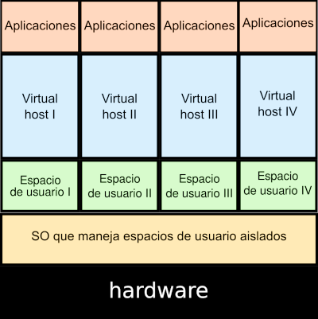

## Virtualización ligera o en contenedores

En este tipo de virtualización, sobre el núcleo del sistema operativo de la máquina anfitriona se ejecuta una capa de virtualización que
permite que existan múltiples instancias aisladas de espacios de usuario (**contenedor**).

Un **contenedor** es un conjunto de procesos aislados, que se ejecutan en un servidor, y que acceden a un sistema de ficheros propio, tienen una configuración red propio y accede a los recursos del host (memoria y CPU).

Tipos de contenedores:

* **Contenedores de Sistemas**: El uso que se hace de ellos es muy similar al que hacemos sobre una máquina virtual: se accede a ellos (normalmente por ssh), se instalan servicios, se actualizan, ejecutan un conjunto de procesos, . . . Ejemplo: LXC(Linux Container).
* **Contenedores de Aplicación**: Se suelen usar para el despliegue de aplicaciones web Ejemplo: Docker, Podman, ...

## ¿Qué aplicaciones web son más idóneas para desplegar en contenedores?

* Si tenemos aplicaciones monolíticas, vamos a usar un **esquema multicapa**, es decir cada servicio (servicio web, servicio de base de datos,... ) se va a desplegar en un contenedor.
* Realmente, las aplicaciones que mejor se ajustan al despliegue en contenedores
son la desarrolladas con **microservicios**:
    * Cada componente de la aplicación ("microservicio") se puede desplegar en un contenedor.
    * Comunicación vía HTTP REST y colas de mensajes
    * Facilita enormemente las actualizaciones de versiones de cada componente
    * ... 

## Docker

**Docker** es una tecnología de virtualización “ligera” cuyo elemento básico es la utilización de contenedores en vez de máquinas virtuales y cuyo objetivo principal es el despliegue de aplicaciones encapsuladas en dichos contenedores.
Establece una nueva metodología en el despliegue de aplicaciones en contenedores: **build, ship and run**

Otros programas similares;

* **cri-o**: Creado por Red Hat como alternativa a containerd y pensado solo para funcionar integrado en kubernetes.
* **podman**: Creado por Red Hat como alternativa a docker.
* **pouch**: Creado por Alibaba como alternativa a docker. 

## Orquestadores de contenedores

Un **Orquestador de contenedores** es un programa que gestiona los contenedores que se ejecutan en un clúster de servidores. Nos ofrece muchas características: actualizaciones automáticas, balanceo de carga, tolerancia a fallos, escalabilidad, ...

Actualmente, el más usado: **Kubernetes**.

