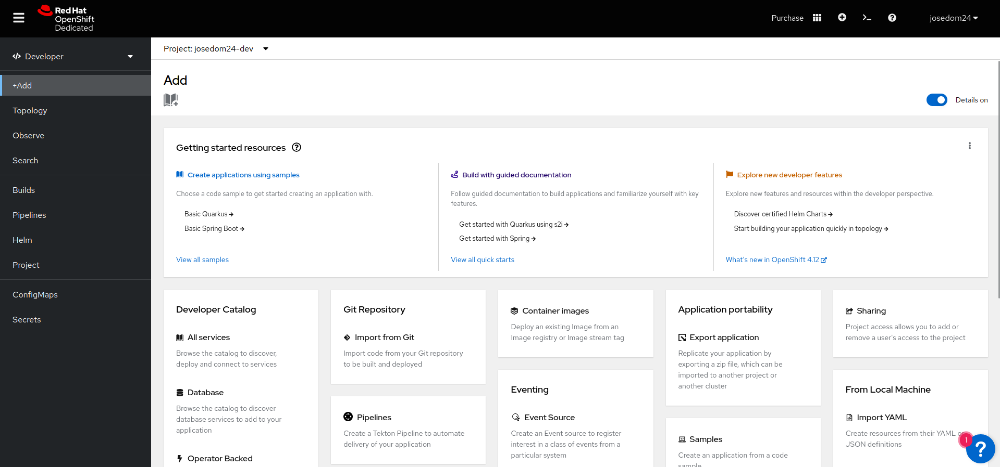
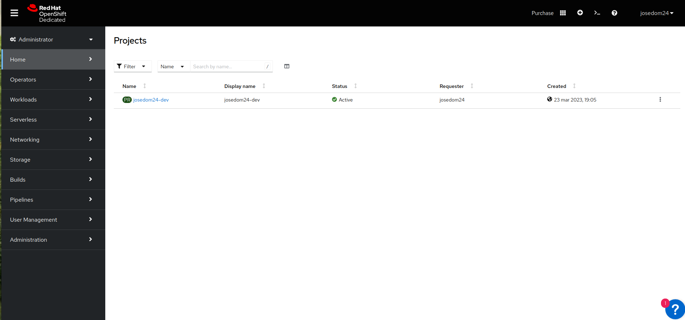

# Visión general de la consola web

Tenemos varias formas de interactuar con nuestro clúster de OpenShift:

* Usando la **consola web**, una aplicación web que nos permite gestionar todos los recursos del clúster.
* Usando la **herramienta de línea de comandos oc**, que nos permite gestionar los recursos con un comando desde la terminal. Puede ser mucho más útil a la hora de automatizar operaciones.
* Accediendo directamente a la **API** que nos proporciona el nodo maestro del clúster. Podríamos hacer peticiones HTTP directamente a la API restful para gestionar los recursos.

En este apartado vamos a ofrecer una vista general de la consola web. La consola web, nos permite trabajar con ella usando dos vistas distnatas: la de Administrador y la de Desarrollador.

## Consola web: vista Developer

**En la vista Developer**, los usuarios tienen acceso a herramientas para desarrollar, implementar y supervisar aplicaciones en el clúster de OpenShift.

Algunas de las opciones que tenemos disponibles en esta vista son:

* **+Add**: Tenemos a nuestra disposición una página donde podemos escoger entre los distintos mecanismos que nos ofrece OpenShift para crear aplicaciones en el clúster: desde un repositorio Git, desde el catálogo, desde imágenes de contenedores, desde ficheros YAML,... 
* **Topology**: En este apartado vemos gráficamente los recursos que tenemos creado en el clúster y de una manera sencilla podemos acceder a ellos para su gestión.
* **Observe**: En este apartado tenemos las herramientas de monitorización y supervisión. Podemos ver paneles gráficos con el consumo de recursos (CPU, memoria, uso de la red,...), elegir distintas métricas, las alertas que hemos definido o los eventos que han ocurrido en el clúster.
* **Search**: Nos permite, de una manera sencilla, buscar los recursos que hemos creado ene l clúster, pudiendo filtrar por las etiquetas.
* **Build**: En esta opción accedemos a los recursos Builds que hemos creado y que nos permiten la construcción automática de imágenes.
* **Pipelines**: Nos permite acceder a los flujos de IC/DC que hemos definido.
* **Helm**: Nos permite la configuración de la herramienta Helm, que nos proporciona una manera rápida y sencilla de realizar instalaciones en nuestro clúster.
* **Project**: Nos permite gestiona los proyectos a los que tenemos acceso.
* Desde la opción **Search**, podemos escoger un recurso de la API y "engancharlo" en el menú de navegación de la vista Developer, por defecto nos encontramos los recursos ConfigMaps y Secrets.

## Consola web: vista Administrator

**En la vista Administrator**, los usuarios tienen acceso a herramientas para administrar el clúster de OpenShift y las aplicaciones que se ejecutan en él. 

Al estar usando un usuario sin privilegios en RedHat OpenShift Dedicated Developer Sandbox, algunas de las opciones no nos dan todas las funcionalidades de administración.

Algunas de las opciones que tenemos disponibles en esta vista son:

* **Home**: Nos da acceso a los proyectos definido en el clúster, a la opción de búsqueda de recursos, a un explorador de los recursos de la API y a los eventos que han ocurrido en el clúster.
* **Operators**: Los operadores nos permiten añadir funcionalidades a nuestro clúster. En el caso del uso de RedHat OpenShift Dedicated Developer Sandbox, al ser un clúster administrador por RedHat, no tenemos permisos para añadir nuevos operadores.
* **Workloads**: Nos permite la gestión de los recursos de la API relacionados con el despliegue de aplicaciones: Deployment, ReplicaSet, Pod, ...
* **Serverless**: Nos proporciona la posibilidad de gestionar las aplicaciones que hemos desplegado como Serverless. Serverless significa sin servidor, y nos permite desplegar aplicaciones sin tener que crear una infraestructura propia, por lo que el pago se realiza por el uso de la aplicación.
* **Networking**: Nos permite la gestión de todos los recursos de la API que nos permiten el acceso a las aplicaciones: Service, Routes,...
* **Storage**: Nos da acceso a la gestión de los recursos relacionados con ela almacenamiento: PersistentVolumeClaim, PersitentVolume,...
* **Build**: En esta opción accedemos a los recursos Builds que hemos creado y que nos permiten la construcción automática de imágenes. Nos ofrece más opciones que en la vista Developer.
* **Pipelines**: Nos permite acceder a los flujos de IC/DC que hemos definido. Nos ofrece más opciones que en la vista Developer.
* **User Management**: Gestión de los usuarios del clúster. 
* **Administration**: Configuración general del clúster.