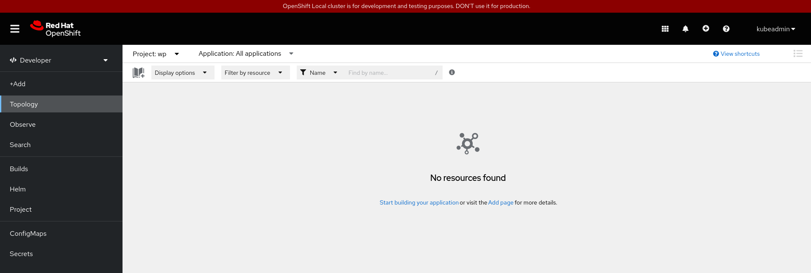
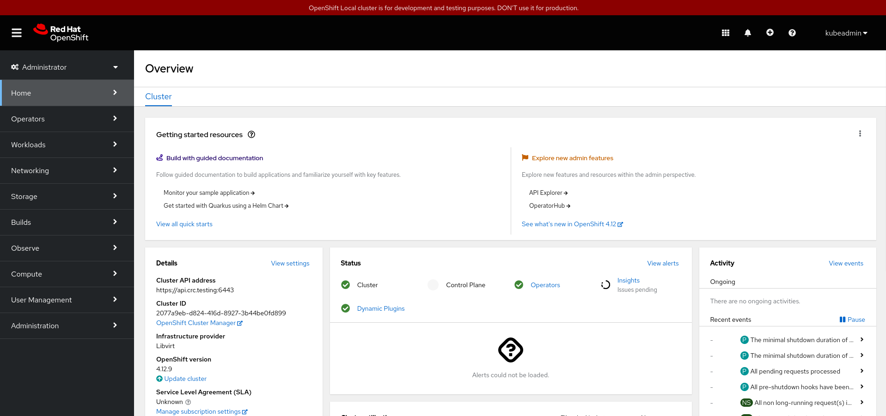

# Visión general de la consola web

Tenemos varias formas de interactuar con nuestro clúster de OpenShift:

* Usando la **consola web**, una aplicación web que nos permite gestionar todos los recursos del clúster.
* Usando la **herramienta de línea de comandos oc**, que nos permite gestionar los recursos con un comando desde la terminal. Puede ser mucho más útil a la hora de automatizar operaciones.
* Accediendo directamente a la **API** que nos proporciona el nodo maestro del clúster. Podríamos hacer peticiones HTTP directamente a la API restful para gestionar los recursos.

Para acceder a la consola web, usamos la URL: [https://console-openshift-console.apps-crc.testing](https://console-openshift-console.apps-crc.testing) y nos pide que hagamos login:

Usamos el usuario `developer` o el usuario `kubeadmin` para acceder con un usuario normal o un usuario administrador. Las opciones serán las mismas, pero como hemos visto el usuario `developer` no tendrá acceso a algunos recursos.

En este apartado vamos a ofrecer una vista general de la consola web. La consola web, nos permite trabajar con ella usando dos vistas distintas: la de Administrador y la de Desarrollador.

## Consola web: vista Developer

**En la vista Developer**, los usuarios tienen acceso a herramientas para desarrollar, implementar y supervisar aplicaciones en el clúster de OpenShift.

Algunas de las opciones que tenemos disponibles en esta vista son:

* **+Add**: Tenemos a nuestra disposición una página donde podemos escoger entre los distintos mecanismos que nos ofrece OpenShift para crear aplicaciones en el clúster: desde un repositorio Git, desde el catálogo de aplicaciones, desde imágenes de contenedores, desde ficheros YAML,... 
* **Topology**: En este apartado vemos gráficamente los recursos que tenemos creados en el clúster y de una manera sencilla podemos acceder a ellos para su gestión.
* **Observe**: En este apartado tenemos las herramientas de monitorización y supervisión. Podemos ver paneles gráficos con el consumo de recursos (CPU, memoria, uso de la red,...), elegir distintas métricas, las alertas que hemos definido o los eventos que han ocurrido en el clúster.
* **Search**: Nos permite, de una manera sencilla, buscar los recursos que hemos creado en el clúster, pudiendo filtrar por las etiquetas.
* **Build**: En esta opción accedemos a los recursos **Builds** que hemos creado y que nos permiten la construcción automática de imágenes.
* **Helm**: Nos permite la configuración de la herramienta Helm, que nos proporciona una manera rápida y sencilla de realizar instalaciones en nuestro clúster.
* **Project**: Nos permite gestionar los proyectos a los que tenemos acceso.
* Desde la opción **Search**, podemos escoger un recurso de la API y "engancharlo" en el menú de navegación de la vista Developer, por defecto nos encontramos los recursos **ConfigMaps** y **Secrets**.

## Consola web: vista Administrator

**En la vista Administrator**, los usuarios tienen acceso a herramientas para administrar el clúster de OpenShift y las aplicaciones que se ejecutan en él. 

Algunas de las opciones que tenemos disponibles en esta vista son:

* **Home**: Nos da acceso a los proyectos definidos en el clúster, a la opción de búsqueda de recursos, a un explorador de los recursos de la API y a los eventos que han ocurrido en el clúster.
* **Operators**: Los operadores nos permiten añadir funcionalidades a nuestro clúster. 
* **Workloads**: Nos permite la gestión de los recursos de la API relacionados con el despliegue de aplicaciones: **Deployment**, **ReplicaSet**, **Pod**, ...
* **Networking**: Nos permite la gestión de todos los recursos de la API que nos permiten el acceso a las aplicaciones: **Service**, **Routes**,...
* **Storage**: Nos da acceso a la gestión de los recursos relacionados con el almacenamiento: **PersistentVolumeClaim**, **PersitentVolume**,...
* **Build**: En esta opción accedemos a los recursos **Builds** que hemos creado y que nos permiten la construcción automática de imágenes. Nos ofrece más opciones que en la vista Developer.
* **Observe**: En este apartado tenemos las herramientas de monitorización y supervisión. Podemos ver paneles gráficos con el consumo de recursos (CPU, memoria, uso de la red,...), elegir distintas métricas, las alertas que hemos definido o los eventos que han ocurrido en el clúster.
* **Compute**: Gestiona todos los recursos relacionados con el clúster: nodos, máquinas, ...
* **User Management**: Gestión de los usuarios del clúster. 
* **Administration**: Configuración general del clúster.