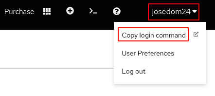

# Configuración de oc para el Developer Sandbox

Una vez que tenemos instalado la herramienta `oc`, el siguiente paso el realizar el login en nuestro clúster. En el caso de **RedHat OpenShift Dedicated Developer Sandbox**, la autentificación se hace por medio de un token.

Para obtener este token accedemos al menú que aparece al pulsar sobre nuestro nombre de usuario (parte superior derecha), eligiendo la opción **Copy login command**:



Copiamos la instrucción de login:


Y la ejecutamos:

    oc login --token=sha256~xxxxxxxxxxxxx... --server=https://api.sandbox-m3.1530.p1.openshiftapps.com:6443

    Logged into "https://api.sandbox-m3.1530.p1.openshiftapps.com:6443" as "josedom24" using the token provided.

    You have one project on this server: "josedom24-dev"

    Using project "josedom24-dev".

Como vemos, hemos accedido con el usuario y estamos usando un proyecto, que en mi caso se llama `josedom24-dev`.

Al igual que en kubernetes, la configuración de acceso se guarda en el fichero `~/.kube/config`:

```yaml
apiVersion: v1
clusters:
- cluster:
    server: https://api.sandbox-m3.1530.p1.openshiftapps.com:6443
  name: api-sandbox-m3-1530-p1-openshiftapps-com:6443
contexts:
- context:
    cluster: api-sandbox-m3-1530-p1-openshiftapps-com:6443
    namespace: josedom24-dev
    user: josedom24/api-sandbox-m3-1530-p1-openshiftapps-com:6443
  name: josedom24-dev/api-sandbox-m3-1530-p1-openshiftapps-com:6443/josedom24
current-context: josedom24-dev/api-sandbox-m3-1530-p1-openshiftapps-com:6443/josedom24
kind: Config
preferences: {}
users:
- name: josedom24/api-sandbox-m3-1530-p1-openshiftapps-com:6443
  user:
    token: sha256~UDgHaWXrosaNOAJEFxjhqZMPgH8ksbREvd8LZ_7mFYw
```

Donde vemos que se ha creado un contexto, donde se guarda el servidor al que nos conectamos (`cluster`), el namespace o proyecto que estamos usando (`namespace`) y el usuario (`user`). Como hemos indicado el usuario utiliza el token para autentificarse sobre el clúster.

Esta operación habrá que repetirla cada vez que el token se caduque.

Como hemos indicado anteriormente el proyecto que estamos usando se corresponde con un recurso `namespace` que nos permite agrupar todos nuestros recursos. Con el usuario que usamos tenemos acceso a nuestro proyecto, pero no podemos acceder a los recurso `namespaces` que están definidos en el clúster:

    oc get project
    NAME            DISPLAY NAME    STATUS
    josedom24-dev   josedom24-dev   Active
    
    oc get namespace
    Error from server (Forbidden): namespaces is forbidden: User "josedom24" cannot list resource "namespaces" in API group "" at the cluster scope

