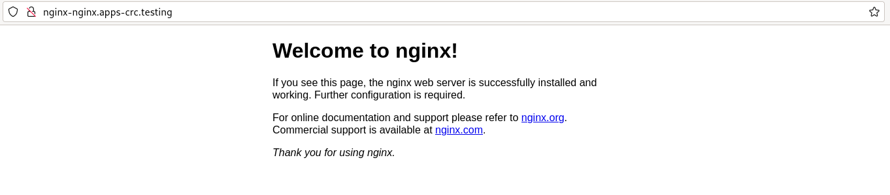

# Ejecución de pods privilegiados

OpenShift configura por defecto una política de seguridad que sólo nos permite ejecutar contenedores no privilegiados, es decir, donde no se ejecuten procesos o acciones por el usuario con privilegio `root` (por ejemplo, no utilizan puertos no privilegiados, puertos menores a 1024). 

Por lo tanto la mayoría de las imágenes que encontramos en el registro Docker Hub no la podemos usar en OpenShift. Veamos un ejemplo, si tenemos un fichero de despliegue donde se define un recurso **Deployment** y otro **Service**, usando la imagen de Docker Hub `nginx`:

```yaml
apiVersion: apps/v1
kind: Deployment
metadata:
  name: nginx
  labels:
    app: nginx
spec:
  revisionHistoryLimit: 2
  strategy:
    type: RollingUpdate
  replicas: 1
  selector:
    matchLabels:
      app: nginx
  template:
    metadata:
      labels:
        app: nginx
    spec:
      containers:
      - image: nginx
        name: contenedor-nginx
        ports:
        - name: http
          containerPort: 80
---
kind: Service
apiVersion: v1
metadata:
  name: nginx
  labels:
    app: nginx
spec:
  type: ClusterIP
  ports:
    - name: http
      port: 80
      targetPort: 80
  selector:
    app: nginx

```

Ahora creamos un nuevo proyecto y creamos los recursos:

    oc new-project nginx
    oc apply -f nginx.yaml
    Warning: would violate PodSecurity "restricted:v1.24": allowPrivilegeEscalation != false (container "contenedor-nginx" must set securityContext.allowPrivilegeEscalation=false), unrestricted capabilities (container "contenedor-nginx" must set securityContext.capabilities.drop=["ALL"]), runAsNonRoot != true (pod or container "contenedor-nginx" must set securityContext.runAsNonRoot=true), seccompProfile (pod or container "contenedor-nginx" must set securityContext.seccompProfile.type to "RuntimeDefault" or "Localhost")


Nos aparece un aviso, de que no estamos cumpliendo las restricciones de seguridad, pero los recursos se han creado. Cuando vemos el estado del pod que hemos creado, nos encontramos:

    NAME                     READY   STATUS             RESTARTS      AGE
    nginx-8565794bdc-lzf65   0/1     CrashLoopBackOff   4 (14s ago)   110s

Está dando error y se está continuamente reiniciando. Si vemos los logs del pod:

    oc logs pod/nginx-8565794bdc-lzf65
    ...
    nginx: [emerg] mkdir() "/var/cache/nginx/client_temp" failed (13: Permission denied)

Significa que el contenedor está intentando creando como `root` un directorio, y no tiene permiso para ello. Terminamos eliminando los recursos:
    oc delete project nginx

## Cómo podemos ejecutar este despliegue

Para poder ejecutar este despliegue, hay que modificar los privilegios de ejecución. Para ello hay que conocer el recurso **Service Account** que nos proporcionan identidades a los pods y a los procesos que se ejecutan dentro de ellos. Existe un **Service Account** llamado `default` al que vamos a modificar los permisos de ejecución.

Por lo tanto como administrador del clúster:

    oc login -u kubeadmin https://api.crc.testing:6443
    oc new-project nginx
    oc adm policy add-scc-to-user anyuid -z default

* Esta instrucción agrega el restricción de seguridad llamada **anyuid** al **ServiceAccount** predeterminado (`default`) en tu proyecto actual de OpenShift.
* La restricción **anyuid** permite a los contenedores en el pod ejecutarse con privilegios.

Por lo tanto, ahora ejecutamos la instrucción:

    oc apply -f nginx.yaml

    oc get pods
    NAME                     READY   STATUS    RESTARTS   AGE
    nginx-8565794bdc-lm7dp   1/1     Running   0          25s

    oc expose service nginx

