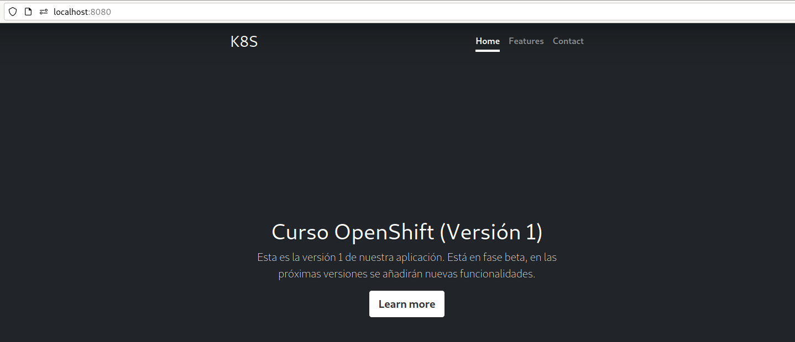
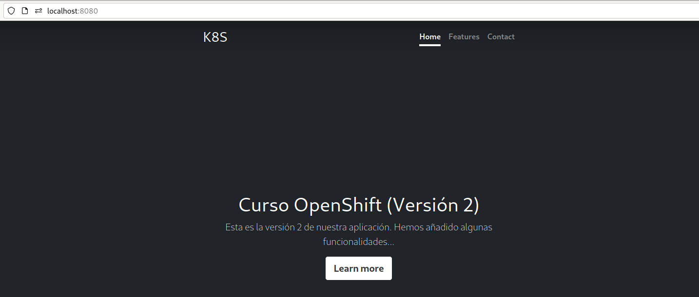
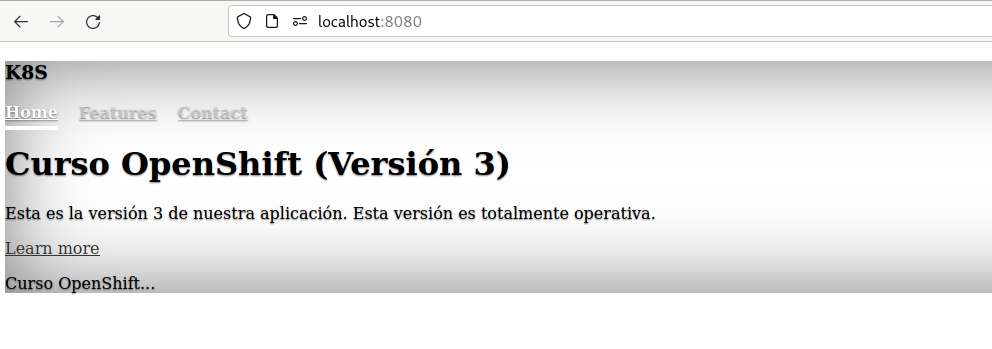

# Actualización de un Deployment (*rollout* y *rollback*)

El ciclo de vida del desarrollo de aplicaciones cuando trabajamos con contenedores nos facilita la labor de versionar nuestros desarrollos. Por cada nueva versión que se desarrolla de nuestra aplicación podemos crear una nueva imagen del contenedor que podemos versionar utilizando la etiqueta del nombre de la imagen.

Por lo tanto, al crear un Deployment indicaremos la imagen desde la que se van a crear los Pods. Al indicar la imagen podremos indicar la etiqueta que nos indica la versión de la aplicación que vamos a implantar.

Una vez que hemos creado un Deployment a partir de una imagen de una versión determinada, tenemos los Pods ejecutando la versión indicada de la aplicación.

¿Cómo podemos actualizar a una nueva versión de la aplicación?. Se seguirán los siguientes pasos:

1. Tendremos que modificar el valor del parámetro `image` para indicar una nueva imagen, especificando la nueva versión mediante el cambio de etiqueta.
2. En ese momento el Deployment se actualiza, es decir, crea un nuevo ReplicaSet que creará nuevos Pods de la nueva versión de la aplicación.
3. Según la estrategia de despliegue indicada, se irán borrando los antiguos Pods y se crearán lo nuevos.
4. El Deployment guardará el ReplicaSet antiguo, por si en algún momento queremos volver a la versión anterior.

Veamos este proceso con más detalles estudiando un ejemplo de despliegue:

## Desplegando la aplicación test_web

Vamos a partir del fichero `deployment.yaml`:

```yaml
kind: Deployment
metadata:
  name: test-web
  labels:
    app: test-web
spec:
  revisionHistoryLimit: 2
  strategy:
    type: RollingUpdate
  replicas: 2
  selector:
    matchLabels:
      app: test-web
  template:
    metadata:
      labels:
        app: test-web
    spec:
      containers:
      - image: josedom24/test_web:v1
        name: contenedor1
        ports:
        - name: http
          containerPort: 8080
        imagePullPolicy: Always
        securityContext:
            runAsNonRoot: true
            allowPrivilegeEscalation: false
            seccompProfile:
              type: RuntimeDefault
            capabilities:
              drop:
              - ALL
```

Vamos a desplegar la versión **v1** de la aplicación test_web. PPara ello ejecutamos:

    oc apply -f deployment.yaml

A continuación podemos "anotar" en el despliegue la causa del nuevo despliegue, de esta forma al visualizar el historial de modificaciones veremos las causas que han provocado cada actualización. Para ello:

    oc annotate deployment/test-web kubernetes.io/change-cause="Primer despliegue. Desplegamos versión 1"

Podemos comprobar los recursos que hemos creado:

    oc get all

Y si accedemos al Pod con un `port-forward` comprobamos que la versión actual de la mediawiki es la 1.38.5:

    oc port-forward deployment/test-web 8080:8080



## Actualizar un Deployment

A continuación queremos desplegar una versión más reciente de la aplicación. Para ello tenemos que modificar el campo `image` de nuestro Deployment, esta operación la podemos hacer de varias formas:

1. Modificando el fichero yaml y volviendo a ejecutar un `kubectl apply`.
2. Ejecutando la siguiente instrucción:

        oc set image deployment/test-web contenedor1=josedom24/test_web:v2

Al ejecutar la actualización del Deployment podemos observar que se ha creado un nuevo ReplicaSet, que creará los nuevos Pods a partir de la versión modificada de la imagen. ¿Cómo se crean los nuevos Pods y se destruyen los antiguos? Dependerá de la estrategia de despliegue:

  * Por defecto la estrategia de despliegue es `Recreate` que elimina los Pods antiguos y crea los nuevos.
  * Si indicamos en el despliegue el tipo de estrategia  `RollingUpdate`, se van creando los nuevos Pods, se comprueba que funcionan y se eliminan los antiguos.

A continuación indicamos el motivo del cambio del despliegue con una anotación:

    oc annotate deployment/test-web kubernetes.io/change-cause="Segundo despliegue. Desplegamos versión 2"

Veamos los recursos que se han creado en la actualización:

    oc get all

Kubernetes y OpenShift utilizan el término *rollout* para la gestión de diferentes versiones de despliegues. Podemos ver el historial de actualizaciones que hemos hecho sobre el despliegue:

    oc rollout history deployment/test-web

Y nos aparecen las anotaciones que hemos hecho de cada despliegue:

    deployment.apps/test-web 
    REVISION  CHANGE-CAUSE
    1         Primer despliegue. Desplegamos versión 1
    2         Segundo despliegue. Desplegamos versión 2

Y volvemos a acceder a la aplicación con un `port-forward` para comprobar que realmente se ha desplegado la versión 2.



## *Rollback* del Deployment

El proceso de despliegue de una nueva versión de una aplicación es una labor crítica, que tradicionalmente ha dado muchos problemas. Si estamos sirviendo una aplicación web que utilizan muchos usuarios, no nos podemos permitir que haya un corte en el servicio por un problema en el despliegue de una nueva versión.

Evidentemente, los problemas que pueden aparecer durante el despliegue de una nueva versión pueden estar causados por muchos motivos, y muchas veces es complicado tener todos los factores controlados. Si finalmente tenemos alguno, la pregunta sería: ¿Hemos diseñado un proceso que nos permita de una manera sencilla y rápida volver a la versión anterior de la aplicación que sabíamos que funcionaba bien?

A ese proceso de volver a una versión anterior de la aplicación es lo que llamamos **rollback**, o de forma concreta en k8s, "deshacer" un **rollout**. Veremos en este ejemplo un mecanismo sencillo de volver a versiones anteriores. Como hemos comentado, las actualizaciones de los Deployment van creando nuevos ReplicaSet, y se va guardando el historial de ReplicaSet anteriores. Deshacer un Rollout será tan sencillo como activar uno de los ReplicaSet antiguos.

Ahora vamos a desplegar una versión que nos da un error (la versión 3 de la aplicación tiene un problema con la hoja de estilo). ¿Podremos volver al despliegue anterior?

    oc set image deployment/test-web contenedor1=josedom24/test_web:v3

Y realizamos la anotación:

    oc annotate deployment/test-web kubernetes.io/change-cause="Tercer despliegue. Desplegamos versión 3"

Comprobamos el historial de despliegues:

```
oc rollout history deployment/test-web
deployment.apps/test-web 
REVISION  CHANGE-CAUSE
1         Primer despliegue. Desplegamos versión 1
2         Segundo despliegue. Desplegamos versión 2
3         Tercer despliegue. Desplegamos versión 3
```

Volvemos a acceder a la aplicación haciendo un `port-forward` y comprobamos que tiene un problema con la hoja de estilo:



Se puede volver a la versión anterior del despliegue mediante rollout:

    oc rollout undo deployment/test-web
    oc get all

Y terminamos comprobando el historial de actualizaciones:

```
oc rollout history deployment/test-web
deployment.apps/test-web
REVISION  CHANGE-CAUSE
1         Primer despliegue. Desplegamos versión 1
3         Tercer despliegue. Desplegamos versión 3
4         Segundo despliegue. Desplegamos versión 2
```

Finalmente, podemos acceder de nuevo con un port-forward y comprobamos que hemos vuelto a la versión 2.