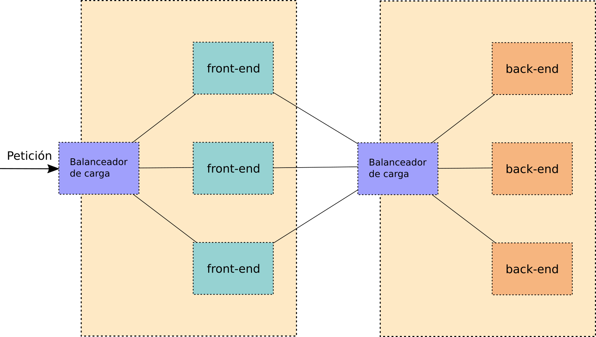
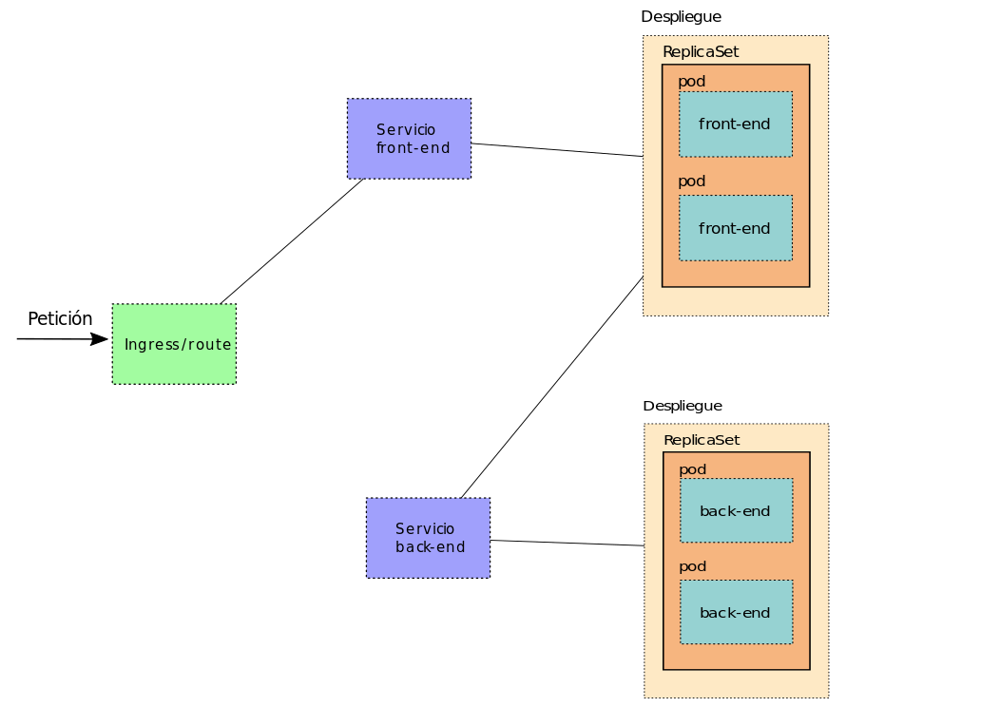

# Despliegues de aplicaciones en Kubernetes

Vamos a resumir brevemente, con la ayuda de un par de imágenes, la forma que tiene OpenShift (y Kubernetes) de hacer despliegues de aplicaciones y lo compararemos con un despliegue "tradicional".

Aunque un despliegue real tiene muchos más elementos que los que vamos a exponer a continuación, con idea de simplificarlo todo y entrarnos en la diferencia de los elementos que intervienen, supondremos una aplicación "tradicional" de dos capas, en las que una serie de equipos son los que están expuestos a Internet y los que pueden ejecutar una parte del código de la aplicación a través de servidores web (a los que de forma genérica denominaremos "front-end"), mientras que otra serie de equipos ejecutan otra parte de código y gestionan el almacenamiento y las bases de datos (a los que llamaremos de forma genérica "back-end").

En la imagen anterior, vemos que el balanceador de carga expuesto al exterior recibe la petición, que asigna a alguna de las máquinas virtuales o físicas que forman el "front-end" y que éstas a su vez se comunican con alguna de las máquinas del "back-end" a través del
balanceador de carga intermedio.

En el caso de OpenShift, esto se realiza utilizando una serie de objetos internos, que normalmente se ejecutan sobre contenedores, denominados Pods, ReplicaSets,  Deployments, Services, Routes,... Hay bastantes más objetos de OpenShift, pero nos centraremos en éstos que son los principales. 

En la siguiente imagen podemos ver la forma en la que una petición externa se gestionaría:

En los siguientes módulos veremos uno a uno estos objetos de OpenShift y aprenderemos paso a paso cómo se interactúa con ellos.

## Arquitectura de nuestras aplicaciones

Tenemos dos clases de aplicaciones que podemos desplegar en un cluster de Kubernetes:

1. Aplicaciones que necesitan varios servicios para ejecutarse: por ejemplo una aplicación escrita en PHP y servida por un servidor web que necesita un servidor de base de datos para guardar la información. En este caso crearemos dos recursos Deployment: uno para desplegar la aplicación PHP y otro para desplegar la base de datos. Por cada servicio que necesite nuestra aplicación crearemos un Deployment para desplegarlo.
2. Aplicaciones construidas con microservicios: cada microservicio se puede desplegar de manera autónoma. Por cada microservicio que forma parte de la aplicación crearemos un recurso Deployment. Por ejemplo, una aplicación que tenga un frontend para ofrecer la información y que haga llamadas a un backend que ofrece un servicio web por medio de una API RESTful.