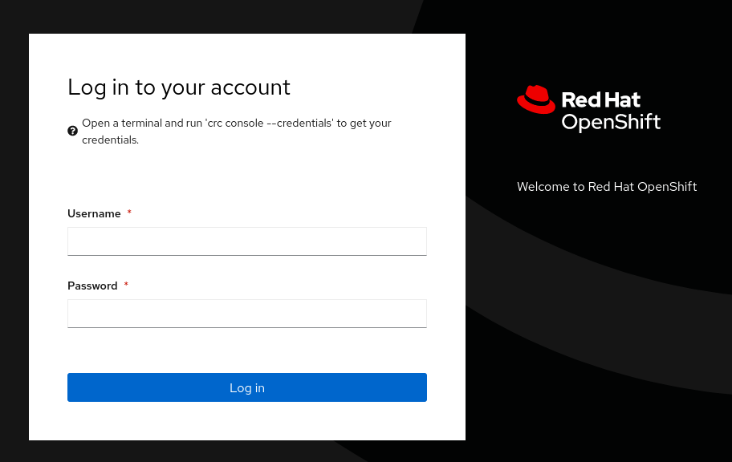
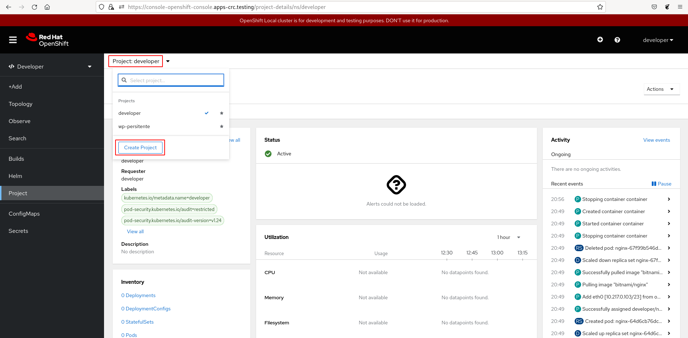
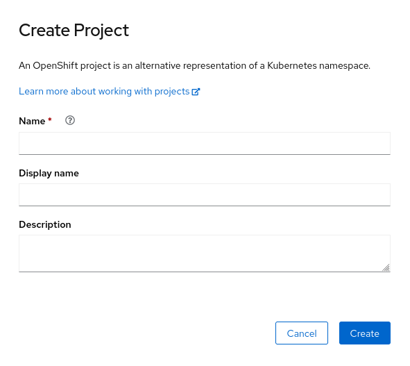
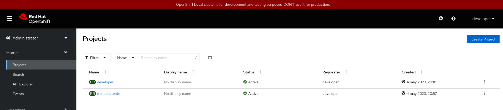
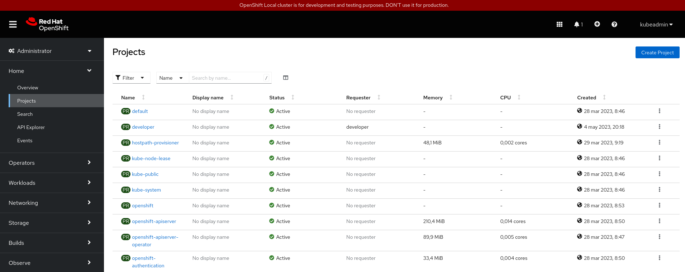

# La consola web en CRC

La consola WEB en la instalación de OpenShift con CRC, es similar a la que hemos estudiado en **RedHat OpenShift Dedicated Developer Sandbox**, teniendo en cuenta algunas diferencias:

* Con CRC no tenemos todas las funcionalidades ofrecidas con **RedHat OpenShift Dedicated Developer Sandbox**, aunque podemos añadirlas con la instalación de nuevos **Operadores**. Por lo tanto faltan opciones como: Pipelines, Serverless,...
* En **RedHat OpenShift Dedicated Developer Sandbox** accedemos a la consola web con un usuario sin privilegios, por lo que muchas opciones no la tenemos disponibles por falta de autorización. Con CRC ocurre lo mismo si accedemos con el usuario `developer`, sin embargo, al acceder con el usuario privilegiado `kubeadmin` tendremos a nuestras disposición todas las opciones de configuración.

## Acceso a la consola web

Para acceder a la consola web, usamos la URL: [https://console-openshift-console.apps-crc.testing](https://console-openshift-console.apps-crc.testing) y nos pide que hagamos login:

Usamos el usuario `developer` o el usuario `kubeadmin` para acceder con un usuario normal o un usuario administrador. Las opciones serán las mismas, pero como hemos visto el usuario `developer` no tendrá acceso a algunos recursos.

Al igual que hemos visto en **RedHat OpenShift Dedicated Developer Sandbox**, tenemos dos vistas para interactuar con los recursos de OpenShift:

**Developer**, los usuarios tienen acceso a herramientas para desarrollar, implementar y supervisar aplicaciones en el clúster de OpenShift.
**Administrator**, los usuarios tienen acceso a herramientas para administrar el clúster de OpenShift y las aplicaciones que se ejecutan en él. 

## Gestión de proyectos en la consola web

En al instalación local de OpenShift con CRC, hemos visto que tenemos la posibilidad de gestionar nuestros proyectos de trabajo. Al igual que vimos en **RedHat OpenShift Dedicated Developer Sandbox**, podemos obtener la información del proyecto actual en el que estamos trabajando, para ello escogemos en la vista **Developer**, la opción **Project**:

Obtenemos la información del proyecto actual, y tenemos la opción de cambiar el proyecto activo. Además, con el botón **Create Project**, tenemos la posibilidad de crear un nuevo proyecto. Y en el desplegable **Actions** tenemos las opciones de editar o borrar el proyecto actual.

Si pulsamos sobre el botón **Create Project**, aparece un sencillo formulario que nos posibilita la creación de un nuevo proyecto:

Desde la vista **Administrator**, la opción **Home->Projects** podemos ver la lista de proyectos que tenemos disponibles:

Evidentemente, si nos conectamos con el usuario administrador `kubeadmin`, tendremos acceso a todos los proyectos del clúster:

