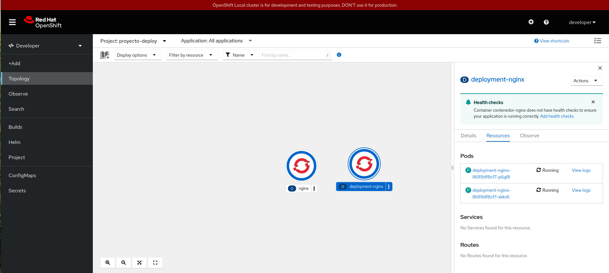
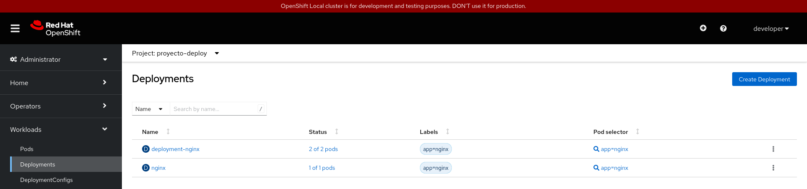
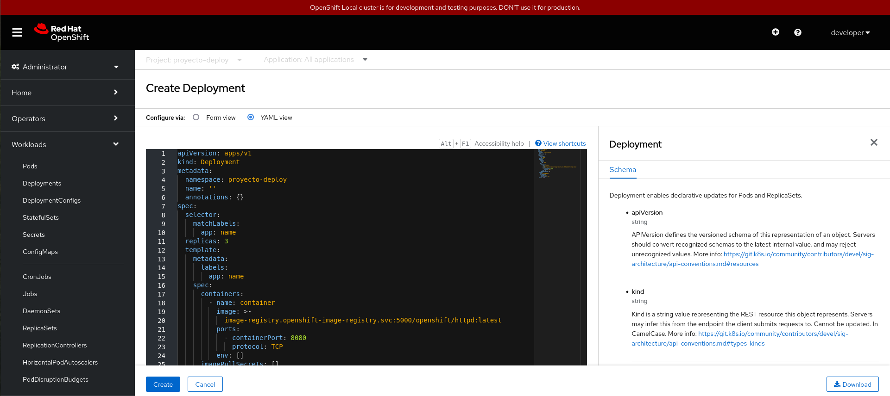
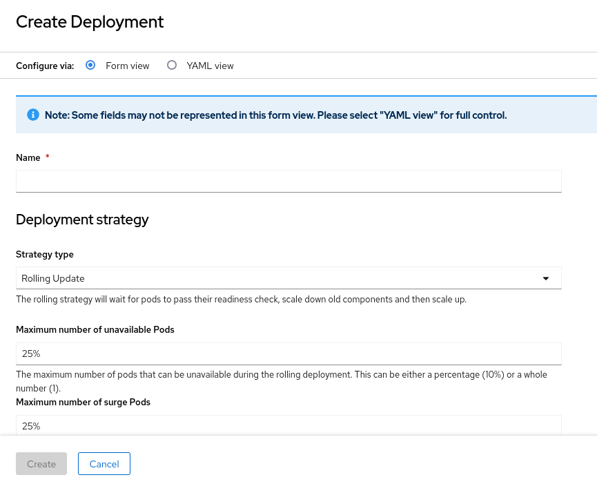
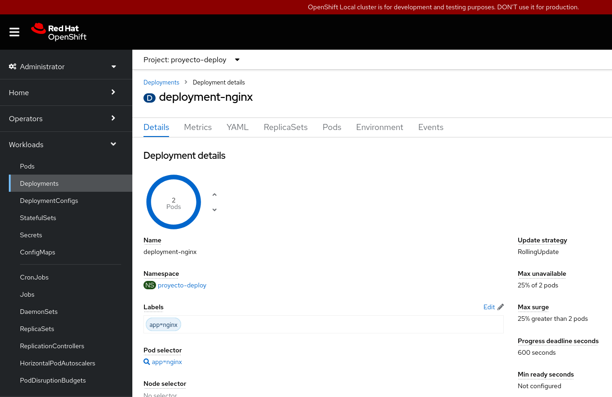

# Trabajando con Deployment desde la consola web

Tenemos varias formas para ver los **Deployments** que hemos creado en la unidad anterior. Por ejemplo desde la vista **Developer**, en la sección **Topology**, vemos todos los recursos que tenemos creado. 

Al elegir el **Deployment**, podemos ver en la ventana lateral todos los detalles, y en el desplegable **Actions**, algunas de las opciones que hemos estudiado (editar los labels, editar la definición del Deployment, escalar,...).

Otra forma de acceder a los **Deployments** sería en la vista de **Administrator**, en el apartado **Workloads -> Deployments**:

En este caso obtenemos la lista de **Deployments**, y en el botón final (con tres puntos) tenemos las acciones que podemos realizar sobre un **Deployment** en particular.

En esta pantalla también tenemos un botón **Create Deployment** que nos permite la creación de un nuevo **Deployment** desde un fichero YAML:

O la creación de un **Deployment** desde un formulario:

**Nota**: También podemos ejecutar un fichero yaml desde la vista **Developer**, sección **+Add** y la opción **Import YAML** (es lo mismo que el icono **+** que encontramos en la parte superior derecha).

Si pinchamos sobre un Deployment, obtenemos los detalles del mismo:

En esta pantalla tenemos varias opciones:

* **Details**: Nos da información del recurso, en este caso del deployment seleccionado.
* **Metrics**: Podemos ver las gráficas de métricas (uso de memoria, cpu, sistema de ficheros y red).
* **YAML**: Podemos editar el YAML con todos los parámetros del recurso.
* **ReplicaSets**: Vemos las lista del historial de replicaSet creado por el despliegue.
* **Pods**: La lista de Pods que actualmente se están ejecutando.
* **Environment**: Podemos definir las variables de entorno que tendrán los contenedores de los Pods.
* **Events**: Listamos los distintos eventos que se han producido sobre el recurso.

