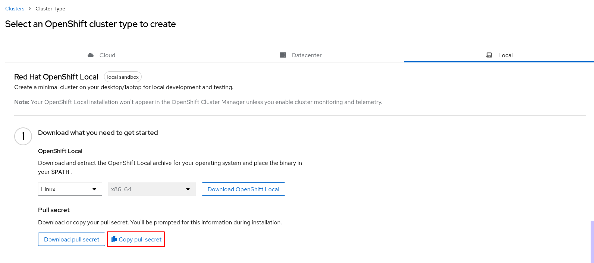

# Instalación en local con CRC

CRC nos proporciona la posibilidad de realizar una instalación local de OpenShift V4, creando un clúster de un nodo que se ejecutará een una máquina virtual. Evidentemente, tener una instalación de este tipo, es adecuado por motivos educativos, en ningún caso para poner aplicaciones en producción.

## Requisitos mínimos

Los requisitos necesarios serán:

* 4 CPUs físicas.
* 9Gb de RAM.
* 35 Gb de almacenamiento.

Los sistemas operativos soportados son: Windows 10 Fall Creators Update (version 1709) os superior, macOS 11 Big Sur os superior, las dos últimas versiones de Red Hat Enterprise Linux/CentOS y Fedora. Ubuntu 18.04 y Debian 10 o superior no están soportadas y requieren configuración manual.

Para más información de la instalación puedes leer la [documentación oficial](https://crc.dev/crc/).

## Instalación de CRC en Debian/Ubuntu

La instalación la he realizado sobre una versión Debian 11. También he probado la instalación en una versión Ubuntu 22.04.

La máquina virtual que se va a crear, se ejecuta sobre KVM/libvirt, por lo que debemos instalar los paquetes necesarios para que funcione este sistema de virtualización:

    sudo apt install qemu-kvm libvirt-daemon libvirt-daemon-system network-manager

Nos tenemos que asegurar que el usuario sin privilegio pertenezca al grupo `libvirt` para que pueda conectarse con el hypervisor (necesitaremos reiniciar la sesión de usuario para que el siguiente comando tenga efecto):

    sudo adduser usuario libvirt

A continuación tienes que bajarte la última versión de CRC, eligiendo la versión del sistema operativo que estés usando, desde la página oficial de descarga (para ello tendrás que hacer login con un cuenta de Red Hat): [https://console.redhat.com/openshift/create/local](https://console.redhat.com/openshift/create/local)

Además de bajarte la versión de CRC, tendrás que bajarte o copiar en el portapapeles un token que durante la instalación tendrás que introducir:



Una vez descargado el paquete lo descomprimimos y lo copiamos a un directorio del PATH para poder ejecutarlo:

    tar -xf crc-linux-amd64.tar.xz
    cd crc-linux-2.17.0-amd64
    sudo install crc /usr/local/bin

    crc version
    CRC version: 2.17.0+44e15711
    OpenShift version: 4.12.9
    Podman version: 4.4.1

Empezamos la instalación, el siguiente comando configurará de manera adecuada KVM/libvirt y bajará los ficheros necesarios (por ejemplo, la imagen base) que se utilizarán posteriormente para crear la máquina virtual:

    crc setup

A continuación, aunque no es necesario, si necesitamos aumentar los recursos de la máquina virtual que vamos a crear podemos hacerlo de la siguiente manera:

    crc config set cpus 8
    crc config set memory 20480

Esto también es opcional, pero si queremos que durante la instalación se instalen los componentes de telemtría para mostrar los recursos que se están utilizando, debes realizar la siguiente configuración:

    crc config set enable-cluster-monitoring true

Finalmente creamos la máquina virtual, que ejecutará el clúster de OpenShift v4:

    crc start

Durante el proceso nos pedirán que introduzcamos el token que hemos bajado o copiado:

    ? Please enter the pull secret  

Después de unos minutos, el clúster estará preparado y nos dará información para acceder:

    Started the OpenShift cluster.

    The server is accessible via web console at:
      https://console-openshift-console.apps-crc.testing

    Log in as administrator:
      Username: kubeadmin
      Password: xxxxxxxxxxxxxxxxxxxxxxxxx

    Log in as user:
      Username: developer
      Password: developer

No es necesario instalar la herramienta `oc`, durante el proceso de instalación se ha descargado, lo único que tenemos que hacer es configurar el PATH para que podamos acceder a ella, para ello:

    eval $(crc oc-env)
    
### Solución al problema detectado en Debian 11

Durante la instalación en Debian 11, al ejecutar el comando `crc start` me aparecía un error del tipo:

    Failed to start: virError(Code=38, Domain=18, Message='Cannot access backing file '/home/usuario/.crc/cache/crc_libvirt_x.x.x/crc.qcow2' of storage file '/home/usuario/.crc/machines/crc/crc.qcow2' (as uid:107, gid:107): Permission denied')

Es decir, al intentar usar la imagen base que se ha descargado y ha guardado en el directorio `~/.crc/cache` nos encontramos con problemas de permiso y no se puede crear la máquina virtual.

La configuracion de seguridad de AppArmor en Debian 11, evita que kvm/libvirt utilice imágenes bases que no estén guardadas en determinados directorios. Por lo tanto hay que modificar la configuración para que se permita el uso de esta imagen base que está guardada en este directorio, para ello, modificamos el fichero `/etc/apparmor.d/libvirt/TEMPLATE.qemu` y añadimos la siguiente línea:

    sudo nano /etc/apparmor.d/libvirt/TEMPLATE.qemu

    profile LIBVIRT_TEMPLATE flags=(attach_disconnected) {
      #include <abstractions/libvirt-qemu>
      /home/jose/.crc/cache/crc_libvirt_4.12.9_amd64/crc.qcow2 rk,
    }

Y posteriormente reiniciamos AppArmor:

    sudo systemctl restart apparmor

Y ya podemos realizar la instalación de CRC sin problemas.

## Algunos detalles de la instalación

Como hemos dicho, todos los ficheros relacionados con CRC se guardan en el directorio `~/.crc`.
La configuración de acceso al clúster, al igual que los clúster de kubernetes se guarda en el fichero `~/.kube/config`. En nuestro caso:

```yaml
apiVersion: v1
clusters:
- cluster:
    certificate-authority-data: LS0tLS1CRUdJTiBDRVJUSUZJQ0FURS0tL..
    server: https://api.crc.testing:6443
  name: api-crc-testing:6443
contexts:
- context:
    cluster: api-crc-testing:6443
    namespace: default
    user: kubeadmin
  name: crc-admin
- context:
    cluster: api-crc-testing:6443
    namespace: default
    user: developer
  name: crc-developer
current-context: crc-admin
kind: Config
preferences: {}
users:
- name: developer
  user:
    token: sha256~gEE6O8LrHV444o44W6kryQSR8pDGKMxnNdkblvX1P9M
- name: kubeadmin
  user:
    token: sha256~qdvyZgGGYo32tdpGh1adh8eu_-NaP5ESgoJTmD2LA1Y
```
## Algunos comando útiles de crc

Cada vez que empecemos a utilizar CRC iniciamos la máquina virtual con:

    crc start

Cuando terminemos de trabajar, paramos la máquina con:

    crc stop

Si necesitamos hacer una nueva instalación y eliminar la máquina virtual, ejecutamos:

    crc delete

Podemos acceder a la consola web podemos acceder a la URL `https://console-openshift-console.apps-crc.testing` o ejecutar el comando:

    crc console

Si queremos la información para loguearnos con el comando `oc` podemos ejecutar:

    crc console --credentials
    To login as a regular user, run 'oc login -u developer -p developer https://api.crc.testing:6443'.
    To login as an admin, run 'oc login -u kubeadmin -p xxxxxxxxxxxxxxx https://api.crc.testing:6443'


