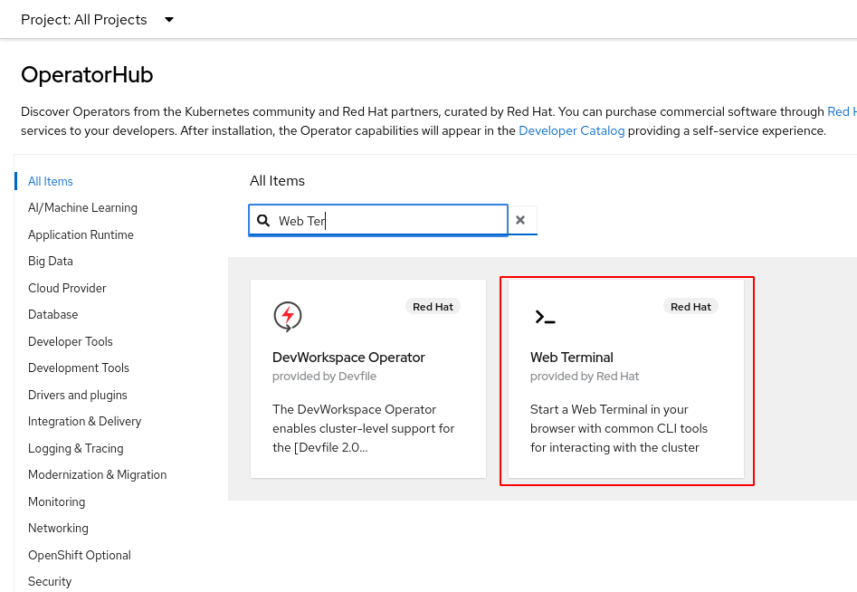
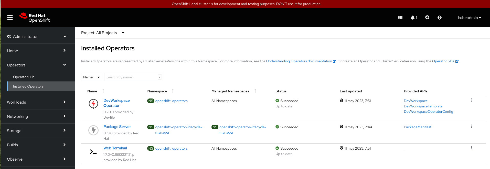
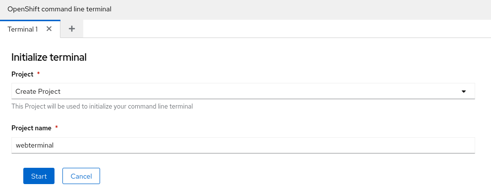
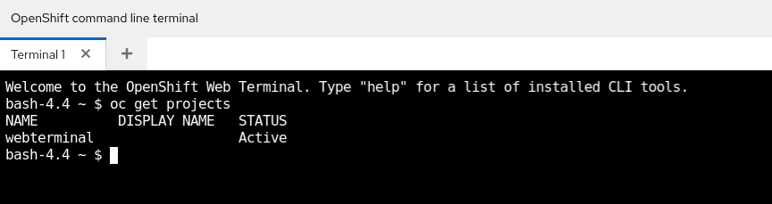

# Configuración de oc para CRC

La herramienta `oc` nos permite gestionar los recursos de nuestro clúster de OpenShift desde la línea de comandos.

Para más información de esta herramienta puedes acceder a la [documentación oficial](https://docs.openshift.com/container-platform/4.12/cli_reference/openshift_cli/getting-started-cli.html).

Si utilizamos CRC no es necesario la instalación de esta herramienta, solamente tenemos que configurar de forma adecuada el PATH, ejecutando:

    eval $(crc oc-env)

Como hemos dicho anteriormente para obtener las instrucciones para hacer login en el clúster, ejecutamos:

    crc console --credentials
    To login as a regular user, run 'oc login -u developer -p developer https://api.crc.testing:6443'.
    To login as an admin, run 'oc login -u kubeadmin https://api.crc.testing:6443'

Como vemos podemos loguearnos con dos usuarios: `kubeadmin` que será un usuario administrador con todos los permisos disponibles, y con el usuario `developer` que será un usuario sin privilegios.

Por ejemplo para loguearnos como administrador.
    
    oc login -u kubeadmin https://api.crc.testing:6443
    Login successful.

    You have access to 66 projects, the list has been suppressed. You can list all projects with 'oc projects'

    Using project "default".

Vemos que tiene acceso a 66 proyectos y que por defecto está usando el proyecto `default`. Por ejemplo el usuario administrador puede acceder a los nodos del clúster

    oc get nodes
    NAME                 STATUS   ROLES                         AGE   VERSION
    crc-8tnb7-master-0   Ready    control-plane,master,worker   36d   v1.25.7+eab9cc9

Si nos conectamos con el usuario `developer`:

    oc login -u developer -p developer https://api.crc.testing:6443

    Login successful.

    You don't have any projects. You can try to create a new project, by running

        oc new-project <projectname>

Te avisa que no tienes asignado ningún proyecto y que tienes que crear uno para trabajar. Si intentamos, por ejemplo acceder a los nodos del clúster, veremos que no tenemos permiso:

    oc get nodes
    Error from server (Forbidden): nodes is forbidden: User "developer" cannot list resource "nodes" in API group "" at the cluster scope

## Terminal desde la consola web

Por defecto la instalación de OpenShift en local no tiene ningún Operador instalado. Los Operadores nos permiten instalar componentes internos de OpenShift que añaden funcionalidades extras a nuestro clúster.

Para poder conectarnos a un terminal desde la consola web y tener a nuestra disposición la herramienta `oc` tenemos que instalar el operador **WebTerminal** (por dependencias se instará también el operador **DevWorkspace Operator**). Nos tenemos que conectar con el usuario administrador `kubeadmin` y en la vista **Administrator** accedemos a la opción **Operators->OperatorHub** y filtramos con el nombre del operador "WebTerminal":

Nos aparece una ventana con información del operador y pulsamos sobre el botón **Install** para comenzar la instalación, dejamos los valores por defecto, realizamos la instalación y comprobamos los operadores que hemos instalados en la opción **Operators->Installed Operators**:

A continuación, accedemos con el usuario `developer` y ya encontramos en la parte superior derecha de la consola web el icono que nos permite el acceso a la terminal:

Pulsamos sobre el icono, y nos pedirá que creemos un proyecto o elijamos uno, para crear los recursos necesarios para que podamos tener acceso al terminal (el recurso **DevWorkspace** donde se crea el **Deployment** que crea el Pod donde se ejecuta el terminal). Yo lo he llamado `webterminal`:

Y después de pulsar el botón **Start** y esperar unos segundos, ya tenemos a nuestra disposición la terminal donde podemos ejecutar la herramienta `oc`:

