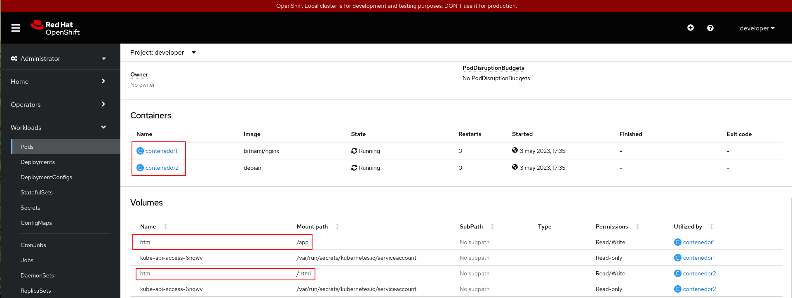

# Ejemplo: Pod multicontenedor

La razón principal por la que los Pods pueden tener múltiples
contenedores es para admitir aplicaciones auxiliares que ayudan a una
aplicación primaria. Ejemplos típicos de estas aplicaciones pueden ser
las que envían o recogen datos externos (por ejemplo de un
repositorio) y los servidores proxy. El ayudante y las aplicaciones
primarias a menudo necesitan comunicarse entre sí. Normalmente, esto
se realiza a través de un sistema de archivos compartido o mediante la
interfaz loopback (localhost).

Veamos dos ejemplos concretos:

1. Un servidor web junto con un programa auxiliar que sondea un
   repositorio Git en busca de nuevas actualizaciones.
2. Un  servidor  web con un servidor de aplicaciones PHP-FPM, lo
   podemos implementar  en un Pod, y cada servicio en un
   contenedor. Además tendría un volumen interno que se montaría en el
   *DocumentRoot* para que el servidor web y el servidor de
   aplicaciones puedan acceder a la aplicación.

Veamos un pequeño ejemplo de un pod multicontenedor. Tenemos la definición del Pod en el fichero `pod-multicontenedor.yaml`:

```yaml
apiVersion: v1
kind: Pod
metadata:
  name: pod-multicontenedor
spec:
  volumes:
  - name: html
    emptyDir: {}
  containers:
  - name: contenedor1
    image: bitnami/nginx
    volumeMounts:
    - name: html
      mountPath: /app
  - name: contenedor2
    image: debian
    volumeMounts:
    - name: html
      mountPath: /html
    command: ["/bin/sh", "-c"]
    args:
      - while true; do
          date >> /html/index.html;
          sleep 1;
        done

```

Estudiemos la definición del Pod:


* El Pod se llama `pod-multicontenedor` y en el apartado `spec` vemos
  que está formado por un volumen (llamado `html` y de tipo
  `emptyDir`, que estudiaremos más adelante, pero que básicamente es
  un directorio que vamos a montar en los contenedores) y dos
  contenedores (llamados `contenedor1` y `contenedor2`).
* El `contenedor1` se crea a partir de la imagen `bitnami/nginx`, es el
  contenedor principal, encargado de servir la web. En este contenedor
  montamos el volumen `html` en su *DocumentRoot*
  (`/app`). Va a servir el fichero `index.html` que
  está modificando el otro contenedor.
* El `contenedor2` es el auxiliar. En este caso se monta el volumen
  `html` en el directorio `html` donde va modificando el fichero
  `index.html` con la fecha y hora actuales cada un segundo (parámetro
  `command` y `args`).
* Como los dos contenedores tienen montado el volumen, el fichero
  `index.html` que va modificando el `contenedor2`, es el fichero que
  sirve el `contenedor1`.

Vamos a realizar los siguientes pasos:

1. Creamos el Pod.

        oc apply -f pod-multicontenedor.yaml

2. Veamos la información del pod y vemos que está formado por dos contenedores y un volumen:

        oc describe pod pod-multicontenedor
    
    Podemos acceder desde la consola web al detalle del pod, y vemos también la misma información:

    


3. Podemos acceder al primer contenedor para ver el contenido del fichero `index.html`:

        oc exec pod-multicontenedor -c contenedor1 -- /bin/cat /app/index.html

    En esta ocasión hay que indicar el contenedor (opción `-c`) para indicar en que contenedor vamos a ejecutar la instrucción.

4. Para mostrar el contenido del fichero `index.html` en el segundo contenedor, ejecutamos:

        oc exec pod-multicontenedor -c contenedor2 -- /bin/cat /html/index.html

5. Si queremos acceder a un contenedor determinado o ver los logs de un contenedor hay que indicar el contenedor. Por ejemplo:

        oc logs pod/pod-multicontenedor -c contenedor1
        oc exec -it pod/pod-multicontenedor -c contenedor1 -- bash
        oc rsh -c contenedor2 pod/pod-multicontenedor 

6. Podemos ejecutar un "port forward" para acceder al Pod en el puerto 8080 de localhost, sabiendo que el servicio usa el puerto 8080.

        oc port-forward pod/pod-multicontenedor 8080:8080

    Y si accedemos al navegador:

    
    
7. Por último borramos el pod:

    oc delete -f pod-multicontenedor.yaml

