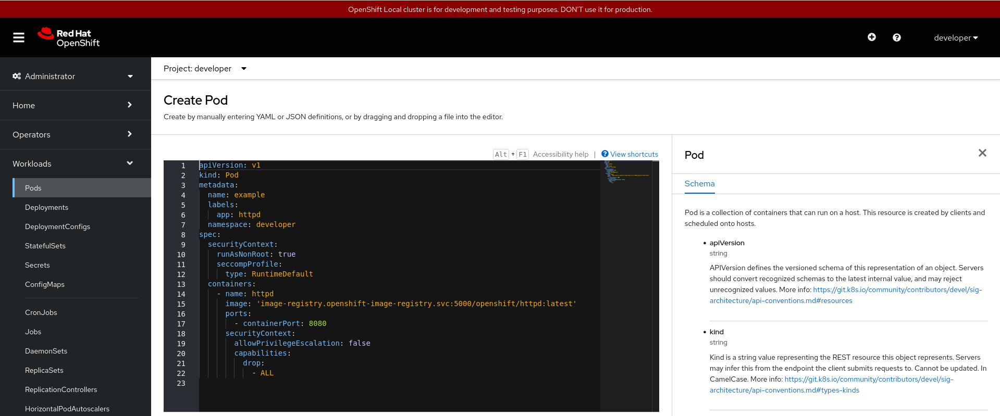
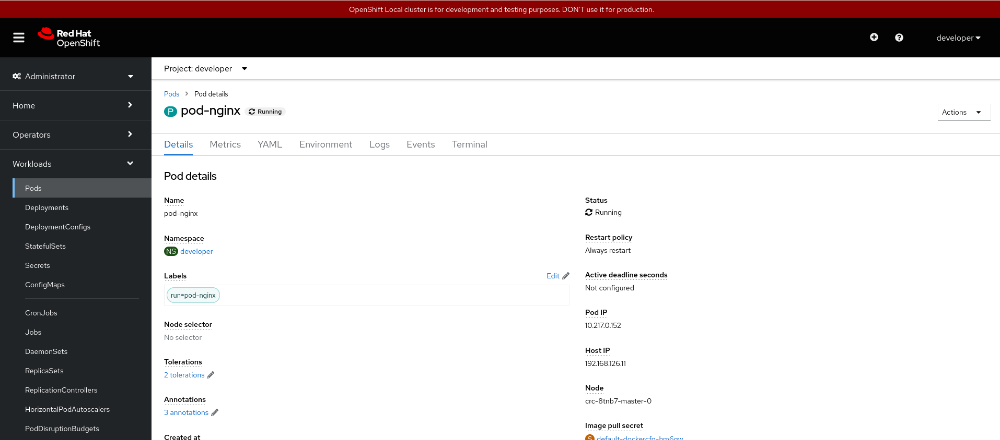

# Trabajando con ReplicaSets desde la consola web

En este caso, el recurso ReplicaSet no lo podemos ver desde la topología. Nos tendremos que ir a la la vista de **Administrator**, en el apartado **Workloads -> ReplicaSets**:

En este caso obtenemos la lista de pods, y en el botón final (con tres puntos) tenemos las acciones que podemos realziar sobre un pod en particular.

En esta pantalla también tenemos un botón **Create Pod** que nos permite la creación de un nuevo pod:

**Noota**: También podemos ejecutar un fichero yaml desde la vista **Developer**, sección **+Add** y la opción **Import YAML** (es lo mismo que el icóno **+** que encontramos en la parte superior derecha).

Si pinchamos sobre un pod, obtenemos los detalles del mismo:

En esta pantalla tenemos varias opciones:

* **Details**: Nos da información del recurso, en este caso del pod seleccionado.
* **Metrics**: Podemos ver las gráficas de métricas (uso de memoria, cpu, sistema de ficheros y red).
* **YAML**: Podemos editar el YAML con todos los parámetros del recurso.
* **Environment**: Podemos definir las variables de entorno que tendrán los contenedores del pod.
* **Logs**: Obtenemos los logs del pod.
* **Events**: Listamos los distintos eventos que se han producido sobre el recurso.
* **Terminal**: Accedemos a un terminal del contenedor del pod.

