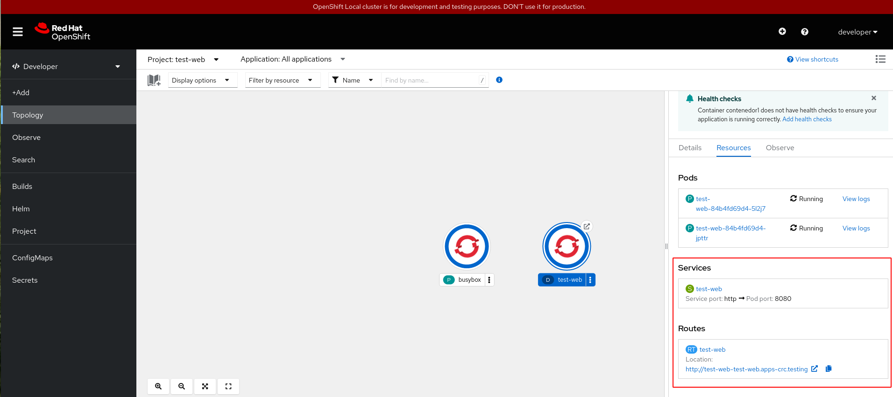
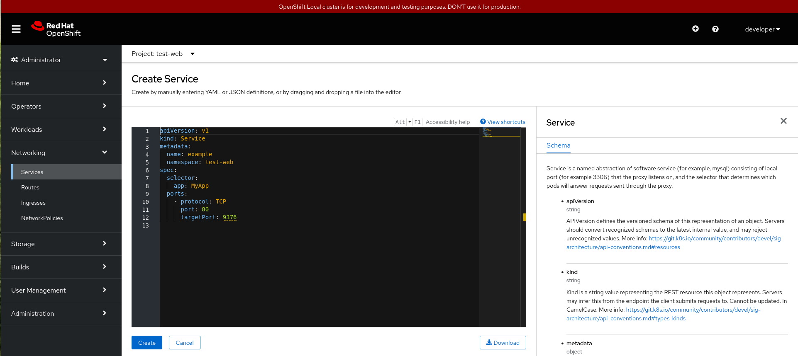
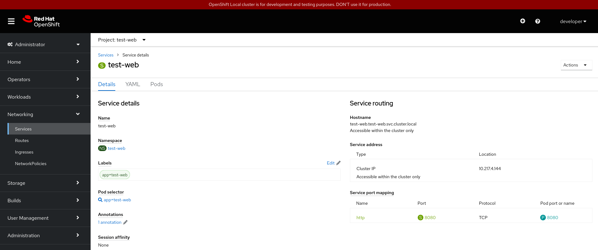
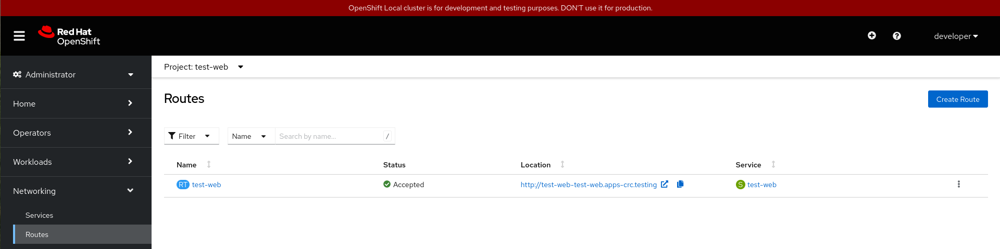
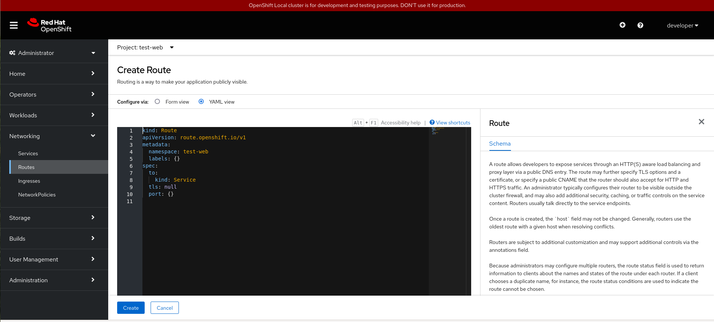
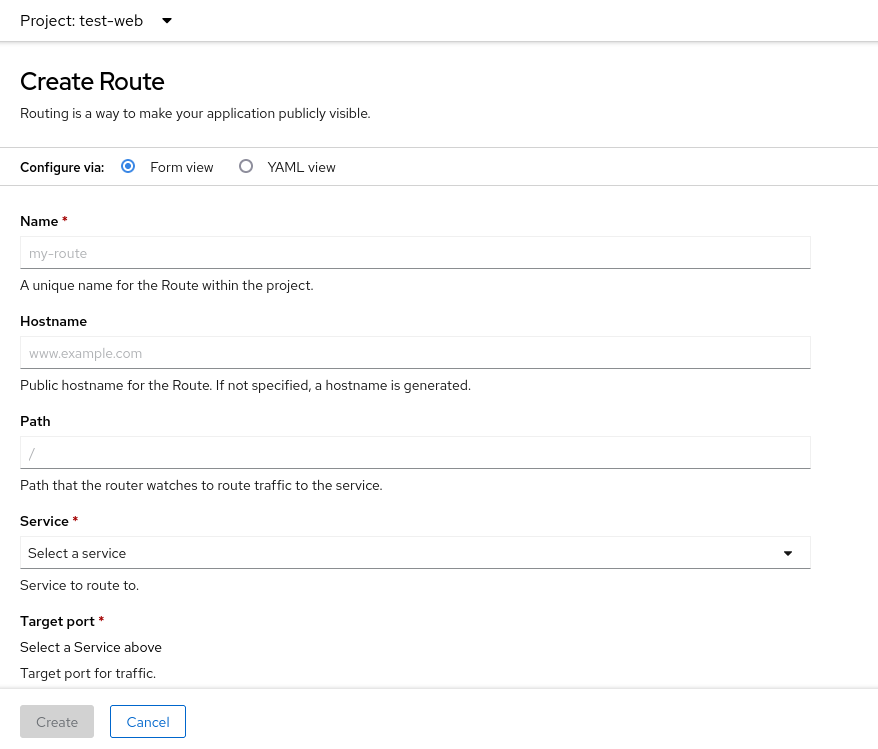
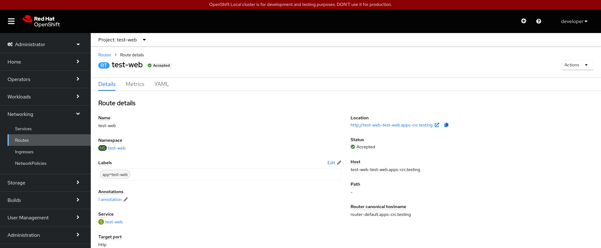

# Gestionando los recursos de acceso desde la consola web

## Services

Desde la vista **Developer**, en la sección **Topology**, vemos todos los recursos que tenemos creado. Si elegimos un **Deployment** podremos acceder a los **Services** y **Routes** asociadas a él:

Otra forma de acceder a los recursos de acceso sería en la vista de **Administrator**, en el apartado **Networking**. Por ejemplo, en el apartado **Services** encontramos los servicios que tenemos declarados:

En el botón final (con tres puntos) tenemos las acciones que podemos realizar sobre un **Service** en particular.

En esta pantalla también tenemos un botón **Create Service** que nos permite la creación de un nuevo servicio:

**Nota**: También podemos ejecutar un fichero yaml desde la vista **Developer**, sección **+Add** y la opción **Import YAML** (es lo mismo que el icono **+** que encontramos en la parte superior derecha).

Si pinchamos sobre un **Service**, obtenemos los detalles del mismo:

En esta pantalla tenemos varias opciones:

* **Details**: Nos da información del recurso, en este caso del **Service** seleccionado.
* **YAML**: Podemos editar el YAML con todos los parámetros del recurso.
* **Pods**: Nos ofrece la lista con los Pods seleccionados por el **Service**.

## Routes

El recurso **Route** se gestiona de forma similar desde la consola web. En el apartado **Networking -> Routes**, encontramos la lista de recursos **Routes**:

También tenemos a nuestra disposición una opción para crear nuevas rutas, con el botón **Create Route**. Desde el fichero YAML:

O usando un formulario:

Y si escogemos una ruta determinada, obtenemos información de la misma:

En esta pantalla tenemos varias opciones:

* **Details**: Nos da información del recurso, en este caso del **Route** seleccionado.
* **Metrics**: Métricas de acceso.
* **YAML**: Podemos editar el YAML con todos los parámetros del recurso.