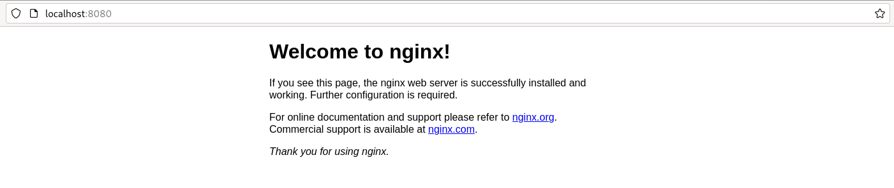

# Ejecución de Pods privilegiados

Como hemos indicado anteriormente, OpenShift configura por defecto una política de seguridad que sólo nos permite ejecutar contenedores no privilegiados, es decir, donde no se ejecuten procesos o acciones por el usuario con privilegio `root` (por ejemplo, no utilizan puertos no privilegiados, puertos menores a 1024, o no ejecuta operaciones con el usuario `root`). 

Hemos estado usando imágenes proporcionada por la empresa Bitnami, que están preparada para ejecutar contenedores no privilegiados. En este apartado vamos a configurar la seguridad de nuestro proyecto para permitir la ejecución de Pods privilegiados, y de esta manera poder usar todas las imágenes que encontramos en Docker Hub.

Vamos a trabajar con el usuario `developer`, creando un nuevo proyecto:

    oc new-project proyecto-nginx

Veamos un ejemplo, si tenemos un fichero de despliegue donde se define un recurso **Deployment**, usando la imagen de Docker Hub `nginx`:

```yaml
apiVersion: apps/v1
kind: Deployment
metadata:
  name: nginx
  labels:
    app: nginx
spec:
  revisionHistoryLimit: 2
  strategy:
    type: RollingUpdate
  replicas: 1
  selector:
    matchLabels:
      app: nginx
  template:
    metadata:
      labels:
        app: nginx
    spec:
      containers:
      - image: nginx
        name: contenedor-nginx
        ports:
        - name: http
          containerPort: 80
```

Creamos el recurso ejecutando:
   
    oc apply -f nginx.yaml
    Warning: would violate PodSecurity "restricted:v1.24": allowPrivilegeEscalation != false (container "contenedor-nginx" must set securityContext.allowPrivilegeEscalation=false), unrestricted capabilities (container "contenedor-nginx" must set securityContext.capabilities.drop=["ALL"]), runAsNonRoot != true (pod or container "contenedor-nginx" must set securityContext.runAsNonRoot=true), seccompProfile (pod or container "contenedor-nginx" must set securityContext.seccompProfile.type to "RuntimeDefault" or "Localhost")


Nos aparece un aviso, de que no estamos cumpliendo las restricciones de seguridad, pero los recursos se han creado. Cuando vemos el estado del Pod que hemos creado, nos encontramos:

    NAME                     READY   STATUS             RESTARTS      AGE
    nginx-8565794bdc-lzf65   0/1     CrashLoopBackOff   4 (14s ago)   110s

Está dando error y se está continuamente reiniciando. Si vemos los logs del pod:

    oc logs pod/nginx-8565794bdc-lzf65
    ...
    nginx: [emerg] mkdir() "/var/cache/nginx/client_temp" failed (13: Permission denied)

Significa que el contenedor está intentando crear un directorio como `root`, y no tiene permiso para ello. Terminamos eliminando los recursos:

    oc delete deploy/nginx

## Cómo podemos ejecutar este despliegue

La solución ya la hemos usado en los apartados anteriores. Tenemos que modificar los privilegios de ejecución de los Pods, para ello tenemos que añadir un privilegio al **Service Account** `default`.

Por lo tanto como administrador del clúster:

    oc login -u kubeadmin https://api.crc.testing:6443
    oc project proyecto-nginx
    oc adm policy add-scc-to-user anyuid -z default
    oc login -u developer -p developer https://api.crc.testing:6443

* Esta instrucción agrega la restricción de seguridad llamada **anyuid** al **ServiceAccount** predeterminado (`default`) en tu proyecto actual de OpenShift.
* La restricción **anyuid** permite a los contenedores en el pod ejecutarse con privilegios.

Por lo tanto, ahora ejecutamos la instrucción:

    oc apply -f nginx.yaml

    oc get pod
    NAME                     READY   STATUS    RESTARTS   AGE
    nginx-8565794bdc-lm7dp   1/1     Running   0          25s

Y comprobamos que funciona:

    oc port-forward deploy/nginx 8080:80

