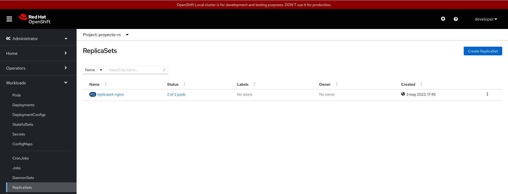
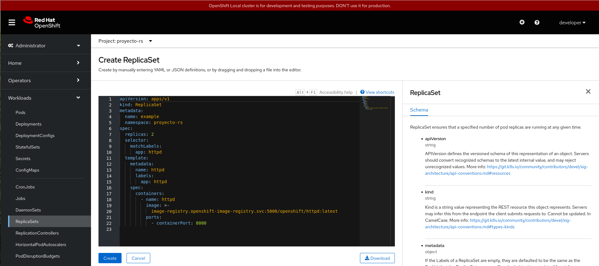
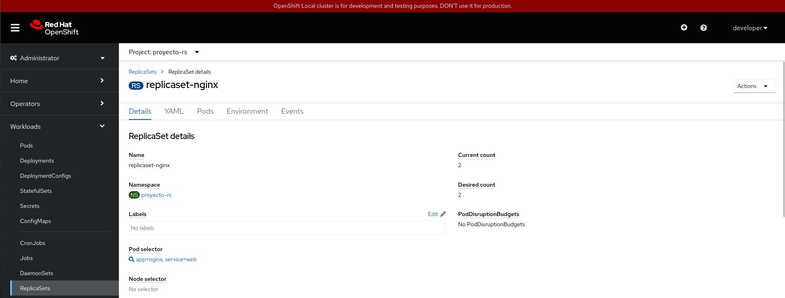

# Trabajando con ReplicaSets desde la consola web

En este caso, el recurso ReplicaSet no lo podemos ver desde la topología. Nos tendremos que ir a la la vista de **Administrator**, en el apartado **Workloads -> ReplicaSets**:

En este caso obtenemos la lista de **ReplicaSets**, y en el botón final (con tres puntos) tenemos las acciones que podemos realizar sobre un **ReplicaSet** en particular. Por ejemplo con la opción **Edit Pod count** podemos escalar el **ReplicaSet**.

En esta pantalla también tenemos un botón **Create ReplicaSet** que nos permite la creación de un nuevo **ReplicaSet**:

**Nota**: También podemos ejecutar un fichero YAML desde la vista **Developer**, sección **+Add** y la opción **Import YAML** (es lo mismo que el icono **+** que encontramos en la parte superior derecha).

Si pinchamos sobre un **ReplicaSet**, obtenemos los detalles del mismo:

En esta pantalla tenemos varias opciones:

* **Details**: Nos da información del recurso, en este caso del **ReplicaSet** seleccionado.
* **YAML**: Podemos editar el YAML con todos los parámetros del recurso.
* **Pods**: Obtenemos la lista de Pods que controla el **ReplicaSet**.
* **Environment**: Podemos definir las variables de entorno que tendrán los contenedores del **ReplicaSet**.
* **Events**: Listamos los distintos eventos que se han producido sobre el recurso.

