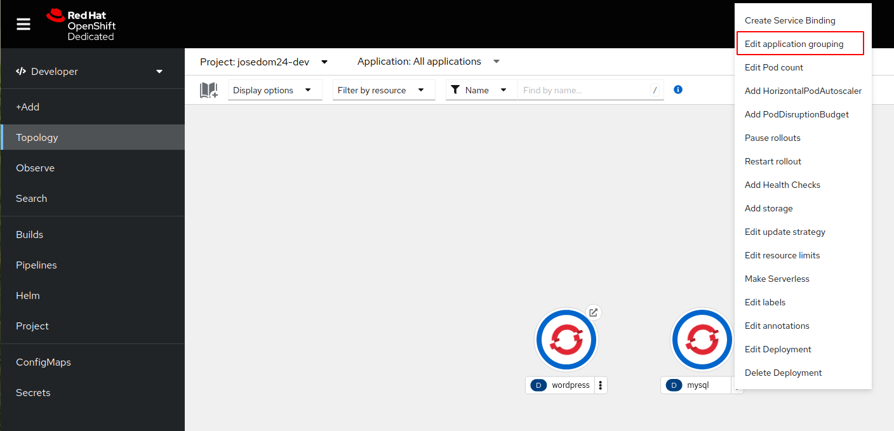
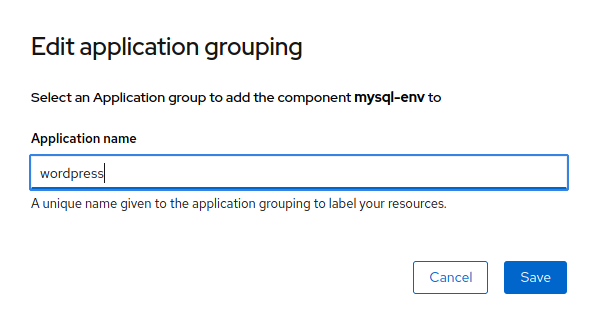
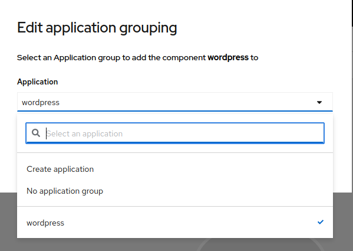
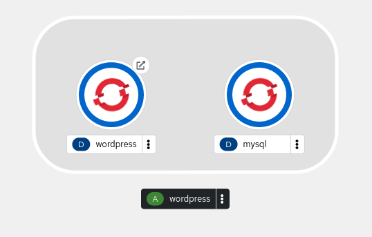
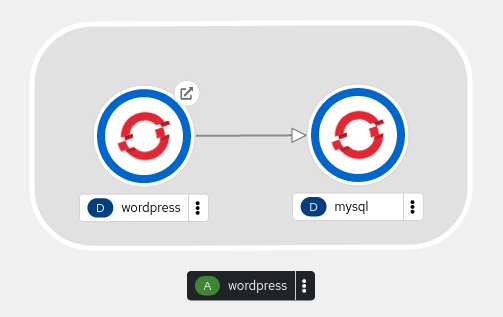
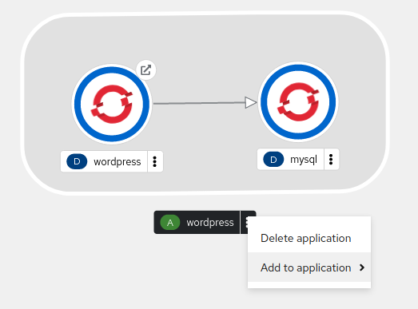
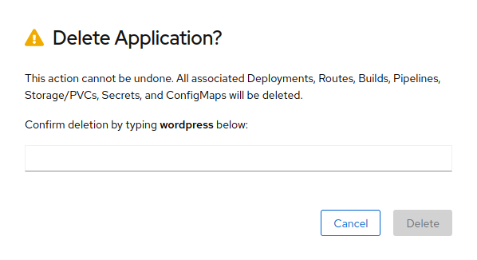

# Agrupación de aplicaciones

En la topología de la consola web podemos visualizar los distintos despliegues que tenemos en nuestro proyecto. Para organizar los recursos tenemos la posibilidad de realizar dos operaciones:

* **Agrupar** distintos recursos dentro de una aplicación: Será una agrupación lógica que nos permitirá visualizar los recursos de forma agrupada para saber que despliegues están relacionados.
* **Conectar** unos despliegues con otros: Nos permitirá establecer una relación más particular entre despliegues, por ejemplo los Pods del despliegue Wordpress acceden a los Pods del despliegue MySql.

## Agrupando despliegues en aplicaciones

Cogemos uno de los despliegues que queremos agrupar, y elegimos la opción **Edit application grouping**:

A continuación podemos nombrar la aplicación (el agrupamiento) que estamos creando:

En el otro despliegue escogemos la misma opción (**Edit application grouping**) y escogemos lel nombre de la aplicación que ya tenemos creada:

En este momento los dos despliegues ya está agrupados, y podemos verlo visualmente en la topología:

La agrupación ha creado un nuevo Label en cada uno de los despliegue donde se indica:

        app.kubernetes.io/part-of=wordpress

## Conexión entre despliegues

Podemos indicar que existe una relación entre despliegues de una aplicación, para ello sólo tenemos que arrastrar la flecha que sale de uno de los despliegues encima de otro despliegue:

En este caso queremos señalar que los Pods del despliegue Wordpress acceden a los Pods del despliegue MySql. Las conexiones se señalan en el recurso con una anotación, por ejemplo en el despliegue Wordpress se ha realiza una nueva anotación:

        app.openshift.io/connects-to: [{"apiVersion":"apps/v1","kind":"Deployment","name":"mysql"}]

## Gestión de la aplicación

Ahora podemos gestionar el agrupamiento o aplicación que hemos creado, podemos añadirle nuevos recursos, o podemos elimar la aplicación con lo que se eliminarán todos los recursos relacionados:

Cuando vayamos a eliminar la aplicación habrá que confirmarlo escribiendo el nombre de la aplicación:

