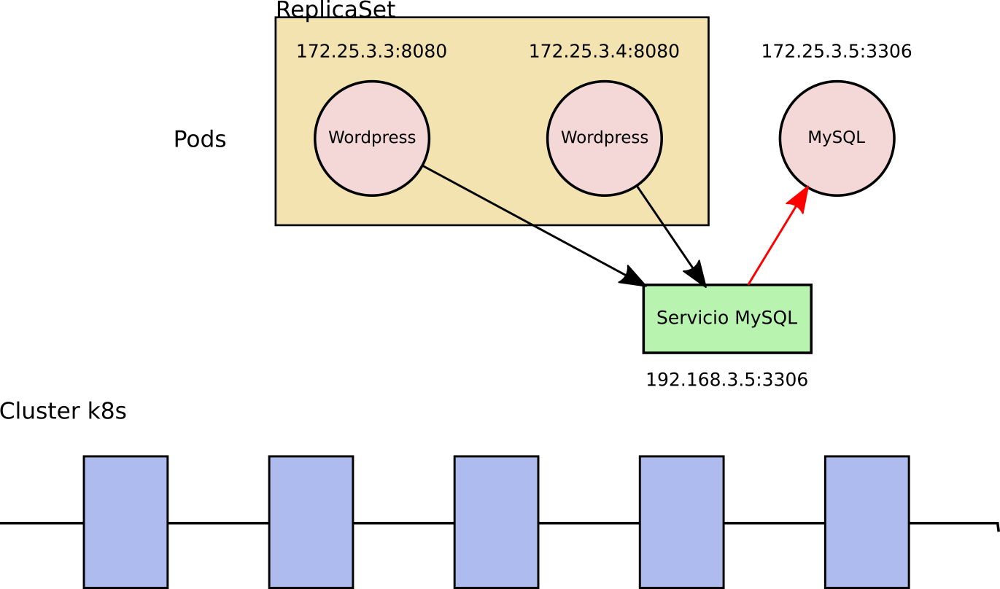
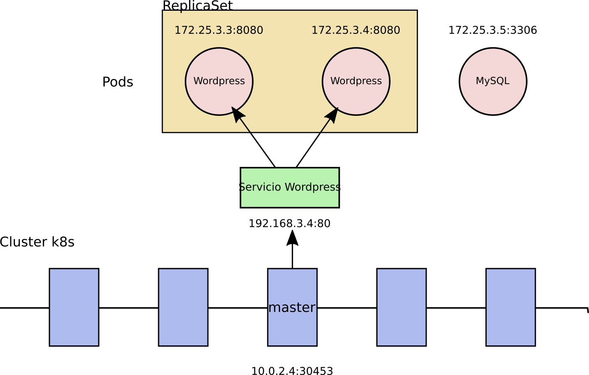
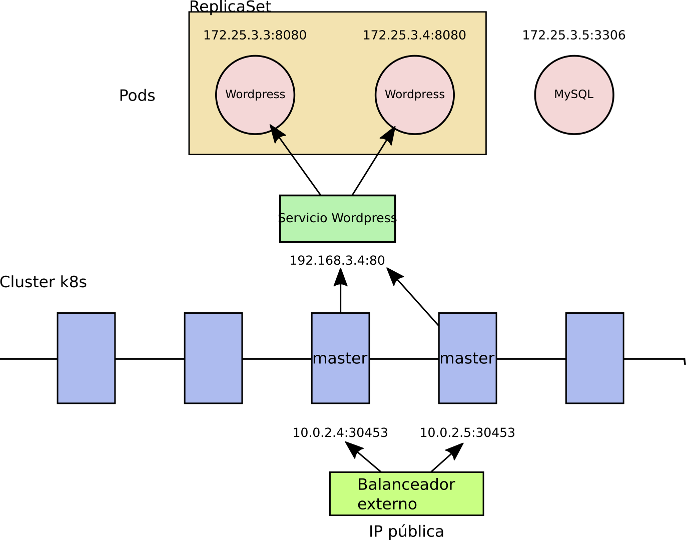
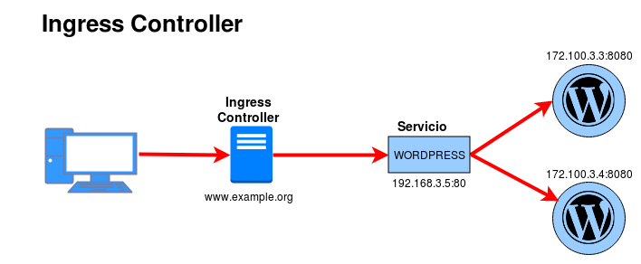

# Recursos que nos ofrece OpenShift para el acceso a las aplicaciones

## Services

Los servicios ([Services](https://kubernetes.io/docs/concepts/services-networking/service/)) nos permiten acceder a las aplicaciones que hemos desplegado en el cluster.

* Un **Service** es una abstracción que **nos permite acceder a un conjunto de Pods** (que se han creado a partir de un Deployment) que implementan una aplicación (Por ejemplo: acceder a un servidor web, a una servidor de base de datos, a un servicio que forma parte de una aplicación, ...).
* A cada Pod se le asigna una IP a la que no se puede acceder directamente, por lo tanto necesitamos un **Service** que nos ofrece **una dirección virtual (CLUSTER-IP) y un nombre** que identifica al conjunto de Pods que representa, al cual nos podemos conectar.
* La conexión al **Service** se puede realizar **desde otros Pods o desde el exterior** (mediante la generación aleatoria de un puerto). Por ejemplo, si tenemos una aplicación formada por dos **Services**: servidor web y servidor de base de datos, tendremos que acceder desde el exterior al servidor web, y acceder al servidor de base de datos desde el servidor web. En principio no será necesario acceder al servidor de base de datos desde el exterior.
* Si el Deployment que hemos creado tiene más de un Pod asociado, el **Service** que representa el acceso a esta aplicación **balanceará la carga** entre los Pods con una política Round Robin.
* En el cluster existirá un componente que nos ofrece un **servicio DNS**. Cada vez que creamos un **Service** se actualizará el DNS para resolver el nombre que hemos asignado al **Service** con la IP virtual (CLUSTER-IP) que se le ha asignado.

### Tipos de Services

#### ClusterIP

Solo se permite el acceso interno a un **Service** de este tipo. Es decir, si tenemos un despliegue con una aplicación a la que no es necesario acceder desde el exterior, crearemos un **Service** de este tipo para que otras aplicaciones puedan acceder a ella (por ejemplo, una base de datos). Es el tipo por defecto. 

#### NodePort

Abre un puerto, para que el **Service** sea accesible desde el exterior. Por defecto el puerto generado está en el rango de 30000:40000. Para acceder usamos la ip del servidor master del cluster y el puerto asignado.

#### LoadBalancer

Este tipo sólo está soportado en servicios de cloud público (GKE, AKS o AWS). El proveedor asignará un recurso de balanceo de carga para el acceso a los **Services**. Si usamos un cloud privado como OpenStack, necesitaremos un plugin para configurar el funcionamiento. Este tipo de **Service** no lo vamos a utilizar en el presente curso.

## Ingress

Un [Ingress controller](https://kubernetes.io/docs/concepts/services-networking/ingress/) que nos permite utilizar un proxy inverso (HAproxy, nginx, traefik,...) que por medio de reglas de encaminamiento que obtiene de la API de Kubernetes, nos permite el acceso a nuestras aplicaciones por medio de nombres.

## Routes

Un recurso **Route** es un recurso de OpenShift, muy similar al recurso **Ingress**, que permite exponer una aplicación a través de una URL personalizada y fácilmente recordable.

Cuando se crea una ruta para una aplicación en OpenShift, se genera una URL única que se asocia con un servicio.

La ventaja de usar rutas en OpenShift es que permiten a los desarrolladores desacoplar la URL pública de acceso a una aplicación de la URL interna del clúster. Esto significa que la aplicación puede moverse entre diferentes servidores o entornos de desarrollo sin que los usuarios tengan que actualizar sus marcadores o enlaces a la aplicación.

Además también permiten a los desarrolladores configurar HTTPS, el balanceo de carga, la autenticación y la autorización, lo que ayuda a mejorar la seguridad y la disponibilidad de la aplicación expuesta.

