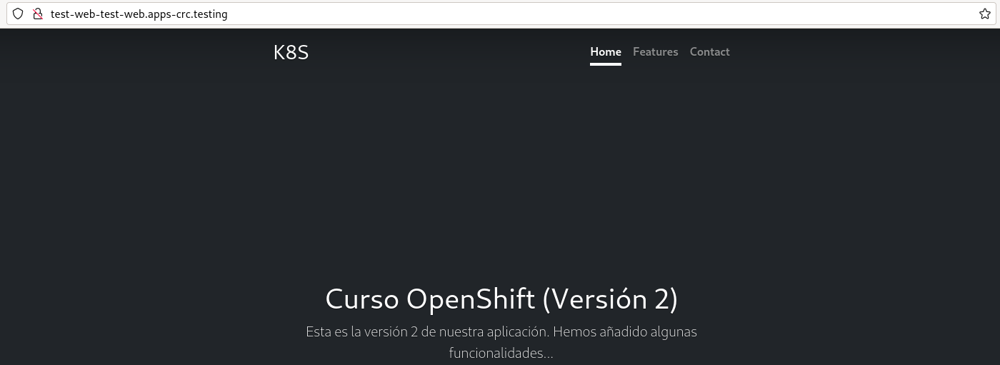

# Accediendo a las aplicaciones: ingress y routes

## Ingress

Aunque podríamos utilizar la definición de un recurso **ingress** para el acceso a la aplicación usando una URL, por ejemplo con un fichero `ingress.yaml`:

```yaml
apiVersion: networking.k8s.io/v1
kind: Ingress
metadata:
  name: ingress-test-web
spec:
  rules:
  - host: www.example.org
    http:
      paths:
      - path: /
        pathType: Prefix
        backend:
          service:
            name: test-web
            port:
              number: 8080
```

En la definición hemos iniciado los siguientes parámetros:

* `host`: Indicamos el nombre de host que vamos a usar para el acceso. Este nombre debe apuntar a la ip de un nodo del clúster.
* `path`: Indicamos el path de la url que vamos a usar, en este caso sería la ruta raíz: `/`. 
* `pathType`: No es importante, nos permite indicar cómo se van a trabajar con las URL. 
* `backend`: Indicamos el Service al que vamos a acceder. En este caso indicamos el nombre del Service (`service/name`) y el puerto del **Service** (`service/port/number`).

Y podríamos crear el recurso, ejecutando:

    oc apply -f ingress.yaml

**Nota:** Si estamos usando **OpenShift Dedicated Developer Sandbox**, no tenemos acceso a la dirección IP del nodo master del clúster, por lo que en nuestro servidor DNS no podemos asociar la URL con una dirección IP. De la misma manera, no podremos usar un recurso **Service** de tipo `NodePort`.

**En OpenShift se recomienda el uso de recursos Routes, que nos asignan de forma automática una URL que podemos usar directamente (está dada de alta en un servidor DNS)**.

## Route

La manera más sencilla de crear un recurso **Route** en OpenShift es ejecutando:

    oc expose service/test-web

También podemos definir el recurso en un fichero `route.yaml`, para crearlo a continuación con `oc apply`:

```yaml
apiVersion: route.openshift.io/v1
kind: Route
metadata:
  name: test-web
  labels:
    app: test-web
spec:
  to:
    kind: Service
    name: test-web
  port:
    targetPort: http
```

Ahora podemos ver los objetos routes que tenemos creados, ejecutando:

    oc get routes

Y obtener información de la ruta creada con el comando:

    oc describe route/test-web
    Name:			test-web
    Namespace:		test-web
    Created:		About a minute ago
    Labels:			app=test-web
    Annotations:		openshift.io/host.generated=true
    Requested Host:		test-web-test-web.apps.sandbox-m3.1530.p1.openshiftapps.com

    ...
    Service:	test-web
    Weight:		100 (100%)
    Endpoints:	10.128.43.128:8080, 10.128.51.189:8080

Podemos ver la URL que nos han asignado para el acceso (`Requested Host`), el servicio con el que esta conectado (`Service`) y cómo está balanceado la carga entre los Pods seleccionados por el servicio (`Endpoints`).

El formato de la URL que se ha generado es:

    <nombre_despliegue>-<nombre_namespace>-<url de acceso al clúster de openshift>

Podemos usar la URL para acceder a la aplicación:

