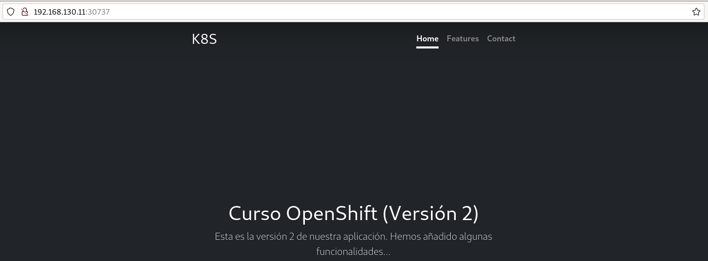

# Trabajando con Services

Suponemos que tenemos desplegado la aplicación `test-web` del capítulo anterior. Tenemos dos Pods ofreciendo el servidor web nginx, a los que queremos acceder desde el exterior y que se balancee la carga entre ellos.

## Service ClusterIP

Podríamos crear un recurso **Service** desde la línea de comandos:

    oc expose deployment/test-web 

También podemos describir las características del **Service** en un fichero yaml `service.yaml`:

```yaml
kind: Service
apiVersion: v1
metadata:
  name: test-web
  labels:
    app: test-web
spec:
  type: ClusterIP
  ports:
    - name: http
      port: 8080
      targetPort: 8080
  selector:
    app: test-web
```

Veamos la descripción:

* Vamos a crear un recurso **Service** (parámetro `kind`) y lo nombramos como `nginx` (parámetro `name`). Este nombre será importante para la resolución dns.
* En la especificación del recurso indicamos el tipo de **Service** (parámetro `type`).
* A continuación, definimos el puerto por el que va a ofrecer el **Service** y lo nombramos (dentro del apartado `port`: el parámetro `port` y el parámetro `name`). Además, debemos indicar el puerto en el que los Pods están ofreciendo el **Service** (parámetro `targetPort`)
* Por ultimo, seleccionamos los Pods a los que vamos acceder y vamos a balancear la carga seleccionando los Pods por medio de sus etiquetas (parámetro `selector`).

Podemos ver la información más detallada del **Service** que acabamos de crear:

    oc describe service/test-web
    Name:              test-web
    ...
    Selector:          app=test-web
    Type:              ClusterIP
    IP Family Policy:  SingleStack
    IP Families:       IPv4
    IP:                172.30.211.73
    IPs:               172.30.211.73
    Port:              http  8080/TCP
    TargetPort:        8080/TCP
    Endpoints:         10.128.43.128:8080,10.128.51.189:8080
    ...

* Podemos ver la etiqueta de los Pods a los que accede (`Selector`). 
* El tipo de **Service** (`Type`). La IP virtual que ha tomado (CLUSTER-IP) y que es accesible desde el cluster (`IP`). 
* El puerto por el que ofrece el **Service** (`Port`). 
* El puerto de los Pods a los que redirige el tráfico (`TargetPort`).
* Y por último, podemos ver las IPs de los Pods que ha seleccionado y sobre los que balanceará la carga (`Endpoints`).

## Services NodePort

La definición de un **Service** de tipo `NodePort` sería exactamente igual, pero cambiando el parámetro `type`. Por ejemplo, lo tenemos definido en el fichero `service-np.yaml`:

```yaml
kind: Service
apiVersion: v1
metadata:
  name: test-web-np
  labels:
    app: test-web
spec:
  type: NodePort
  ports:
    - name: http
      port: 8080
      targetPort: 8080
  selector:
    app: test-web
```

Creamos el recurso:

    oc apply -f service-np.yaml

Para ver los **Services** que tenemos creado:

    oc get services

    NAME          TYPE        CLUSTER-IP     EXTERNAL-IP   PORT(S)          AGE
    test-web      ClusterIP   10.217.4.144   <none>        8080/TCP         7s
    test-web-np   NodePort    10.217.5.209   <none>        8080:30737/TCP   4s

Recuerda que si usamos `oc get all` también se mostrarán los **Services**.

Vamos a acceder a la aplicación, necesitamos saber la dirección IP del nodo master del clúster, para ello ejecuto:

    crc ip
    192.168.130.11

Por lo tanto para acceder necesito esa dirección IP y el puerto que se ha asignado al **Service** `NodePort`, en nuestro caso `30737`:



Para eliminar el **Service**, ejecutamos:

    oc delete service/test-web-np

