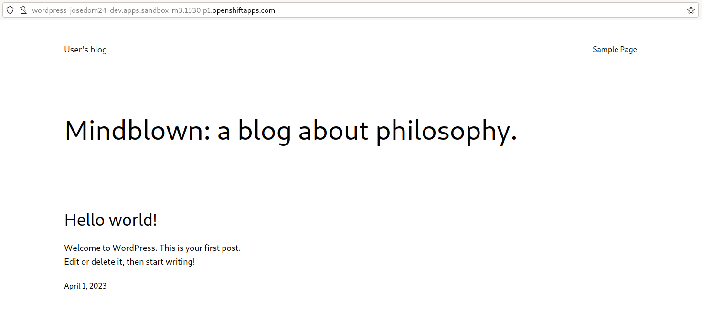
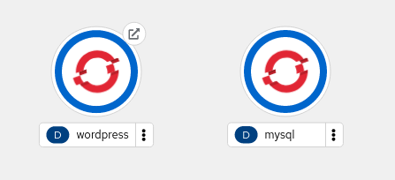

# Ejemplo completo: Despliegue y acceso a Wordpress + MySql

En este ejemplo vamos a desplegar la aplicación Wordpress, para ello será necesario realizar dos despliegues: uno para ejecutar los Pods que sirven la aplicación, y otro para desplegar la base de datos MySql necesaria para el funcionamiento. Veamos algunos aspectos antes de empezar:

* Como hemos estudiado en los ejemplos vistos en este módulo, al crear el despliegue de MySql tendremos que configurar las siguientes variables de entorno: `MYSQL_ROOT_PASSWORD` (contraseña del usuario root de la base de datos), `MYSQL_DATABASE` (el nombre de la base de datos que se va a crear), `MYSQL_USER` (nombre del usuario de la base de datos que se va carear), `MYSQL_PASSWORD` (contraseña de este usuario).
* Si comprobamos la documentación de la imagen [bitnami/wordpress en Docker Hub](https://hub.docker.com/r/bitnami/wordpress/) las variables de entorno que vamos a definir son las siguientes: `WORDPRESS_DATABASE_HOST` (la dirección del servidor de base de datos), `WORDPRESS_DATABASE_USER` (el usuario que se va a usar para acceder a la base de datos), `WORDPRESS_DATABASE_PASSWORD` (la contraseña de dicho usuario) y `WORDPRESS_DATABASE_NAME` (el nombre de la base de datos a las que vamos a conectar para gestionar las tablas de Wordpress).
* El valor de la variable `WORDPRESS_DATABASE_HOST` será el nombre del Service que creemos para acceder a la base de datos, como ya hemos estudiado, se creará un registro en el DNS del cluster que permitirá que Wordpress acceda a la base de datos usando el nombre del Service.
* Los valores de las credenciales para el acceso a la base de datos, las vamos a guardar en dos recursos de nuestro cluster:: los datos no sensibles (nombre de usuario y nombre de la base de datos) lo guardaremos en un ConfigMap y los datos sensibles, las contraseñas, la guardaremos en un Secret.

## Creación del ConfigMap y el Secret

    oc create cm wordpress-cm --from-literal=bd_user=user_wordpress \
                               --from-literal=bd_name=wordpress

    oc create secret generic wordpress-secret --from-literal=bd_password=password1234 \
                                               --from-literal=bd_rootpassword=root1234

Podríamos usar los ficheros con al definición de los recursos. El fichero `configmap.yaml`:

```yaml
apiVersion: v1
kind: ConfigMap
metadata:
  name: wordpress-cm
data:
  bd_name: wordpress
  bd_user: user_wordpress
```

Y el fichero `secret.yaml`:

```yaml
apiVersion: v1
kind: Secret
metadata:
  name: wordpress-secret
data:
  bd_password: cGFzc3dvcmQxMjM0
  bd_rootpassword: cm9vdDEyMzQ=
```

Y creamos los recursos ejecutando:

    oc apply -f configmap.yaml
    oc apply -f secret.yaml

## Despliegue de la base de datos MySql

Utilizamos el fichero de despliegue `mysql-deployment.yaml`:

```yaml
apiVersion: apps/v1
kind: Deployment
metadata:
  name: mysql
  labels:
    app: wordpress
    type: database
spec:
  replicas: 1
  selector:
    matchLabels:
      app: wordpress
  template:
    metadata:
      labels:
        app: wordpress
        type: database
    spec:
      containers:
        - name: contenedor-mysql
          image: bitnami/mysql
          ports:
            - containerPort: 3306
              name: db-port
          env:
            - name: MYSQL_USER
              valueFrom:
                configMapKeyRef:
                  name: wordpress-cm
                  key: bd_user
            - name: MYSQL_DATABASE
              valueFrom:
                configMapKeyRef:
                  name: wordpress-cm
                  key: bd_name
            - name: MYSQL_PASSWORD
              valueFrom:
                secretKeyRef:
                  name: wordpress-secret
                  key: bd_password
            - name: MYSQL_ROOT_PASSWORD
              valueFrom:
                secretKeyRef:
                  name: wordpress-secret
                  key: bd_rootpassword
```

Y la definición del recurso Service, en el fichero `mysql-service.yaml`:

```yaml
apiVersion: v1
kind: Service
metadata:
  name: mysql
  labels:
    app: wordpress
    type: database
spec:
  selector:
    app: wordpress
    type: database
  ports:
  - port: 3306
    targetPort: db-port
  type: ClusterIP
```

Creamos los dos recursos:

    oc apply -f mysql-deployment.yaml
    oc apply -f mysql-service.yaml

## Despliegue de Wordpress

En este caso usaremos la definición del despliegue que tenemos en el fichero `wordpress-deployment.yaml`:

```yaml
apiVersion: apps/v1
kind: Deployment
metadata:
  name: wordpress
  labels:
    app: wordpress
    type: frontend
spec:
  replicas: 1
  selector:
    matchLabels:
      app: wordpress
      type: frontend
  template:
    metadata:
      labels:
        app: wordpress
        type: frontend
    spec:
      containers:
        - name: contenedor-wordpress
          image: bitnami/wordpress
          ports:
            - containerPort: 8080
              name: http-port
            - containerPort: 443
              name: https-port
          env:
            - name: WORDPRESS_DATABASE_HOST
              value: mysql
            - name: WORDPRESS_DATABASE_NAME
              valueFrom:
                configMapKeyRef:
                  name: wordpress-cm
                  key: bd_name
            - name: WORDPRESS_DATABASE_USER
              valueFrom:
                configMapKeyRef:
                  name: wordpress-cm
                  key: bd_user
            - name: WORDPRESS_DATABASE_PASSWORD
              valueFrom:
                secretKeyRef:
                  name: wordpress-secret
                  key: bd_password
            
```

Y el Service definido en `wordpress-service.yaml`:

```yaml
apiVersion: v1
kind: Service
metadata:
  name: wordpress
  labels:
    app: wordpress
    type: frontend
spec:
  selector:
    app: wordpress
    type: frontend
  ports:
  - name: http-sv-port
    port: 8080
    targetPort: http-port
  - name: https-sv-port
    port: 443
    targetPort: https-port
  type: ClusterIP
```

Ejecutamos:

    oc apply -f wordpress-deployment.yaml
    oc apply -f wordpress-service.yaml

Además como al despliegue de Wordpress necesitamos acceder desde el exterior, vamos a crear un recurso Route:

    oc expose service/wordpress

## Comprobaciones finales

Finalmente visualizamos todos los recursos que hemos creado:

    oc get all
    NAME                             READY   STATUS    RESTARTS   AGE
    pod/mysql-547989d679-2ws9s       1/1     Running   0          90s
    pod/wordpress-64bfd486d5-75l7v   1/1     Running   0          62s

    NAME                        TYPE        CLUSTER-IP       EXTERNAL-IP   PORT(S)                               AGE
    service/modelmesh-serving   ClusterIP   None             <none>        8033/TCP,8008/TCP,8443/TCP,2112/TCP   8d
    service/mysql               ClusterIP   172.30.221.14    <none>        3306/TCP                              82s
    service/wordpress           ClusterIP   172.30.187.161   <none>        8080/TCP,443/TCP                      51s

    NAME                        READY   UP-TO-DATE   AVAILABLE   AGE
    deployment.apps/mysql       1/1     1            1           90s
    deployment.apps/wordpress   1/1     1            1           62s

    NAME                                   DESIRED   CURRENT   READY   AGE
    replicaset.apps/mysql-547989d679        1         1         1       90s
    replicaset.apps/wordpress-64bfd486d5   1         1         1       62s

    NAME                                 HOST/PORT                                                           PATH   SERVICES    PORT           TERMINATION   WILDCARD
    route.route.openshift.io/wordpress   wordpress-josedom24-dev.apps.sandbox-m3.1530.p1.openshiftapps.com          wordpress   http-sv-port                 None

Y podemos acceder a la URL generada para que comprobar que el Wordpress está funcionando:



Si accedemos a la consola web, podremos gestionar todos los recursos de la aplicación, por ejemplo en la topología tendremos la representación de los despliegues que hemos creado:

