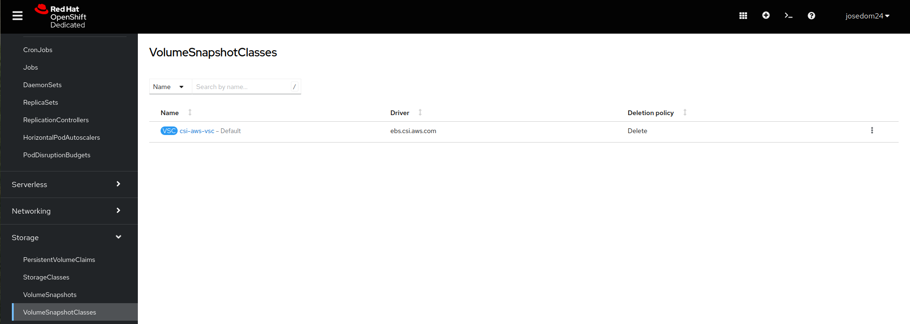

# Instantáneas de volúmenes

Un recurso **VolumeSnapshot** representa una instantánea de un volumen en un sistema de almacenamiento. Las instantáneas de volumen nos proporciona una forma estandarizada de copiar el contenido de un volumen en un momento determinado sin crear un volumen completamente nuevo.

Realmente un recurso **VolumeSnapshot** es una solicitud de instantánea de un volumen por parte de un usuario. Será necesio tener configurado un recurso **VolumeSnapshotClass**, donde el administrador del clúster habrá configurado diferentes características sobre al almacenamiento que está utilizando para que se realicen las instantáneas.

Eb la consola web, en la vista de **Administrator**, el apartado **Storage -> VolumeSnapshotClasses**, podemos ver los recursos **VolumeSnapshotClasses** que están definido en este clúster:

Continuamos con en el ejemplo anterior, donde habíamos creado un objeto 