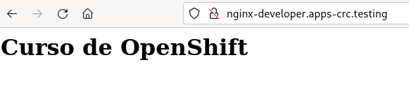

# Aprovisionamiento dinámico de volúmenes

En este ejemplo vamos a desplegar un servidor web que va a servir una página html que tendrá almacenada en un volumen. La asignación del volumen se va a realizar de forma dinámica.

Como vimos en RedHat OpenShift Dedicated Developer Sandbox tenemos configurado varios recursos StrogaClass, que son los que de una forma dinámica crear el nuevo volumen y lo asocian a la petición de volumen que vamos a realizar.

    oc get storageclass
    NAME            PROVISIONER             RECLAIMPOLICY   VOLUMEBINDINGMODE      ALLOWVOLUMEEXPANSION   AGE
    gp2             kubernetes.io/aws-ebs   Delete          WaitForFirstConsumer   true                   143d
    gp2-csi         ebs.csi.aws.com         Delete          WaitForFirstConsumer   true                   143d
    gp3 (default)   ebs.csi.aws.com         Delete          WaitForFirstConsumer   true                   143d
    gp3-csi         ebs.csi.aws.com         Delete          WaitForFirstConsumer   true                   143d      

## Solicitud del volumen

Vamos a realizar la solicitud de volumen, en este caso usaremos el fichero `pvc.yaml`:

```yaml
apiVersion: v1
kind: PersistentVolumeClaim
metadata:
    name: my-pvc
spec:
  accessModes:
    - ReadWriteOnce
  resources:
    requests:
      storage: 1Gi
```

Al crear el objeto **PersistentVolumenClaim (PVC)**, veremos que se queda en estado Pending, no se creará el objeto **PersistentVolume (PV)** hasta que no lo vayamos a usar por primera vez:

    oc apply -f pvc.yaml 

    oc get pvc
    NAME     STATUS    VOLUME   CAPACITY   ACCESS MODES   STORAGECLASS   AGE

    oc describe pvc my-pvc
    Name:          my-pvc
    Namespace:     josedom24-dev
    StorageClass:  gp3
    Status:        Pending
    Volume:        
    Labels:        <none>
    Annotations:   <none>
    Finalizers:    [kubernetes.io/pvc-protection]
    Capacity:      
    Access Modes:  
    VolumeMode:    Filesystem
    Used By:       <none>
    Events:
      Type    Reason                Age               From                         Message
      ----    ------                ----              ----                         -------

## Uso del volumen

Creamos el Deployment usando el `fichero deployment.yaml`:

```yaml
apiVersion: apps/v1
kind: Deployment
metadata:
  name: nginx
  labels:
    app: nginx
spec:
  replicas: 1
  selector:
    matchLabels:
      app: nginx
  template:
    metadata:
      labels:
        app: nginx
    spec:
      containers:
      - image: bitnami/nginx
        name: contenedor-nginx
        ports:
        - name: http
          containerPort: 8080
        volumeMounts:
        - name: my-volumen
          mountPath: /app
        securityContext:
            runAsNonRoot: true
            allowPrivilegeEscalation: false
            seccompProfile:
              type: RuntimeDefault
            capabilities:
              drop:
              - ALL
      volumes:
      - name: my-volumen
        persistentVolumeClaim:
          claimName: my-pvc
```

* En la especificación del Pod, además de indicar el contenedor, hemos indicado que va a tener un volumen (campo `volumes`). 
* En realidad definimos una lista de volúmenes (en este caso solo definimos uno) indicando su nombre (`name`) y la solicitud del volumen (`persistentVolumeClaim`, `claimName`).
* Además en la definición del contenedor tendremos que indicar el punto de montaje del volumen (`volumeMounts`) señalando el directorio del contenedor (`mountPath`) y el nombre (`name`).

Creamos el Deployment:


    oc apply -f deployment.yaml

Y a continuación, cuando el contenedor esté funcionando, creamos el fichero `index.html`:

    oc exec deploy/nginx -- bash -c "echo '<h1>Curso de OpenShift</h1>' > /app/index.html"

Finalmente creamos el Service y el Route para acceder al despliegue:

    oc expose deploy/nginx
    oc expose service/nginx



Finalmente podemos comprobar que la información de la aplicación no se pierde borrando el Deployment y volviéndolo a crear, comprobando que se sigue sirviendo el fichero `index.html`.

## Escalando el despliegue

Veamos una característica del tipo de volumen que estamos usando. El modo de acceso del volumen AWS EBS es **ReadWriteOnce**. Es decir, se puede montar en modo lectura y escritura en un sólo contenedor que se esté ejecutando en un nodo del clúster. 

Si escalamos el despliegue:

    oc scale deploy/nginx --replicas=2
    oc get pod
    NAME                     READY   STATUS              RESTARTS   AGE
    nginx-5676d5ddc6-5xzkw   1/1     Running             0          7m14s
    nginx-5676d5ddc6-rjs4x   0/1     ContainerCreating   0          15s
 
    oc describe pod nginx-5676d5ddc6-rjs4x
    ...
    Events:
      Type     Reason              Age   From                     Message
      ----     ------              ----  ----                     -------
      Normal   Scheduled           24s   default-scheduler        Successfully assigned josedom24-dev/nginx-5676d5ddc6-rjs4x to ip-10-0-136-61.ec2.internal
      Warning  FailedAttachVolume  24s   attachdetach-controller  Multi-Attach error for volume "pvc-4b828a1b-8977-4cde-bcf3-36dead6c0c06" Volume is already used by pod(s) nginx-5676d5ddc6-5xzkw

Es decir, el segundo Pod se va a quedar en estado **ContainerCreating** porque las caracteríosticas del volumen que estamos usando no permiten conectarlos a dos Pods al mismo tiempo. Para ello, es decir, para tener almacenamiento compartido entre varios Pods, tendríamos que tener volúmenes con modo de acceso: **ReadOnlyMany**, de sólo lectura, o **ReadWriteMany**, de lectura y escritura.

## Eliminación del volumen

En este caso, los volúmenes que crea de forma dinámica el StorageClass tiene como política de reciclaje el valor de `Delete`. Esto significa que cuando eliminemos la solicitud, el objeto **PersistentVolumeClaim**, también se borrará el volumen, el objeto **PersistentVolume**.

    oc delete deploy/nginx
    oc delete persistentvolumeclaim/my-pvc
