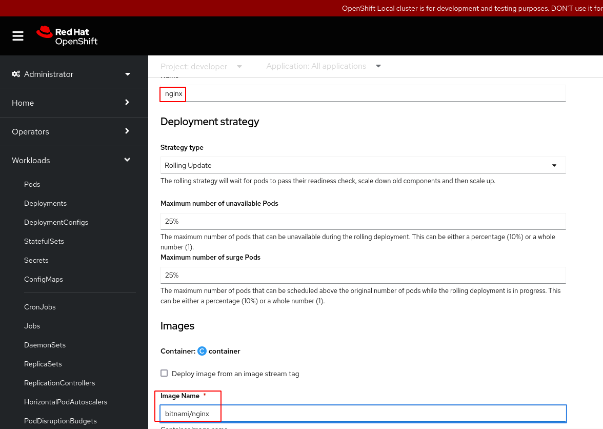
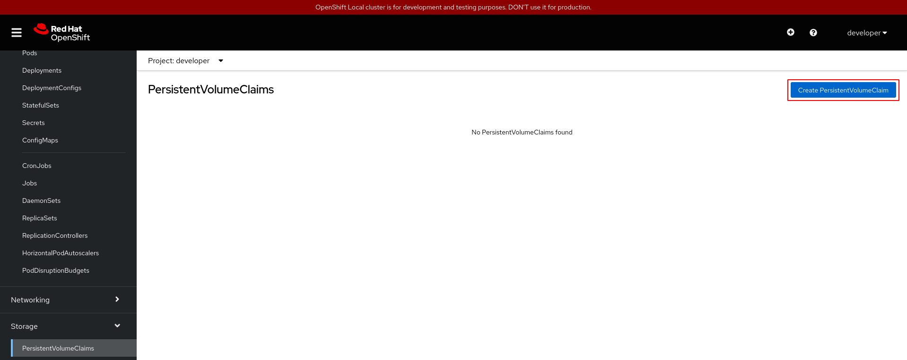
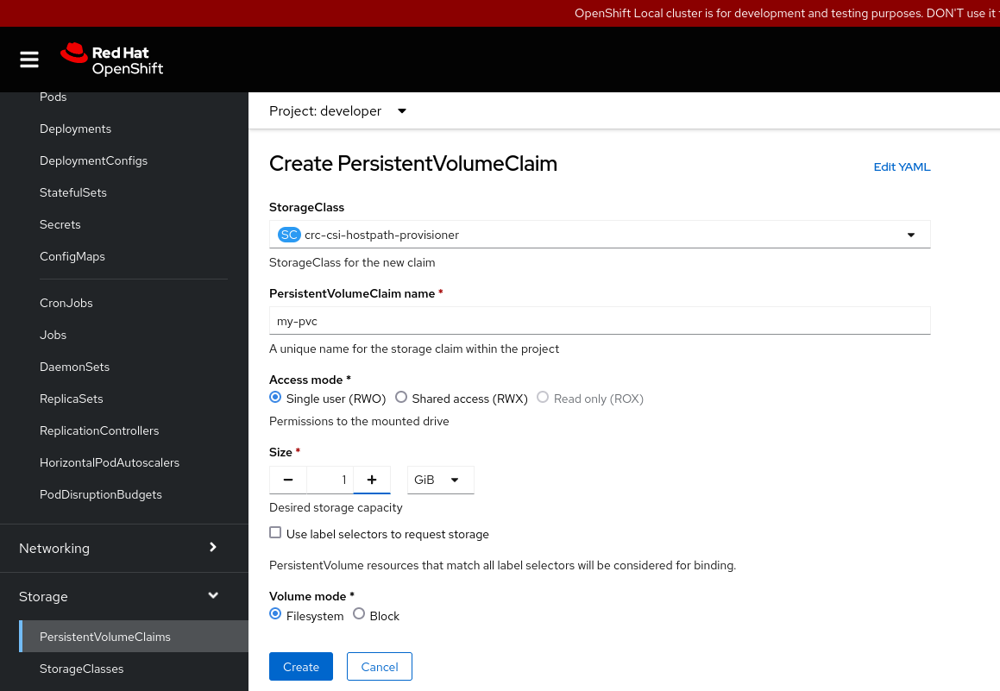
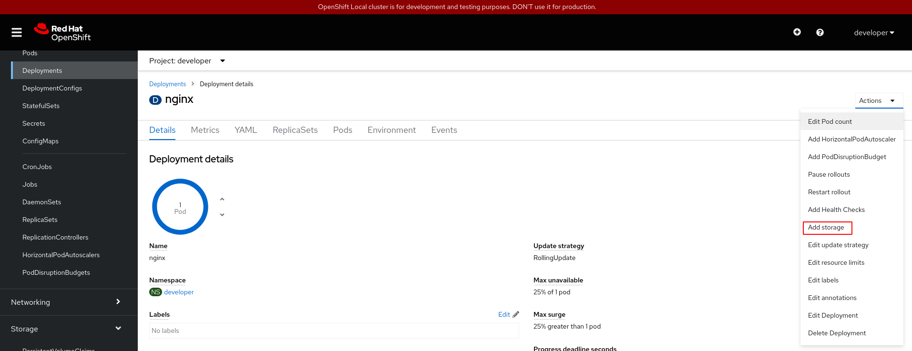
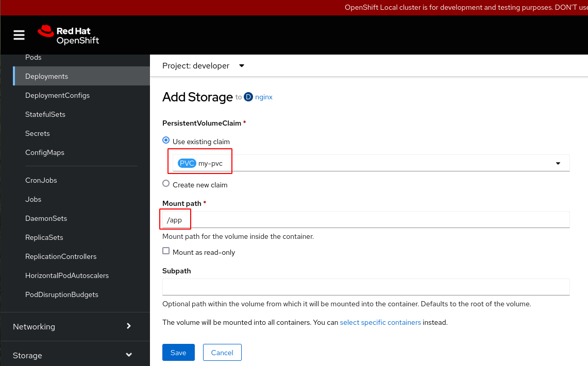
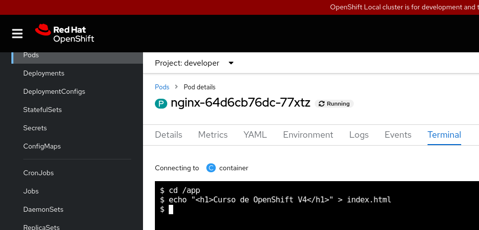

# Gestionando el almacenamiento desde la consola web

## Gestionando el almacenamiento desde la consola web como usuario sin privilegios

Vamos a repetir el ejemplo visto en el punto anterior desde la consola web, con el usuario `developer` trabajdno en el mismo proyecto `developer`.

Lo primero será crear un objeto **Deployment**, para ello desde la vista **Administrator**, escogemos el apartado **Workloads -> Deployments** y pulsamos sobre el botón **Create Deployment**:

Creamos el **Deployment** desde el formulario, indicando el nombre (`nginx`), la imagen (`bitnami/nginx`):

Los recursos relacionados con el almacenamiento lo encontramos en la vista de **Administrator**, el apartado **Storage**. Por ejemplo en el apartado **StorageClasses** encontramos los recursos de este tipo definidos en este clúster:

En el apartado **PersistentVolumeClaims** podemos gestionar este tipo de recursos, pulsando en el botón **Create PersistentVolumeClaim**, podemos crear un nuevo objeto:

Creamos la solicitud de almacenamiento desde el formulario, indicando el nombre, el modo de acceso y el tamaño entre otras propiedades:

Podemos ver la lista de recursos **PersistentVolumenClaim (PVC)**:

Ahora tenemos que añadir a nuestro **Deployment**, el almacenamiento que hemos solicitado, para ello nos vamos al detalle del recurso **Deployment** y escogemos la acción **Add storage**:

Indicando el recurso **PersistentVolumenClaim (PVC)** que vamos a asociar, y el punto de montaje:

Como ha cambiado la definición del objeto, se crear un nuevo Pod con la nueva definición:

A continuación, creamos el fichero `index.html` desde un terminal del Pod que se está ejecutando:

Y podemos acceder a la aplicación usando los recursos **Serviice** y **Route** del aparatado anterior y comprobamos que está funcionando de forma adecuada:

