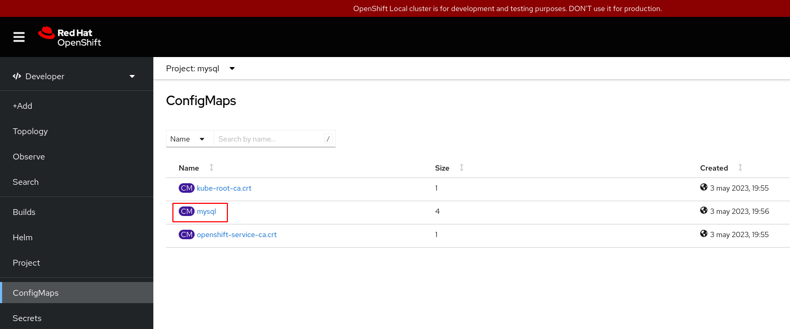
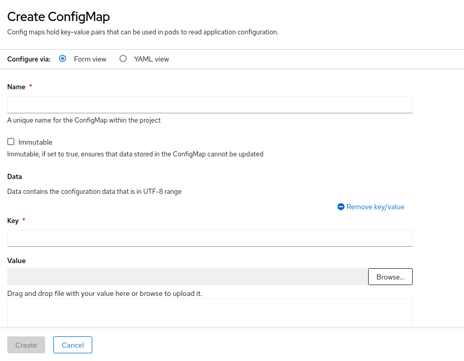
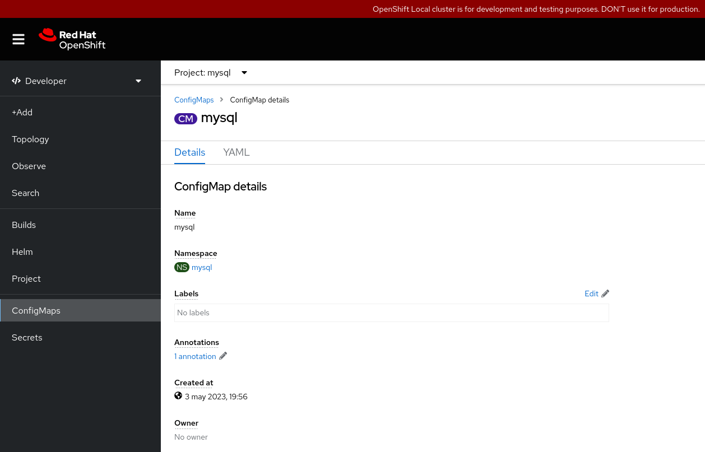
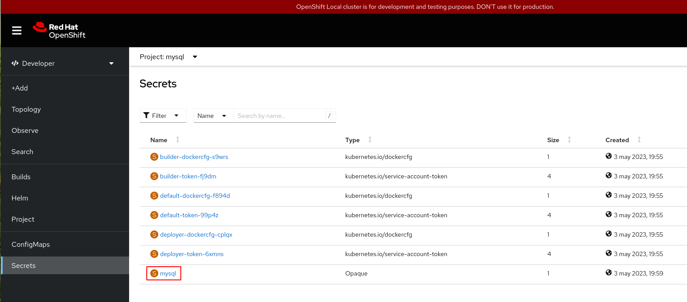
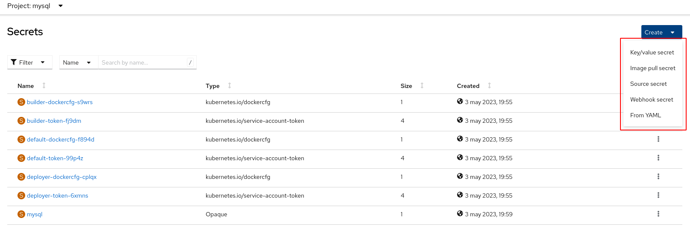
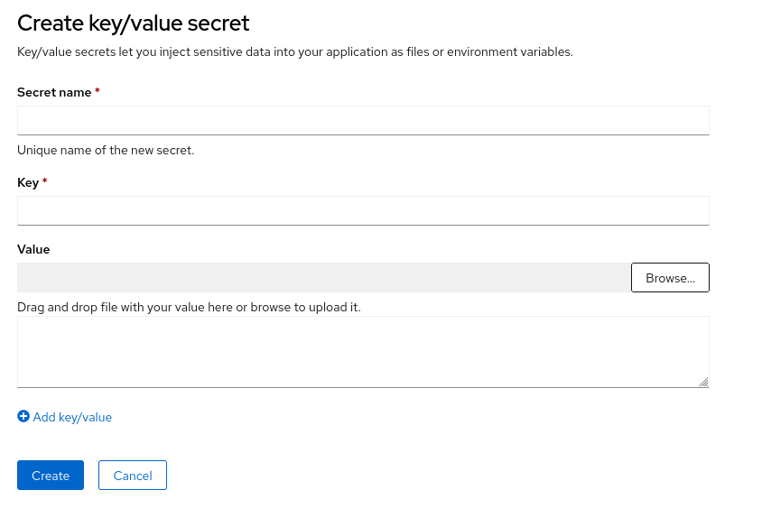
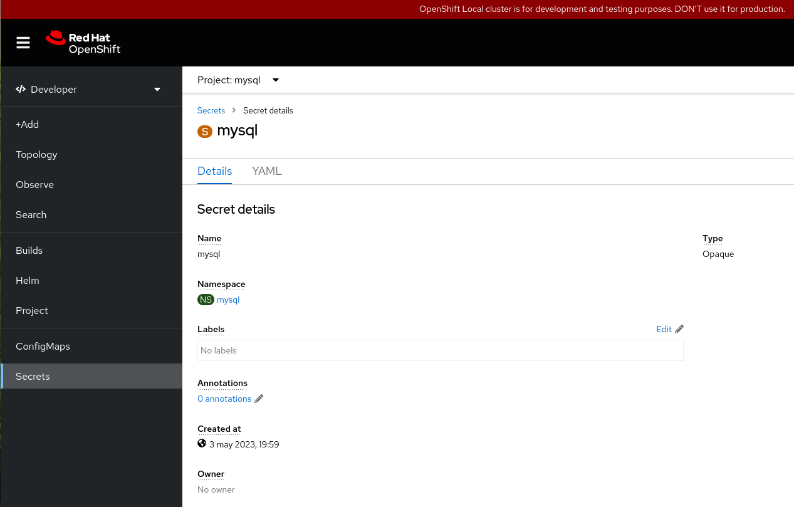
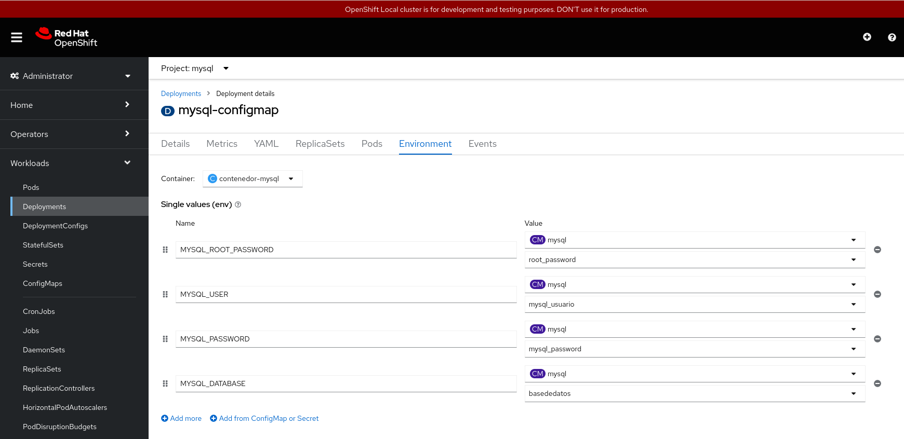
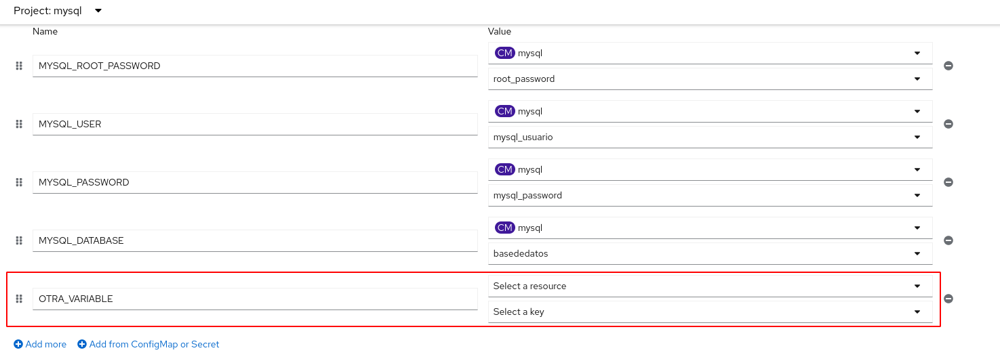

# Gestionando las variables de entorno, los ConfigMap y los Secret desde la consola web

## ConfigMap

Para gestionar **ConfigMap** tenemos varias opciones: vista **Developer**, apartado **ConfigMaps**. también puedes escoger vista **Administrator**, apartado **Workloads -> ConfigMaps**:

En esa ventana tenemos las distintas opciones que podemos realizar sobre un **ConfigMap**, además tenemos la opción de crear uno nuevo pulsando el botón **Create ConfigMap** (tendremos la opción de crearlo a partir de un formulario o a partir de la definición YAML del recurso):

Si escogemos un **ConfigMap** de la lista, obtendremos los detalles del mismo:

Además en esta pantalla, tenemos una pestaña llamada **YAML** que nos permite editar la configuración del recurso.

## Secret

De la misma forma podemos gestionar los recursos **Secrets**. También tendríamos varias formas de acceder a su gestión: vista **Developer**, apartado **Secrets** o desde la vista **Administrator**, apartado **Workloads -> Secrets**:

Vemos en esta pantalla las distintas opciones que podemos realizar sobre un **Secret** determinado. Además, comprobamos que a la hora de crear un nuevo **Secret** con el botón **Create Secret**, tenemos varias posibilidades:

Por ejemplo, si escogemos las opción **Key/value secret**, tendremos un formulario que nos facilita la creación del recurso:

Si escogemos un **Secret** particular, obtendremos los detalles del mismo:

Y podremos editar la configuración del recurso, en la pestaña **YAML**.

## Variables de entorno

Si escogemos un despliegue para obtener información detallada, podremos ver las variables de entorno que tienen definido los contenedores de los Pods que controla accediendo al apartado **Environment**:

Podremos añadir nuevas variables de entorno, pudiendo indicar un valor concreto, o indicando la clave del **ConfigMap** o del **Secret** donde tiene que obtener el valor:

