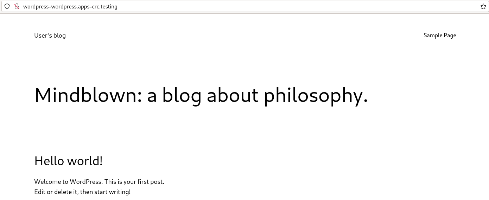
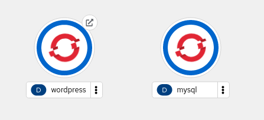

# Ejemplo completo: Haciendo persistente la aplicación Wordpress

En este ejemplo vamos a volver e realizar el depliege de Wordparess +  MySql, pero añadiendo el almacenamiento necesario para que la aplicación sea persistente.

Para llevar a cabo esta tarea necesitaremos tener a nuestra disposición dos volúmenes:

* Uno para guardar la información de Wordpress.
* Otro para guardar la información de MySql.

## Creación de los volúmenes necesarios

Como hemos comentado vamos a usar la asignación dinámica de volúmenes, por lo tanto tendremos que crear dos objetos **PersistentVolumenClaim** para solicitar los dos volúmenes.

Para solicitar el volumen para la aplicación Wordpress usaremos el fichero `wordpress-pvc.yaml`:

```yaml
apiVersion: v1
kind: PersistentVolumeClaim
metadata:
    name: wordpress-pvc
spec:
  accessModes:
    - ReadWriteOnce
  resources:
    requests:
      storage: 5Gi
```

Y para solicitar el volumen para la base de datos usaremos un fichero similar: `mariadb-pvc.yaml`:

```yaml
apiVersion: v1
kind: PersistentVolumeClaim
metadata:
    name: mysql-pvc
spec:
  accessModes:
    - ReadWriteOnce
  resources:
    requests:
      storage: 5Gi
```

Creamos las solicitudes ejecutando:


    oc apply -f wordpress-pvc.yaml
    oc apply -f mariadb-pvc.yaml


## Modificación de los Deployments para el uso de los volúmenes

Para el despliegue de Wordpress vamos a usar el fichero `wordpress-deployment.yaml`:

```yaml
apiVersion: apps/v1
kind: Deployment
metadata:
  name: wordpress
  labels:
    app: wordpress
    type: frontend
spec:
  replicas: 1
  selector:
    matchLabels:
      app: wordpress
      type: frontend
  template:
    metadata:
      labels:
        app: wordpress
        type: frontend
    spec:
      containers:
        - name: contenedor-wordpress
          image: bitnami/wordpress
          volumeMounts:
            - name: wordpress-data
              mountPath: /bitnami/wordpress
          ports:
            - containerPort: 8080
              name: http-port
            - containerPort: 443
              name: https-port
          env:
            - name: WORDPRESS_DATABASE_HOST
              value: mysql
            - name: WORDPRESS_DATABASE_NAME
              valueFrom:
                configMapKeyRef:
                  name: wordpress-cm
                  key: bd_name
            - name: WORDPRESS_DATABASE_USER
              valueFrom:
                configMapKeyRef:
                  name: wordpress-cm
                  key: bd_user
            - name: WORDPRESS_DATABASE_PASSWORD
              valueFrom:
                secretKeyRef:
                  name: wordpress-secret
                  key: bd_password
      volumes:
        - name: wordpress-data
          persistentVolumeClaim:
            claimName: wordpress-pvc      
```

Como observamos vamos a usar el volumen asociado al PersistentVolumenClaim `wordpress-pvc` y que lo vamos a montar en el directorio *DocumentRoot* del servidor web: `/bitnami/wordpress`.

De forma similar, tenemos el fichero `mariadb-deployment.yaml` para deplegar la base de datos:

```yaml
apiVersion: apps/v1
kind: Deployment
metadata:
  name: mysql
  labels:
    app: wordpress
    type: database
spec:
  replicas: 1
  selector:
    matchLabels:
      app: wordpress
  template:
    metadata:
      labels:
        app: wordpress
        type: database
    spec:
      containers:
        - name: contenedor-mysql
          image: bitnami/mysql
          volumeMounts:
            - name: mysql-data
              mountPath: /bitnami/mysql/data
          ports:
            - containerPort: 3306
              name: db-port
          env:
            - name: MYSQL_USER
              valueFrom:
                configMapKeyRef:
                  name: wordpress-cm
                  key: bd_user
            - name: MYSQL_DATABASE
              valueFrom:
                configMapKeyRef:
                  name: wordpress-cm
                  key: bd_name
            - name: MYSQL_PASSWORD
              valueFrom:
                secretKeyRef:
                  name: wordpress-secret
                  key: bd_password
            - name: MYSQL_ROOT_PASSWORD
              valueFrom:
                secretKeyRef:
                  name: wordpress-secret
                  key: bd_rootpassword
      volumes:
        - name: mysql-data
          persistentVolumeClaim:
            claimName: mysql-pvc
```
En esta ocasión usaremos el volumen asociado a `mysql-pvc` y el punto de montaje se hará sobre el directorio donde se guarda la información de la base de datos: `/bitnami/mysql/data`.

Creamos los recursos necesarios:

    oc apply -f configmap.yaml
    oc apply -f secret.yaml
    oc apply -f mysql-deployment.yaml
    oc apply -f mysql-service.yaml
    oc apply -f wordpress-deployment.yaml
    oc apply -f wordpress-service.yaml
    oc expose service/wordpress

Acedemos a la aplicación, y usando el usuario y la contraseña por defecto (`user` y `bitnami`) creamos un nuevo post en el blog:



## Comprobando la persistencia de la información

Si en cualquier momento tenemos que eliminar o actualizar uno de los despliegues, podemos comprobar que la información sigue existiendo después de volver a crear los Deployments:


    oc delete -f mysql-deployment.yaml
    oc delete -f wordpress-deployment.yaml
    
    oc apply -f mariadb-deployment.yaml
    oc apply -f wordpress-deployment.yaml


Si volvemos acceder, comprobamos que la aplicación sigue funcionando con toda la información:


