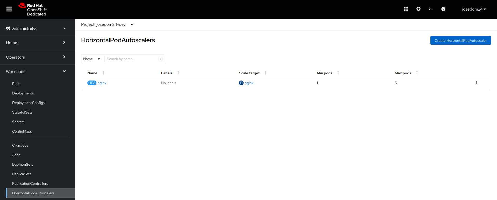
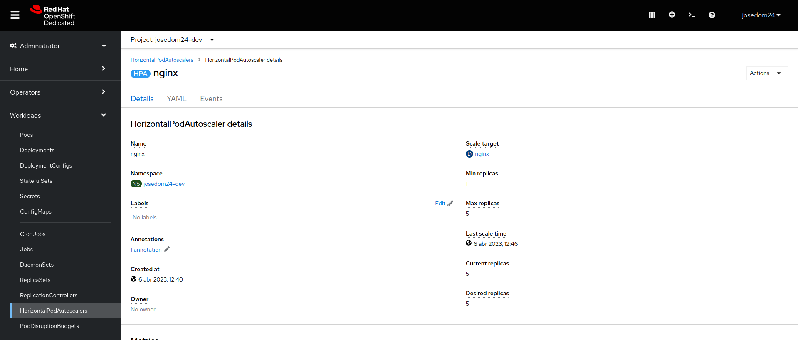

# Horizontal Pod AutoScaler

El recurso **Horizontal Pod AutoScaler** nos permite variar el número de *ods desplegados mediante un deployment en función de diferentes métricas: por ejemplo el uso de la CPU o la memoria.

En este ejemplo vamos a desplegar un servidor web y le vamos asociar un recurso **Horizontal Pod AutoScaler** que permitirá autoescalar el despliegue por el el uso de la CPU.

En primer lugar, vamos a crear el recurso Deployment que tenemos definido en el fichero `deployment-hpa.yaml`:

```yaml
apiVersion: apps/v1
kind: Deployment
metadata:
  name: nginx
  labels:
    app: nginx
spec:
  replicas: 1
  selector:
    matchLabels:
      app: nginx
  template:
    metadata:
      labels:
        app: nginx
    spec:
      containers:
      - name: nginx
        image: bitnami/nginx
        ports:
        - containerPort: 8080
        resources:
          requests:
            cpu: "200m"
            memory: "64Mi"
          limits:
            cpu: "500m"
            memory: "128Mi"
```

En este ejemplo, hemos indicado los recursos que necesita el contenedor:

* **requests**: Es la cantidad mínima de recursos que un contenedor necesita para poder funcionar correctamente. Kubernetes garantiza que los nodos en los que se ejecuten los Pods reserven al menos los recursos solicitados. Si no hay suficientes recursos disponibles, Kubernetes no planificará el Pod en ese nodo.
* **limits**: Es la cantidad máxima de recursos que un contenedor puede utilizar. Kubernetes impone estos límites para evitar que un contenedor utilice más recursos de los que realmente necesita. Si un contenedor intenta utilizar más recursos que los límites especificados, Kubernetes limitará su uso de recursos.

Vemos que hemos reservado para cada Pod 200m (**200 milicpus**). En kubernetes y openshift, la unidad de CPU se llama "CPU" o "core", y se expresa como una fracción de un núcleo de CPU completo.  La unidad de medida "milicpu" (mCPU) es una fracción de una CPU. Si un contenedor necesita 200 milicpus, solicita 0.2 CPU o 1/5 de un núcleo de CPU. 

Ahora asignamos el recurso **Horizontal Pod AutoScaler**, que tenemos definido en el fichero `hpa.yaml`:

```yaml
apiVersion: autoscaling/v2
kind: HorizontalPodAutoscaler
metadata:
  name: nginx
spec:
  scaleTargetRef:
    apiVersion: apps/v1
    kind: Deployment
    name: nginx
  minReplicas: 1
  maxReplicas: 5
  metrics:
    - type: Resource
      resource:
        name: cpu
        target:
          averageUtilization: 50
          type: Utilization
```

* Indicamos el Deployment con el que está relacionado, parámetro `scaleTargetRef`.
* Indicamos el número máximo y mínimo de Pods que va a controlar: `minReplicas` y `maxReplicas`.
* Y en este ejemplo indicamos el objetivo que hay que alcanzar para que se produzca la creación automática de nuevos Pods. Lo indicamos con el parámetro `metrics`.
* El parámetro `targetCPUUtilizationPercentage` define el objetivo de uso de la CPU para el pod. Es decir, si su valor es 50%:
    * Si el uso de la CPU del Pod es menor al 50%, el HPA puede intentar escalar hacia abajo el número de réplicas del Pod para ahorrar recursos. 
    * Si el uso de la CPU del Pod es mayor al 50%, el HPA puede intentar escalar hacia arriba el número de réplicas para manejar la carga.

Creamos el despliegue, creamos el recurso **Horizontal Pod AutoScaler** y creamos un recurso Service y un recurso Route para acceder al servicio:

    oc apply -f deployment-hpa.yaml
    oc apply -f hpa.yaml
    oc expose deploy/nginx
    oc expose service/nginx

Vamos a comprobar si funciona el HPA, para ello vamos a usar la herramienta Apache Benchmark (`ab`) (en sistemas operativos DEbian/ubuntu esta herramienta se encuentra en el paquete `apache2-utils`) para realizar peticiones al servidor web. 

En una terminal, podemos monitorizar la creación de Pods:

    watch oc get pod

En otro terminal podemos obtener información del recurso HPA:

    watch oc get hpa/nginx

Y en otro terminal, podemos ejecutar la herramienta `ab`, podemos hacer 100000 peticiones con 100 concurrentes:

    ab -n 100000 -c 100 -k http://nginx-josedom24-dev.apps.sandbox-m3.1530.p1.openshiftapps.com/index.html

Esperamos unos minutos hasta que las métricas empiezan a ofrecer resultado y el campo `TARGETS` del recurso **Horizontal Pod AutoScaler** empiece a aumentar. 


## Gestión de recursos Horizontal Pod AutoScaler desde el terminal web

Si accedemos al apartado de Topología, y escogemos los detalles del despliegue podemos ver como tiene asociado un recurso **Horizontal Pod AutoScaler**:


También en la vista **Administrator**, en el apartado **Workloads -> HorizontalPodAutoScalers** puedes obtener la lista de recursos HPA definidos y crear nuevos recursos en el botón **Create HorizontalPodAutoScaler**.



Por último si escogemos un recurso en particulares, vemos los detalles del mismo:

