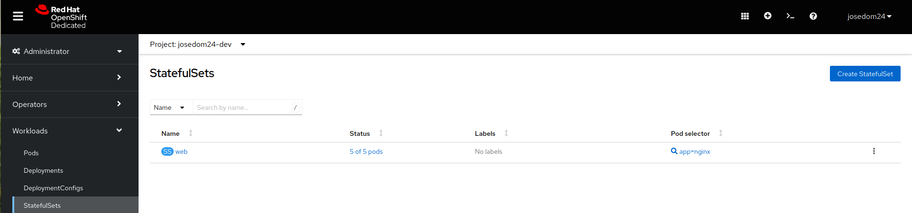
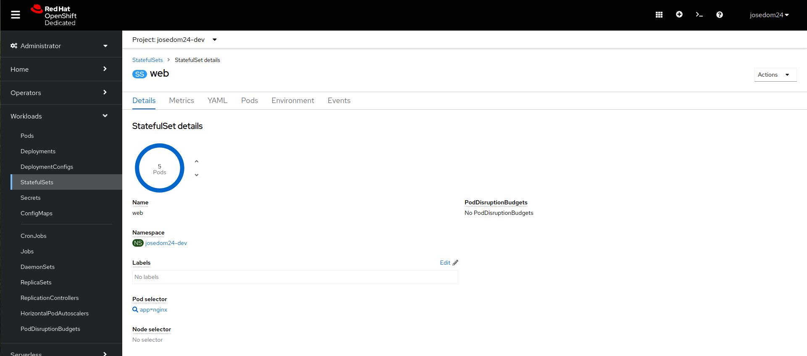
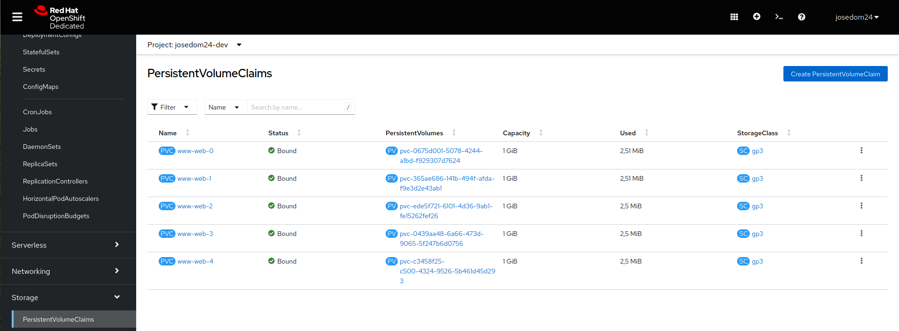

# StatefulSet

A diferencia de un Deployment, un StatefulSet mantiene una identidad fija para cada uno de sus Pods.

Por lo tanto cada pod es distinto (**tiene una identidad única**), y este hecho tiene algunas consecuencias:
* El nombre de cada pod tendrá un número (1,2,...) que lo identifica y que nos proporciona la posibilidad de que la creación actualización y eliminación sea ordenada.
* Si un nuevo pod es recreado, obtendrá el mismo nombre (hostname), los mismos nombres DNS (aunque la IP pueda cambiar) y el mismo volumen
que tenía asociado.
* Necesitamos crear un servicio especial, llamado **Headless Service**, que nos permite acceder a los pods de forma independiente, pero que no balancea la carga entre ellos, por lo tanto este servicio no tendrá una ClusterIP.

La definición del objeto **StatefulSet** la tenemos guardada en el fichero `statefulset.yaml`:

```yaml
apiVersion: apps/v1
kind: StatefulSet
metadata:
  name: web
spec:
  serviceName: "nginx"
  replicas: 2
  selector:
    matchLabels:
      app: nginx
  template:
    metadata:
      labels:
        app: nginx
    spec:
      containers:
      - name: nginx
        image: bitnami/nginx
        ports:
        - containerPort: 8080
          name: web
        volumeMounts:
        - name: www
          mountPath: /app
  volumeClaimTemplates:
  - metadata:
      name: www
    spec:
      accessModes: [ "ReadWriteOnce" ]
      resources:
        requests:
          storage: 1Gi

```

* Se indica los pods que vamos a controlar por medio de la etiqueta `selector`.
* Como hemos indicado cada pods va a tener asociado un volumen persistente, se hace la definición de la reclamación del volumen con la etiqueta `volumeClaimTemplates`.
* Se indica el punto de montaje en el contenedor, con la etiqueta `volumeMounts`.

Por otro lado la definición del recurso **Headless Service** la tenemos en el fichero `service.yaml`:

```yaml
apiVersion: v1
kind: Service
metadata:
  name: nginx
  labels:
    app: nginx
spec:
  ports:
  - port: 8080
    name: web
  clusterIP: None
  selector:
    app: nginx
```

* En este caso no se balancea la carga a cada pod, sino que podemos acceder a cada pod de manera independiente, con el nombre:
        
        <nombre_del_pod>.<nombre-statefulset>.<nombre-proyecto>.svc.cluster.local

* Por lo tanto no va tener asignada ninguna Cluster IP (`clusterIP: None`).
* Se seleccionan los pods a los que se puede acceder por medio de la etiqueta declarada en el apartado `selector`.

## Creación ordenada de pods

Lo primero creamos el recurso **Headless Service** y vamos comprobar la creación ordenados de pods, para ello en un terminal observamos la creación de pods y en otro terminal creamos los pods

    watch oc get pod
    oc apply -f statefulset.yaml

## Comprobamos la identidad de red estable

Vemos los hostname y los nombres DNS asociados:

    for i in 0 1; do oc exec web-$i -- sh -c 'hostname'; done
    web-0
    web-1

    oc run -it --image busybox:1.28 dns-test --restart=Never --rm
    / # nslookup web-0.nginx
    ...
    Address 1: 10.128.8.181 web-0.nginx.josedom24-dev.svc.cluster.local

    / # nslookup web-1.nginx
    ...
    Address 1: 10.128.43.7 web-1.nginx.josedom24-dev.svc.cluster.local

## Eliminación de pods

En un terminal observamos la creación de pods y en otro terminal eliminamos los pods

    watch oc get pod
    oc delete pod -l app=nginx

## Comprobamos la identidad de red estable

Volvemos a crear el recurso StatefulSet y comprobamos que los hostnames y los nombres DNS asociados no han cambiado (las IP pueden cambiar):

    oc apply -f statefulset.yaml
    for i in 0 1; do oc exec web-$i -- sh -c 'hostname'; done

    oc run -it --image busybox:1.28 dns-test --restart=Never --rm
    / # nslookup web-0.nginx
    / # nslookup web-1.nginx

## Escribiendo en los volúmenes persistentes

Comprobamos que se han creado volúmenes para los pods:

    oc get pvc

Creamos el fichero `index.html` en el directorio que hemos montado (directorio *DocumentRoot* del servidor web):

    for i in 0 1; do oc exec "web-$i" -- sh -c 'echo "$(hostname)" > /app/index.html'; done
    for i in 0 1; do oc exec -i -t "web-$i" -- sh -c 'cat  /app/index.html'; done
    web-0
    web-1

    Volvemos a eliminar los pods, y comprobamos que la información es persistente al estar guardadas en los volúmenes:

    oc delete pod -l app=nginx
    oc apply -f statefulset.yaml
    for i in 0 1; do oc exec -i -t "web-$i" -- sh -c 'cat  /app/index.html'; done

## Escalar statefulset

Para escalar el despliegue:

    oc scale sts web --replicas=5

Comprobamos los pods y los volúmenes:

    oc get pod,pvc

Si reducimos el número de pods los volúmenes no se eliminan.

## Gestión de StatefulSet desde la consola web

Para gestionar los objetos **StatefulSet** desde la consola web, escogemos la vista **Admionistrator** y la opción **Workloads -> StatefulSets**:



En esa pantalla además tenemos la opción de crear un nuevo recurso con el botón **Create StatefulSet**. Si escogemos un objeto determinado obtendremos la descripción del mismo:



También podemos gestionar los objetos **PersistentVolumeClaim** que se han creado para cada uno de los pods, en la sección **Storage - > PersistentVolumeClaim**:



## Borrado del escenario

Para terminar eliminamos el statefulset y el service:

    oc delete -f statefulset.yaml
    oc delete -f service.yaml

Para borrar los volúmenes:

    oc delete --all pvc
