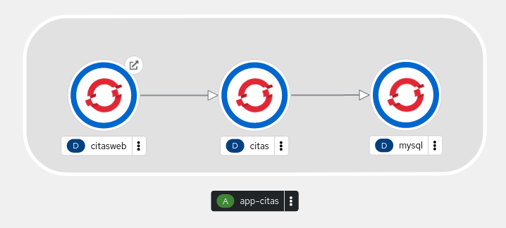

# Actualización de la aplicación citas-backend

Como hemos dicho anteriormente, la nueva versión lee la información de las cita de la base de datos. El programa hace una conexión a la base de datos, utilizando variables de entorno donde debemos guardar las credenciales de acceso. Podemos ver el fragmento del código donde se realiza la conexión:

```
...
    conn = MySQLdb.connect(
            user=os.environ['USER_DB'],
            password=os.environ['PASSWORD_DB'],
            host=os.environ['HOST_DB'],
            database="citas",
            port=3306)
...
```

Por lo tanto en el despliegue de `citas-backend` vamos a crear las variables de entorno necesarias. Lo vamos a hacer de forma imperativa, indicando directamente los valores. En el valor de la variable `HOST_DB` tendremos que poner el nombre del servicio creado para mysql, para que se pueda realizar la conexión:

    oc set env deployment/citas USER_DB=usuario
    oc set env deployment/citas PASSWORD_DB=usuario_pass
    oc set env deployment/citas HOST_DB=mysql


Y la actualización de la versión del despliegue también la hacemos de forma imperativa:

    oc set image deploy citas contenedor-citas=josedom24/citas-backend:v2

Esperamos unos segundos y comprobamos que los 3 pods del despliegue se han creado de nuevo con la nueva versión:


    oc get pod -l app=citas
    NAME                     READY   STATUS    RESTARTS   AGE
    citas-767594d7c5-d2f8v   1/1     Running   0          3s
    citas-767594d7c5-dr5sg   1/1     Running   0          6s
    citas-767594d7c5-s8jvg   1/1     Running   0          10s


Y podemos acceder de nuevo a la página web y comprobamos que el servicio que está devolviendo la información de la citas es `citas-backend` **versión 2** y además comprobamos que tenemos más citas (en la tabla hay 16 citas), la versión 1 tenía sólo 6 citas:


Finalmente si accedemos a la Topología, en la consola web, hemos añadido el nuevo despliegue a la aplicación `app-citas`:

