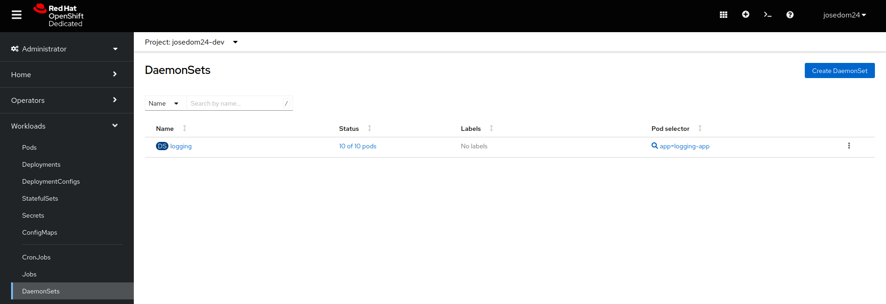
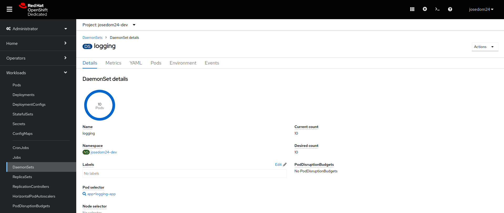

# DaemonSet

Un recurso **DaemonSet** garantiza que un Pod esté en ejecución en cada nodo del clúster OpenShift.

El recurso **DaemonSet** es útil en situaciones donde se necesita ejecutar una tarea o servicio en todos los nodos del clúster, como la recolección de logs o la supervisión del sistema. También es común utilizar un **DaemonSet** para desplegar agentes de monitoreo o herramientas de seguridad en todos los nodos del clúster.

Podemos seleccionar un subconjuntos de nodos del clúster donde queremos que se ejecuten los Pods, pero usando **Red Hat OpenShift Dedicated Developer Sandbox**, no somos usuarios administradores, por lo que no tenemos acceso a los objetos nodos del clúster y por lo tanto no podemos realizar la selección.

Veamos un ejemplo, tenemos descrito el recurso **DaemonSet** en el fichero `daemonset.yaml`:

```yaml
apiVersion: apps/v1
kind: DaemonSet
metadata:
  name: logging
spec:
 selector:
    matchLabels:
       app: logging-app
 template:
   metadata:
     labels:
       app: logging-app
   spec:
     containers:
       - name: webserver
         image: bitnami/nginx
         ports:
         - containerPort: 8080

```

En este caso se va a crear un contenedor por cada nodo del clúster, para ello creamos el recursos y vemos los Pods que se han creado:

    oc apply -f daemonset.yaml

    oc get pod -o wide
    NAME            READY   STATUS    RESTARTS   AGE   IP              NODE                           NOMINATED NODE   READINESS GATES
    logging-4d9l6   1/1     Running   0          10s   10.128.53.82    ip-10-0-243-92.ec2.internal    <none>           <none>
    logging-6bcmx   1/1     Running   0          10s   10.128.18.135   ip-10-0-150-108.ec2.internal   <none>           <none>
    logging-9bfg9   1/1     Running   0          10s   10.128.20.117   ip-10-0-129-235.ec2.internal   <none>           <none>
    logging-b4zwk   1/1     Running   0          10s   10.128.8.216    ip-10-0-184-58.ec2.internal    <none>           <none>
    logging-bxcj6   1/1     Running   0          10s   10.128.34.48    ip-10-0-129-162.ec2.internal   <none>           <none>
    logging-dg98c   1/1     Running   0          10s   10.128.17.156   ip-10-0-136-61.ec2.internal    <none>           <none>
    logging-f7qpq   1/1     Running   0          10s   10.128.28.63    ip-10-0-153-158.ec2.internal   <none>           <none>
    logging-gb7hx   1/1     Running   0          10s   10.128.43.129   ip-10-0-148-113.ec2.internal   <none>           <none>
    logging-gp58r   1/1     Running   0          10s   10.128.14.70    ip-10-0-178-128.ec2.internal   <none>           <none>
    logging-rpjrt   1/1     Running   0          10s   10.128.7.132    ip-10-0-205-209.ec2.internal   <none>           <none>

## Gestión de DaemonSet desde la consola web

Para gestionar los objetos **DaemonSets** desde la consola web, escogemos la vista **Administrator** y la opción **Workloads -> DaemonSets**:



En esa pantalla además, tenemos la opción de crear un nuevo recurso con el botón **Create DaemonSet**. Si escogemos un objeto determinado obtendremos la descripción del mismo:

