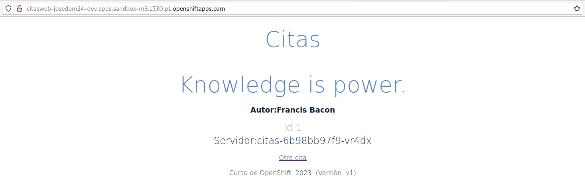
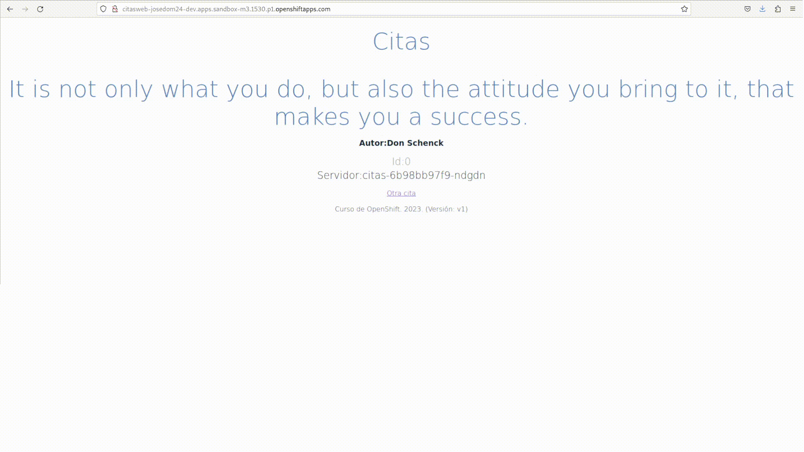
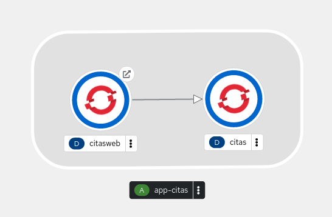

# Despliegue de citas-frontend

Este microservicio nos va a mostrar una aplicación web que hace una consulta al servicio anterior y muestra una cita aleatoria en pantalla. 

A continuación desplegamos la aplicación, creando un deployment, un service y un route. Para ello usamos los siguientes ficheros:

En el fichero `deployment.yaml` tenemos la definición del recurso Deployment:

```yaml
kind: Deployment
apiVersion: apps/v1
metadata:
  name: citasweb
  labels:
    app: citasweb
spec:
  replicas: 1
  selector:
    matchLabels:
      app: citasweb
  template:
    metadata:
      labels:
        app: citasweb
    spec:
      containers:
        - name: contenedor-citasweb
          image: josedom24/citas-frontend
          imagePullPolicy: Always
          ports:
            - containerPort: 5000
              protocol: TCP
          env:
            - name: CITAS_SERVER
              value: citas:10000
            
```
Nos fijamos que en el despliegue se ha creado una variable de entorno que se debe llamar `CITAS_SERVIDOR`, con el valor del nombre del host para accede a la aplicación `citas-backend` y el puerto que está utilizando. En nuestro caso indicaremos el nombre del recurso Service que hemos creado pra acceder a la aplicación `citas`.

La definición del recurso service, la encontramos en el fichero `service.yaml`:

```yaml
apiVersion: v1
kind: Service
metadata:
  labels:
    app: citasweb
  name: citasweb
spec:
  ports:
  - name: 5000-tcp
    port: 5000
    protocol: TCP
    targetPort: 5000
  selector:
    app: citasweb
  sessionAffinity: None
  type: ClusterIP
```

Y por último el recurso Route se encuentra en el fichero `route.yaml`:

```yaml
apiVersion: route.openshift.io/v1
kind: Route
metadata:
  labels:
    app: citasweb
    sandbox: learn-kubernetes
    sandbox-learn-kubernetes: citasweb
  name: citasweb
spec:
  port:
    targetPort: 5000-tcp
  to:
    kind: Service
    name: citasweb
```

Creamos todos los recursos, ejecutando:

    oc apply -f deployment.yaml
    oc apply -f service.yaml
    oc apply -f ingress.yaml

Y volvemos a comprobar a comprobar los recursos que hemos creado:

    oc get all
    NAME                            READY   STATUS    RESTARTS   AGE
    pod/citas-6b98bb97f9-vr4dx      1/1     Running   0          169m
    pod/citasweb-7c5469486c-5slwn   1/1     Running   0          5s
    
    NAME                        TYPE        CLUSTER-IP       EXTERNAL-IP   PORT(S)                               AGE
    service/citas               ClusterIP   172.30.140.203   <none>        10000/TCP                             169m
    service/citasweb            ClusterIP   172.30.184.208   <none>        5000/TCP                              5s
    service/modelmesh-serving   ClusterIP   None             <none>        8033/TCP,8008/TCP,8443/TCP,2112/TCP   12d
    
    NAME                       READY   UP-TO-DATE   AVAILABLE   AGE
    deployment.apps/citas      1/1     1            1           169m
    deployment.apps/citasweb   1/1     1            1           5s
    
    NAME                                  DESIRED   CURRENT   READY   AGE
    replicaset.apps/citas-6b98bb97f9      1         1         1       169m
    replicaset.apps/citasweb-7c5469486c   1         1         1       6s
    
    NAME                                HOST/PORT                                                          PATH   SERVICES   PORT       TERMINATION   WILDCARD
    route.route.openshift.io/citasweb   citasweb-josedom24-dev.apps.sandbox-m3.1530.p1.openshiftapps.com          citasweb   5000-tcp                 None
    
Y si accedemos la URL proporcionada por el recuro Route podemos acceder a la aplicación:



### Escalando la aplicación `citas-backend`

Podemos escalar cualquiera de los dos despliegues que hemos realizado. En este caso vamos a escalar el número de Pods del despliegue de `citas-backend` y podremos observar como en la información que se muestra en la página web va cambiado el nombre del hostname demostrando, de esta manera, que se esta balanceando la carga entre los Pods del despliegue:

    oc scale deployment.apps/citas --replicas=3

Y vemos los nuevos Pods que se han creado:

    oc get pod
    NAME                        READY   STATUS    RESTARTS   AGE
    citas-6b98bb97f9-7p6tk      1/1     Running   0          9s
    citas-6b98bb97f9-ndgdn      1/1     Running   0          9s
    citas-6b98bb97f9-vr4dx      1/1     Running   0          172m
    citasweb-7c5469486c-5slwn   1/1     Running   0          3m19s

Y si accedemos a la página web y vamos refrescando, observamos como se balancea la carga entre los distintos Pods:  



Si accedemos a la Topología de la consola web, después de realizar una agrupación de los dos despliegues, obtenemos:

