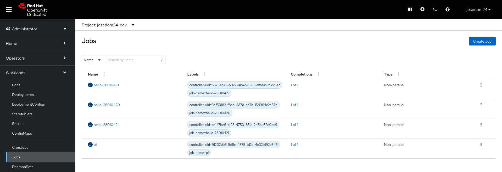
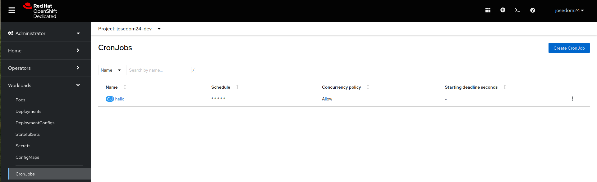

# Jobs y CronJobs

Los recursos **Jobs** y **CronJobs** son recursos que permiten ejecutar tareas en un clúster. 

* Un **Job** es un objeto que crea uno o más Pods en Kubernetes/OpenShift para ejecutar una tarea. Los jobs se utilizan comúnmente para realizar trabajos puntuales o tareas que no necesitan ejecutarse de manera continua. 
* Por otro lado, un **CronJob** es un objeto que crea jobs de manera programada en un clúster de Kubernetes/OpenShift. Los **CronJobs** se utilizan para realizar tareas de manera repetitiva, según un horario establecido. 

## Jobs

Vamos a ejecutar un recurso **Job** que simplemente crea un Pod para calcular el valor del numero pi con 200 decimales. La definición del recurso la tenemos guardada en el fichero `job.yaml`:

```yaml
apiVersion: batch/v1
kind: Job
metadata:
  name: pi
spec:
  template:
    spec:
      containers:
      - name: pi
        image: perl:5.34.0
        command: ["perl",  "-Mbignum=bpi", "-wle", "print bpi(2000)"]
      restartPolicy: Never
  backoffLimit: 4
```

* El valor de `restartPolicy` se establece en `Never`, lo que significa que el Pod no se reiniciará después de que se complete la tarea del contenedor.
* En el parámetro `backoffLimit` indicamos el número de intentos que se van a ejecutar antes de determinar que la tarea ha fallado.

Vamos a ejecutar el recurso **Job**, y comprobamos que cuando termina el Pod está en estado *Completado* y que podemos acceder al resultado del cálculo:

    oc apply -f job.yaml 
    
    oc get pod
    NAME       READY   STATUS      RESTARTS   AGE
    pi-bkk2b   0/1     Completed   0          21s
    
    oc logs job/pi
    3.14159...

## CronJobs

En este caso se ejecuta una tarea periódicamente. Vamos a ver un ejemplo, que tenemos definido en el fichero `cronjob.yaml`:

```yaml
apiVersion: batch/v1
kind: CronJob
metadata:
  name: hello
spec:
  schedule: "* * * * *"
  jobTemplate:
    spec:
      template:
        spec:
          containers:
          - name: hello
            image: busybox:1.28
            imagePullPolicy: IfNotPresent
            command:
            - /bin/sh
            - -c
            - date; echo Hello from the OpenShift cluster
          restartPolicy: OnFailure
```

* Para programar la tarea usamos el parámetro `schdule` que funciona de forma similar al cron de linux:

         ┌───────────── minute (0 - 59)
         │ ┌───────────── hour (0 - 23)
         │ │ ┌───────────── day of the month (1 - 31)
         │ │ │ ┌───────────── month (1 - 12)
         │ │ │ │ ┌───────────── day of the week (0 - 6) (Sunday to Saturday;
         │ │ │ │ │                                   7 is also Sunday on some systems)
         │ │ │ │ │                                   OR sun, mon, tue, wed, thu, fri, sat
         │ │ │ │ │
         * * * * *
    
      También podemos indicar el periodo con valores específicos: 
          * `@yearly`: El 1 de enero a medianoche. (0 0 1 1 *)
          * `@monthly`: Una vez al mes, el primer día del mes. (0 0 1 * *)
          * `@weekly`: Una vez a la semana. (0 0 * * 0)
          * `@daily`: una vez al día a las 12 de la noche. (0 0 * * *)
          * `@hourly`: Cada hora. (0 * * * *)

Ejecutamos el **CronJob**, esperamos varios minutos y vemos cómo se han creado varios recursos cada minuto:

    oc apply -f cronjob.yaml

    oc get all
    NAME                       READY   STATUS      RESTARTS   AGE
    pod/hello-28010418-msxlw   0/1     Completed   0          2m21s
    pod/hello-28010419-4jvl8   0/1     Completed   0          81s
    pod/hello-28010420-zt499   0/1     Completed   0          21s
    pod/pi-bkk2b               0/1     Completed   0          11m
    
    NAME                  SCHEDULE    SUSPEND   ACTIVE   LAST SCHEDULE   AGE
    cronjob.batch/hello   * * * * *   False     0        21s             8m16s

    NAME                       COMPLETIONS   DURATION   AGE
    job.batch/hello-28010418   1/1           4s         2m21s
    job.batch/hello-28010419   1/1           5s         81s
    job.batch/hello-28010420   1/1           4s         21s

## Gestión de Jobs y CronJobs desde la consola web

Como hemos estudiado los otros recursos, podemos gestionar los recursos **Jobs** y **CronJobs** desde la consola web:






