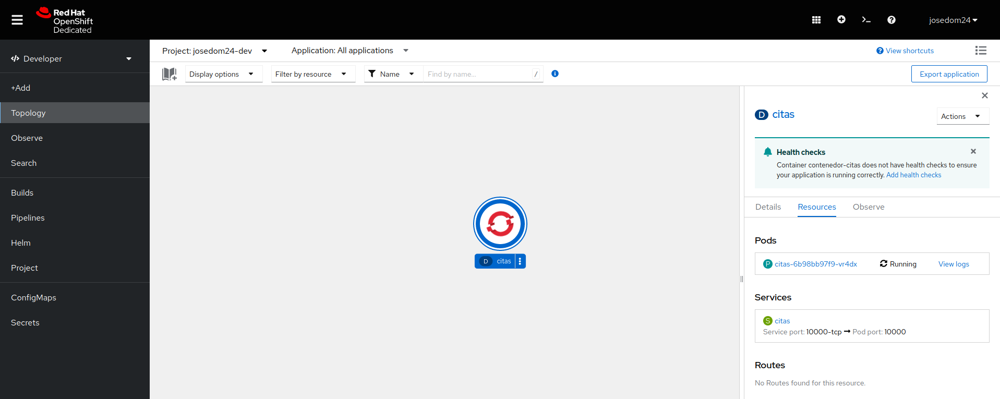

# Despliegues de citas-backend

Vamos a desplegar la **versión 1** del microservicio **citas-backend**, para ello vamos a usar la definición del recurso **Deployment** guardada en el fichero `deployment.yaml`:

```yaml
kind: Deployment
apiVersion: apps/v1
metadata:
  name: citas
  labels:
    app: citas
spec:
  replicas: 1
  selector:
    matchLabels:
      app: citas
  template:
    metadata:
      labels:
        app: citas
    spec:
      containers:
        - name: contenedor-citas
          image: josedom24/citas-backend:v1
          imagePullPolicy: Always
          ports:
            - containerPort: 10000
              protocol: TCP
```

Vamos a crear un recurso **Service**, con la definición del fichero `service.yaml`:

```yaml
apiVersion: v1
kind: Service
metadata:
  labels:
    app: citas
  name: citas
spec:
  ports:
  - name: 10000-tcp
    port: 10000
    protocol: TCP
    targetPort: 10000
  selector:
    app: citas
  type: ClusterIP
```

Aunque no vamos a acceder a este microservicio desde el exterior, vamos a comprobar su funcionamiento, por lo que le vamos a crear un recurso **Route**, aunque posteriormente lo borraremos. La definición del recurso **Route** está en el fichero `route.yaml`:

```yaml
apiVersion: route.openshift.io/v1
kind: Route
metadata:
  labels:
    app: citas
  name: citas
spec:
  port:
    targetPort: 10000-tcp
  to:
    kind: Service
    name: citas
```

Creamos los tres recursos:

    oc apply -f deployment.yaml
    oc apply -f service.yaml
    oc apply -f route.yaml

Podemos ver los recursos que se han creado:

    oc get all
    NAME                         READY   STATUS    RESTARTS   AGE
    pod/citas-6b98bb97f9-vr4dx   1/1     Running   0          5m41s

    NAME                        TYPE        CLUSTER-IP       EXTERNAL-IP   PORT(S)                               AGE
    service/citas               ClusterIP   172.30.140.203   <none>        10000/TCP                             5m41s
    service/modelmesh-serving   ClusterIP   None             <none>        8033/TCP,8008/TCP,8443/TCP,2112/TCP   12d

    NAME                    READY   UP-TO-DATE   AVAILABLE   AGE
    deployment.apps/citas   1/1     1            1           5m42s

    NAME                               DESIRED   CURRENT   READY   AGE
    replicaset.apps/citas-6b98bb97f9   1         1         1       5m42s

    NAME                             HOST/PORT                                                       PATH   SERVICES   PORT        TERMINATION   WILDCARD
    route.route.openshift.io/citas   citas-josedom24-dev.apps.sandbox-m3.1530.p1.openshiftapps.com          citas      10000-tcp                 None

Este servicio será interno, es decir, no será necesario el acceso desde el exterior, pero hemos creado el recurso **ingress** para poder probarlo:

    curl http://citas-josedom24-dev.apps.sandbox-m3.1530.p1.openshiftapps.com/quotes
    [
      {
        "author": "Don Schenck",
        "hostname": "citas-6b98bb97f9-vr4dx",
        "id": 0,
        "quotation": "It is not only what you do, but also the attitude you bring to it, that makes you a success."
      },
      {
        "author": "Francis Bacon",
        "hostname": "citas-6b98bb97f9-vr4dx",
        "id": 1,
        "quotation": "Knowledge is power."
      },
      {
        "author": "Confucius",
        "hostname": "citas-6b98bb97f9-vr4dx",
        "id": 2,
        "quotation": "Life is really simple, but we insist on making it complicated."
      },
      {
        "author": "William Shakespeare",
        "hostname": "citas-6b98bb97f9-vr4dx",
        "id": 3,
        "quotation": "This above all, to thine own self be true."
      },
      {
        "author": "Will Ferrell",
        "hostname": "citas-6b98bb97f9-vr4dx",
        "id": 4,
        "quotation": "I got a fever, and the only prescription is more cowbell."
      },
      {
        "author": "Andrew Hendrixson",
        "hostname": "citas-6b98bb97f9-vr4dx",
        "id": 5,
        "quotation": "Anyone who has ever made anything of importance was disciplined."
      }
    ]

Por ejemplo, podemos generar una cita aleatoria:

    curl http://citas-josedom24-dev.apps.sandbox-m3.1530.p1.openshiftapps.com/quotes/random
    {
      "author": "Don Schenck",
      "hostname": "citas-6b98bb97f9-vr4dx",
      "id": 0,
      "quotation": "It is not only what you do, but also the attitude you bring to it, that makes you a success."
    }

Como puedes observar nos da cuatro informaciones: la cita, el autor, el identificador y el nombre de la maquina donde se está ejecutando.

Para terminar, y como hemos indicado vamos a eliminar la ruta de acceso a este microservicio:

    oc delete route/citas

Si accedemos a la Topología en la consola web, vemos los recursos que hemos creado:

