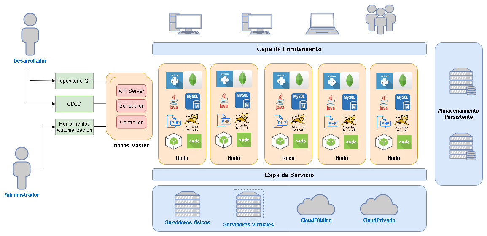

# OpenShift la plataforma PaaS de RedHat

OpenShift v4 es una plataforma de contenedores de código abierto basada en Kubernetes que proporciona una solución completa de orquestación de contenedores y servicios de aplicaciones para desarrolladores y equipos de operaciones. 

Por lo tanto nos ofrece muchas de la ventajas de usar un orquestador de contenedores como Kubernetes:

* Desplegar aplicaciones de forma muy sencilla.
* Tolerancia a fallos.
* Escalalabilidad de las aplicaciones.
* Actualizaciones automáticas de las aplicaciones.
* Permite limitar los recursos a utilizar.
* Enrutamiento a nuestras aplicaciones.
* Uso de volúmenes para guardar la información.
* ...

Pero lo más importante, es que podemos considerar OpenShift como una plataforma **PaaS**, que permite a los desarrolladores centrar en el desarrollo del código, para que posteriormente de una manera muy sencilla y automática sean capaces de desplegar sus aplicaciones en contenedores y con las ventajas que obtenemos de tenerlos gestionados por Kubernetes.

¿Qué aspectos caracterizan a OpenShift para considerarlo una plataforma PaaS?

* No es necesario diseñar la definición yaml de los recursos de kubernetes que vamos a gestionar.
* Tenemos a nuestra disposición herramientas de despliegue de aplicaciones que crean y gestionan los recursos kubernetes por nosotros.
* Tiene procesos de construcción automática de imágenes de contenedores.
* Nos simplifica el ciclo de vida de implantación de nuestras aplicaciones.
* Es muy fácil de implementar un despliegue continúo que haga que una modificación del código conlleve, de forma automática, el despliegue de una nueva versión de la aplicación.
* Permite la integración con herramienta de IC/DC, que nos facilita la gestión del ciclo de vida de la aplicación.
* Nos permite de forma sencilla desplegar aplicaciones en distintos entornos: Desarrollo, Pruebas, Producción,...
* Tenemos a nuestra disposición distintas herramientas de métrica y monitorización.
* Despliegue sencillo de aplicación con el uso de Plantillas.
* Tenemos varios mecanismos para interactuar con OpenShift: entorno web, cliente de línea de comandos o uso de la API.
* Se integra con muchas herramientas de ecosistema de Kubernetes que nos ofrecen distintas funcionalidad: Tekton (integración y despliegue continuo), Knative (aplicaciones Serverless), Helm (despliegue y gestión del ciclo de visa de aplicaciones),...

## Arquitectura de OpenShift v4

