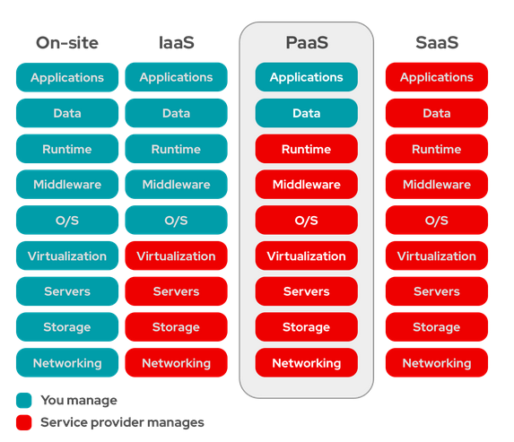

# Cloud Computing PaaS: Plataforma como servicio

## Cloud Computing

El **Cloud Computing** define una manera de ofrecer servicios informáticos: infraestructura, plataformas de desarrollo, aplicaciones,...

Este nuevo paradigma de consumir servicios informáticos tiene varias características:

* Servicio disponible de forma automática y a demanda
* Accesible a través de la red
* Modelo multi-tenancy
    * Se comparten los recursos con otros usuarios
    * Debe garantizarse aislamiento y seguridad entre usuarios
* Los recursos se agrupan en pools
* Elasticidad
* Pago por uso

A esta manera de ofrecer servicios se le suele llamar **... as a service**, y según el servicio que se esté ofreciendo tenemos varias capas:

* **Infraestructura como servicio (IaaS)**: El servicio ofrecido es infraestructura: capacidad de cómputo, redes, almacenamiento,... Enfocada para administradores.
* **Plataforma como servicio (PaaS)**: El servicio proporcionado es una plataforma de desarrollo y despliegue de aplicaciones. enfocada para desarrolladores.
* **Software como servicio (SaaS)**: El servicio ofrecido es una aplicación que el cualquier usuario utiliza a través de internet.

## PaaS

La **Plataforma como servicio (PaaS)** es una modalidad del Cloud Computing en la cual un tercero brinda una plataforma de software de aplicaciones. La PaaS es ideal principalmente para los desarrolladores y los programadores, ya que permite que el usuario desarrolle, ejecute y gestione sus propias aplicaciones sin tener que diseñar ni mantener la infraestructura ni la plataforma que suelen estar relacionadas con el proceso.

Al usar alguna plataforma de PaaS:

* Los desarrolladores solo tienen que preocuparse por la programación y centrarse en el código de las aplicaciones.
* No se preocupan por la configuración ni el software que hay por debajo, ahorrando tiempo y recursos.
* PaaS puede ejecutarse por encima del IaaS (si vamos a virtualizar todo), en máquinas físicas e incluso en contenedores.
* Obtenemos características de Cloud Computing: elasticidad, pago por uso,...

