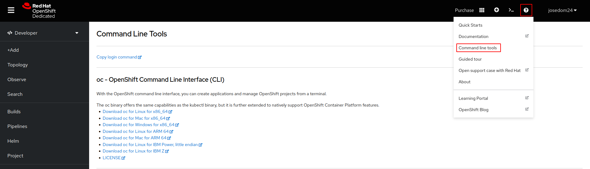
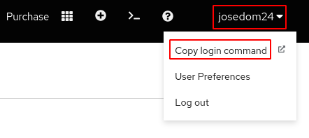
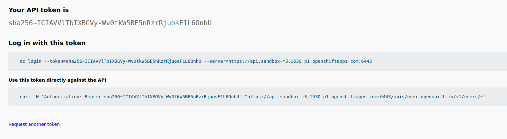
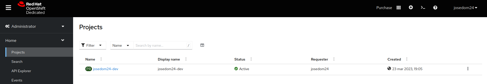

# Introducción a  Red Hat OpenShift Dedicated Developer Sandbox

[Acceso a Red Hat OpenShift Dedicated Developer Sandbox](https://developers.redhat.com/developer-sandbox)

Tenemos varias formas de interactuar con nuestro clúster de OpenShift:

* Usando la **consola web**, una aplicación web que nos permite gestionar todos los recursos del clúster.
* Usando la **herramienta de línea de comandos oc**, que nos permite gestionar los recursos con un comando desde la terminal. Puede ser mucho más útil a la hora de automatizar operaciones.
* Accediendo directamente a la **API** que nos proporciona el nodo maestro del clúster. Podríamos hacer peticiones HTTP directamente a la API restful para gestionar los recursos.

## Consola Web

Tenemos dos vistas para trabajar con Openshift desde la consola web:

**En la vista Developer**, los usuarios tienen acceso a herramientas para desarrollar, implementar y supervisar aplicaciones en el clúster de OpenShift.
**En la vista Administrator**, los usuarios tienen acceso a herramientas para administrar el clúster de OpenShift y las aplicaciones que se ejecutan en él. 

## CLI de OpenShift: oc

La herramienta `oc` nos permite gestionar los recursos de nuestro clúster de OpenShift desde la línea de comandos.

Para más información de esta herramienta puedes acceder a la [documentación oficial](https://docs.openshift.com/container-platform/4.12/cli_reference/openshift_cli/getting-started-cli.html).

### Instalación de oc

Una de las formas de instalar la herramienta es de la consola web: escogemos el icono de ayuda en la parte superior derecha, y posteriormente elegimos la opción **Command Line Tools**:

Nos aparecerá una página donde podremos descargarnos las distintas versiones de la herramienta, en mi caso he escogido la versión Linux x86_64.

Nos descargamos un fichero comprimido `oc.tar`, lo descomprimimos y lo copiamos con permisos de ejecución en un directorio del PATH:

    tar xvf oc.tar
    sudo install oc /usr/local/bin

### Configuración de oc

Una vez que tenemos instalado la herramienta `oc`, el siguiente paso el realizar el login en nuestro clúster. En el caso de **Red Hat OpenShift Dedicated Developer Sandbox**, la autentificación se hace por medio de un token.

Para obtener este token accedemos al menú que aparece al pulsar sobre nuestro nombre de usuario (parte superior derecha), eligiendo la opción **Copy login command**:

Copiamos la instrucción de login:

Y la ejecutamos:

    oc login --token=sha256~xxxxxxxxxxxxx... --server=https://api.sandbox-m3.1530.p1.openshiftapps.com:6443

Como vemos, hemos accedido con el usuario y estamos usando un proyecto, que en mi caso se llama `josedom24-dev`.

## Visión general del proyecto de trabajo

Para acceder a la información de nuestro proyecto, en la **Vista Administrator**, escogemos la opción **Home -> Projects**:

