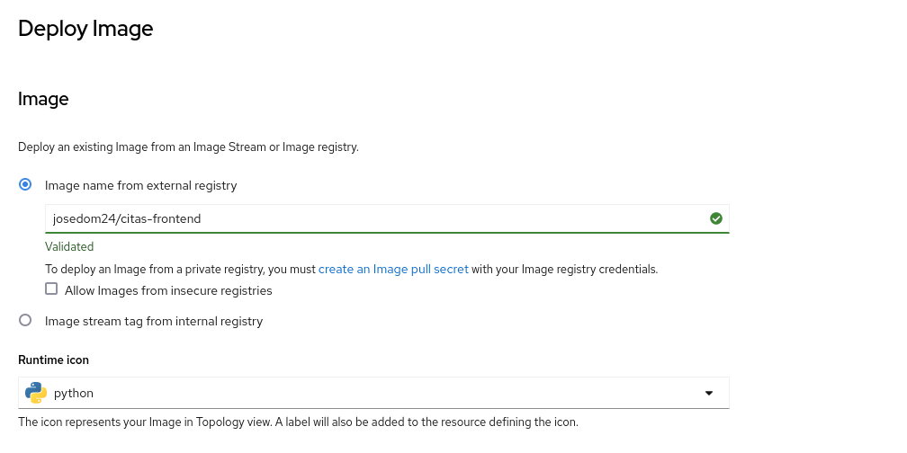
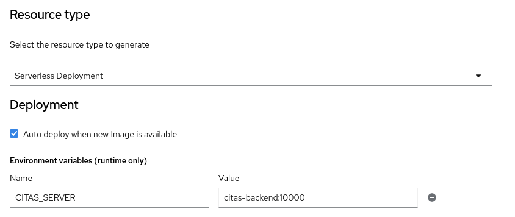
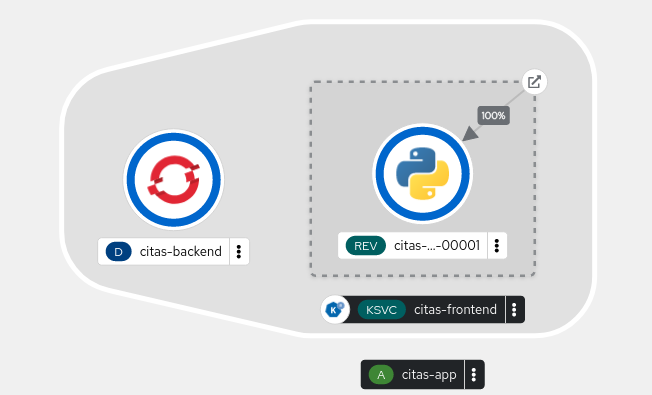

# Despliegue de aplicación Citas en OpenShift v4 (1ª parte)

La aplicación **Citas** nos muestra citas celebres de distintos autores en una página web. Esta formada por dos microservicios (`citas-backend` y `citas-frontend`) y un servicio de base de datos mysql. La aplicación funciona de la siguiente manera:

* `citas-backend`: Es una API RESTful que devuelve información sobre citas famosas de distintos autores famosos. La **versión 1** devuelve información de 6 citas que tiene incluidas en el programa. La **versión 2** lee la información de las citas de una base de datos guardada en un servidor mysql. La aplicación está construida en python 3.9 y ofrece el servicio en el puerto TCP/10000.
* `citas-frontend`: Es una aplicación python flask que crea una página web dinámica con una cita aleatoria que lee de `citas-backend` para ello conecta al servicio API RESTful usando el nombre y el puerto del servidor indicado en la variable de entorno `CITAS_SERVIDOR`.

## Despliegue de citas-backend

Para realizar el despliegue y posteriormente actualizar a una nueva versión, lo primero que vamos a hacer es crear un objeto **ImageStream** que apunte a las imágenes de la aplicación que vamos a desplegar, para ello:

    oc create is citas-backend
    oc import-image citas-backend:v1 --from=docker.io/josedom24/citas-backend:v1
    oc import-image citas-backend:v2 --from=docker.io/josedom24/citas-backend:v2

Vamos a crear la etiqueta `prod` apuntando a la versión que vamos a desplegar:

    oc tag citas-backend:v1 citas-backend:prod

Vamos a crear el despliegue de la siguiente manera:

    oc new-app citas-backend:prod -l app.kubernetes.io/part-of=citas-app --name=citas-backend 

Podemos crear un objeto **Route** para comprobar que está funcionando:

    oc expose service citas-backend --port=10000

    oc get routes
    NAME            HOST/PORT                                                               PATH   SERVICES        PORT    TERMINATION   WILDCARD
    citas-backend   citas-backend-josedom24-dev.apps.sandbox-m3.1530.p1.openshiftapps.com          citas-backend   10000                 None

Para mostrar todas las citas:

    curl http://citas-backend-josedom24-dev.apps.sandbox-m3.1530.p1.openshiftapps.com/quotes

Para mostrar una ruta aleatoria:

    curl http://citas-backend-josedom24-dev.apps.sandbox-m3.1530.p1.openshiftapps.com/quotes/random

Una vez comprobado que funciona, borramos la ruta:

    oc delete route/citas-backend

## Despliegue de citas-frontend

Para desplegar el componente `citas-frontend` vamos a usar un **Deployment Serverless**. Vamos a realizar la configuración desde la consola web. Indicamos la imagen `josedom24/citas-frontend` y el icono de la aplicación:

Indicamos el nombre de la aplicación: `citas-app`, el nombre del despliegue: `citas-frontend` y el puerto que será el `5000`:

Elegimos el recurso **Deployment Serverless** como **Resource type** y creamos la variable de entorno `CITAS_SERVIDOR` con el valor del nombre del host para acceder a la aplicación `citas-backend` y el puerto que está utilizando. En nuestro caso: `citas-backend:10000`. Es decir, indicaremos el nombre del recurso **Service** que hemos creado para acceder a la aplicación `citas-backend`.

Una vez que se han creado los recursos, tenemos el siguiente esquema en la topología:

Accedemos a la aplicación y comprobamos que funciona de forma correcta:

Como hemos desplegado `citas-frontend` en un **Deployment Serverless**, pasados unos segundos sin acceder a la página veremos que escala a 0. El componente `citas-backend` sigue funcionando continuamente, y podemos tener otros componentes que acceden a él sin problemas.

