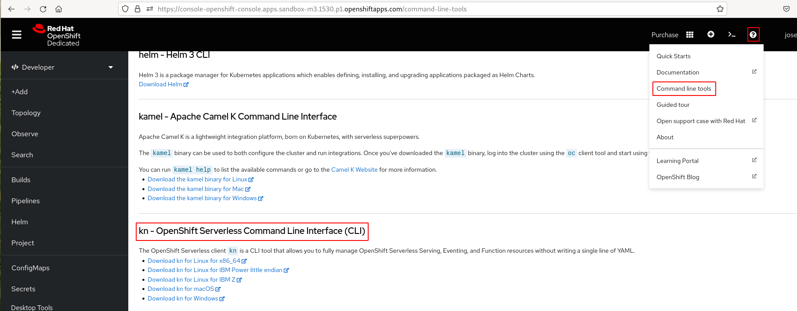
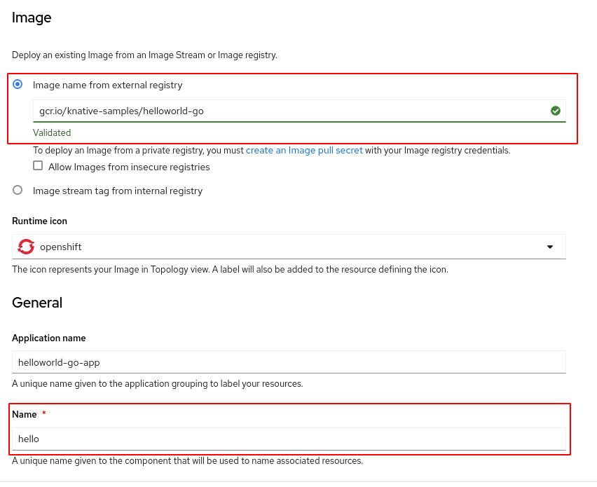
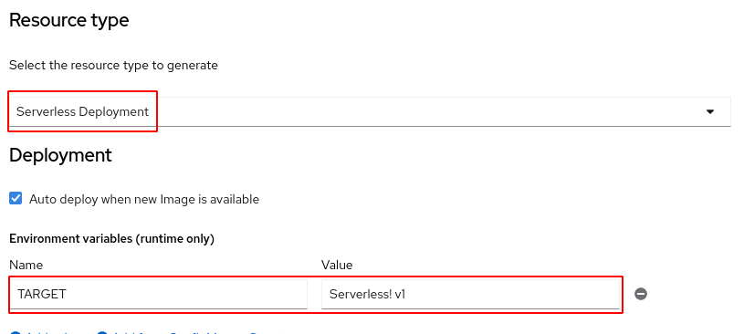
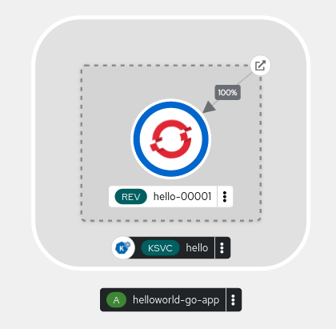
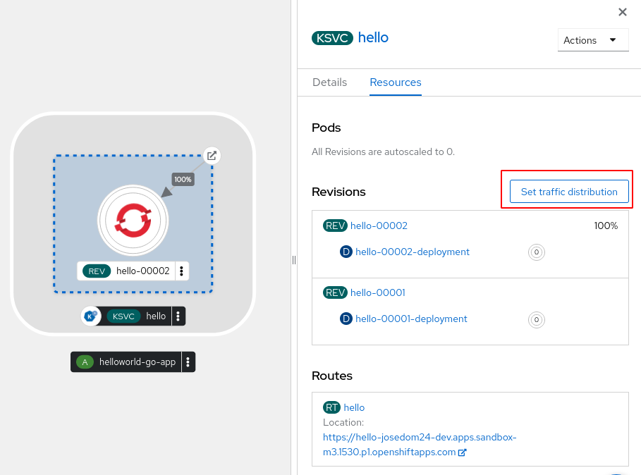
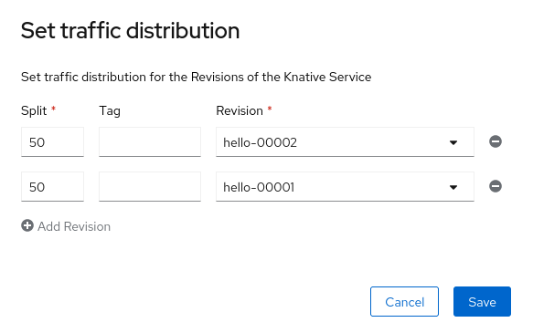
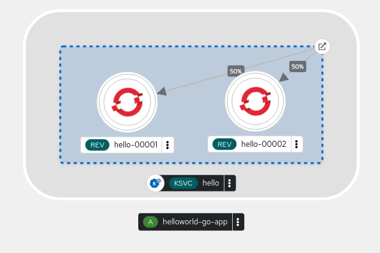

# Ejemplo de Serverless Serving

## Knative CLI

En estos ejemplos, vamos a usar la herramienta de línea de comando `kn` para manejar las aplicaciones Serverless. Para bajar esta herramienta, accedemos a la consola web de OpenShift y elegimos la opción **Command line tools** en el icono de ayuda (**?**):



También los puedes bajar en la página de la [documentación oficial](https://docs.openshift.com/container-platform/4.12/serverless/install/installing-kn.html).

Para la instalación, descomprimimos y copiamos a un directorio que tengamos en el path:

    tar -xf kn-linux-amd64.tar.gz
    sudo cp kn /usr/local/bin
    
    kn version
    Version:      v1.7.1
    Build Date:   2023-03-29 06:35:36
    ...

## Desplegando una aplicación Serverless

Tenemos varias formas de realizar el despliegue:

### Usando la definición del servicio en un fichero yaml

La definición del despliegue Serverless lo tenemos guardado en el fichero `serverless.yaml`:

```yaml
apiVersion: serving.knative.dev/v1
kind: Service
metadata:
  name: hello 
spec:
  template:
    spec:
      containers:
        - image: gcr.io/knative-samples/helloworld-go
          env:
            - name: TARGET 
              value: "Serverless! v1"
```

En ella hemos indicado la imagen que vamos a desplegar, con una variable de entrono que será el mensaje que devuelve la aplicación. Para crear el despliegue:

    oc apply -f serverless.yaml

### Usando el CLI kn

Si usamos la herramienta `kn`, ejecutamos:

    kn service create hello \
    --image gcr.io/knative-samples/helloworld-go \
    --port 8080 \
    --env TARGET="Serverless! v1"

### Desde la consola web de OpenShift

Añadimos un nuevo despliegue desde una imagen:



Indicamos la imagen, el nombre y nos aseguramos que en el tipo de despliegue (**Resource type**) está configurado como **Serverless Deployment** y creamos la variable de entorno:



## Comprobación de los recursos que se han creado

Si creamos con la aplicación con cualquiera de las tres alternativas, podemos comprobar los recursos que se han creado:

    oc get ksvc,revision,configuration,route.serving.knative
    NAME                                URL                                                                     LATESTCREATED   LATESTREADY   READY   REASON
    service.serving.knative.dev/hello   https://hello-josedom24-dev.apps.sandbox-m3.1530.p1.openshiftapps.com   hello-00001     hello-00001   True    

    NAME                                       CONFIG NAME   K8S SERVICE NAME   GENERATION   READY   REASON   ACTUAL REPLICAS   DESIRED REPLICAS
    revision.serving.knative.dev/hello-00001   hello                            1            True             0                 0

    NAME                                      LATESTCREATED   LATESTREADY   READY   REASON
    configuration.serving.knative.dev/hello   hello-00001     hello-00001   True    

    NAME                              URL                                                                     READY   REASON
    route.serving.knative.dev/hello   https://hello-josedom24-dev.apps.sandbox-m3.1530.p1.openshiftapps.com   True    

Puedes ver estos recursos también con la herramienta `kn`:

    kn service list
    kn revision list
    kn route list


Veamos los recursos que se han creado propios de las aplicaciones Serverless:

* **Service**: El objeto **service.serving.knative.dev** gestiona automáticamente el ciclo de vida de su carga de trabajo para garantizar que la aplicación se despliega y es accesible a través de la red. Crea una ruta, una configuración y una nueva revisión para cada cambio en un servicio creado por el usuario, o recurso personalizado.
* **Revision**: El objeto **revision.serving.knative.dev** es una instantánea puntual del código y la configuración para cada modificación realizada en la carga de trabajo. 
* **Route**: El objeto **route.serving.knative.dev** asigna una URL para acceder a una o varias revisiones.
* **Configuration**: El objeto **configuration.serving.knative.dev** mantiene el estado deseado para su despliegue. Proporciona una separación limpia entre el código y la configuración. Modificar una configuración crea una nueva revisión.


Realmente podemos comprobar que estos objetos han creado otros objetos, para que la aplicación este desplegada:



Si obtenemos los recursos en el terminal:

    oc get all -o name
    pod/hello-00001-deployment-57d4c44b69-6wb6z
    service/hello
    service/hello-00001
    service/hello-00001-private
    service/modelmesh-serving
    deployment.apps/hello-00001-deployment
    replicaset.apps/hello-00001-deployment-57d4c44b69
    imagestream.image.openshift.io/hello
    route.serving.knative.dev/hello
    service.serving.knative.dev/hello
    revision.serving.knative.dev/hello-00001
    configuration.serving.knative.dev/hello

## Autoescalado

Podemos comprobar que la aplicación funciona:

    curl https://hello-josedom24-dev.apps.sandbox-m3.1530.p1.openshiftapps.com
    Hello Serverless! v1!

Comprobamos que hay un Pod ejecutando la aplicación:

    oc get pod
    NAME                                      READY   STATUS    RESTARTS   AGE
    hello-00001-deployment-57d4c44b69-vd7kz   2/2     Running   0          3s

Si esperamos unos segundos veremos que el despliegue Serverless escala a 0, eliminando el Pod mientras no accedemos a la aplicación.

    oc get pod
    NAME                                      READY   STATUS        RESTARTS   AGE
    hello-00001-deployment-57d4c44b69-4df6z   2/2     Terminating   0          64s

Puedes ejecutar la instrucción `watch oc get pod` y comprobar como se crean y eliminan los Pods si hay o no tráfico hacia la aplicación.

## Distribución de tráfico hacía una aplicación Serverless

Esta característica la podemos usar para realizar distintas estrategias de despliegues, por ejemplo una estrategia Blue/Green. Para ello vamos a crear una nueva revisión, creando un nuevo objeto **Revision** modificando la configuración del servicio, por ejemplo cambiando la variable de entorno. Para ello podemos realizar la modificación como hemos con otros objetos de OpenShift:

    oc edit ksvc/hello
    ...
    containers:
      - env:
        - name: TARGET
          value: Serverless! v2

Esta modificación también se puede hacer con la herramienta `kn`:

    kn service update hello --env TARGET="Serverless! v2"

Ahora hemos creado una segunda revisión de la aplicación:

    oc get revision
    NAME          CONFIG NAME   K8S SERVICE NAME   GENERATION   READY   REASON   ACTUAL REPLICAS   DESIRED REPLICAS
    hello-00001   hello                            1            True             0                 0
    hello-00002   hello                            2            True             0                 0

El objeto **Revision** que hemos creado ha creado un nuevo **Deployment** que controlará los Pods de la nueva versión de la aplicación.
Si accedemos ahora a la ruta de la aplicación, veremos que nos redirige a los Pods de la nueva revisión:

    curl https://hello-josedom24-dev.apps.sandbox-m3.1530.p1.openshiftapps.com
    Hello Serverless! v2!

Sin embargo, de una manera muy sencilla podemos redistribuir el tráfico entre cualquier revisión del despliegue, asignando pesos a cada uno de ello y de está manera podemos implementar una estrategia de despliegue Blue/Green.

Por ejemplo, desde la consola web, elegimos la opción **Set traffic distribution**:



Y indicamos el peso que asignamos a cada revisión para que el tráfico se distribuye con esa proporción:



En la topología obtenemos el siguiente esquema:



Ahora podemos probar el acceso de la aplicación ejecutando el siguiente bucle:

    while true; do curl https://hello-josedom24-dev.apps.sandbox-m3.1530.p1.openshiftapps.com; done
    Hello Serverless! v2!
    Hello Serverless! v1!
    ...

La distribución entre distintas revisiones se puede realizar también con la herramienta `kn`:

    kn service update hello --traffic hello-00001=25 --traffic @latest=75