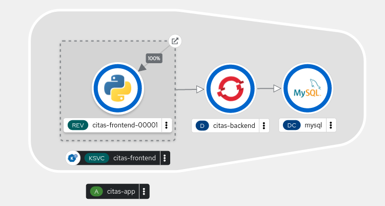

# Despliegue de aplicación Citas en OpenShift v4 (2ª parte)

## Despliegue de la base de datos mysql

Para hacer el despliegue de la base de datos persistente vamos a usar la plantilla `mysql-persistent`. Veamos los parámetros que podemos configurar:

    oc process --parameters mysql-persistent -n openshift
    NAME                    DESCRIPTION                                                             GENERATOR           VALUE
    MEMORY_LIMIT            Maximum amount of memory the container can use.                                             512Mi
    NAMESPACE               The OpenShift Namespace where the ImageStream resides.                                      openshift
    DATABASE_SERVICE_NAME   The name of the OpenShift Service exposed for the database.                                 mysql
    MYSQL_USER              Username for MySQL user that will be used for accessing the database.   expression          user[A-Z0-9]{3}
    MYSQL_PASSWORD          Password for the MySQL connection user.                                 expression          [a-zA-Z0-9]{16}
    MYSQL_ROOT_PASSWORD     Password for the MySQL root user.                                       expression          [a-zA-Z0-9]{16}
    MYSQL_DATABASE          Name of the MySQL database accessed.                                                        sampledb
    VOLUME_CAPACITY         Volume space available for data, e.g. 512Mi, 2Gi.                                           1Gi
    MYSQL_VERSION           Version of MySQL image to be used (8.0-el7, 8.0-el8, or latest).                            8.0-el8

Creamos el despliegue ejecutando:

    oc new-app mysql-persistent -p MYSQL_USER=usuario \
                                -p MYSQL_PASSWORD=asdasd \
                                -p MYSQL_DATABASE=citas \
                                -p MYSQL_ROOT_PASSWORD=asdasd \
                                -p VOLUME_CAPACITY=5Gi \
                                -l app.kubernetes.io/part-of=citas-app \
                                -l app.openshift.io/runtime=mysql-database

Y comprobamos los recursos que hemos creado:

A continuación nos queda inicializar la base de datos, para ello vamos a copiar el fichero `citas.sql` al pod. Para facilitar el copiado de ficheros vamos a guardar el nombre del Pod en una variable de entorno:

    export PODNAME="mysql-2-wzqv4"

A continuación copiamos el fichero:

    oc cp citas.sql $PODNAME:/tmp/

Y finalmente ejecutamos el fichero sql:

    oc exec dc/mysql -- bash -c "mysql -uroot -pasdasd -h 127.0.0.1 < /tmp/citas.sql"

finalmente comprobamos que hemos guardado las citas en la tabla `quotes`:

    oc exec -it dc/mysql -- bash -c "mysql -u root -padmin -h 127.0.0.1 citas"
    ...
    mysql> select * from quotes;
    +----+---------------------------------------------------------------------------------------------------------------------------------------------------------------+---------------------+
    | Id | quotation                                                                                                                                                     | author              |
    +----+---------------------------------------------------------------------------------------------------------------------------------------------------------------+---------------------+
    |  1 | Yeah, well, that's just like, your opinion, man.                                                                                                              | The Dude            |
    |  2 | It is not only what you do but also the attitude you bring to it, that makes you a success.                                                                   | Don Schenck         |
    ...

## Actualización de la aplicación citas-backend

Para terminar este ejercicio, vamos a actualizar `citas-backend` a la versión 2. Esta versión conecta con la base de datos mysql, para obtener las citas, por lo que tendremos que configurar las credenciales de acceso a la base de datos utilizando variables de entorno.

Por lo tanto en el despliegue de `citas-backend` vamos a crear las variables de entorno necesarias. Para realizar esta operación, vamos a crear un recurso **ConfigMap** con las variables de entorno que posteriormente cargaremos en el despliegue:

    oc create cm citas-mysql --from-literal=USER_DB=usuario \
                          --from-literal=PASSWORD_DB=asdasd     \
                          --from-literal=HOST_DB=mysql 

Y configuramos el objeto **Deployment** `citas-backend` con las variables que hemos creado en el **ConfigMap** con el parámetro `--from`:

    oc set env deploy/citas-backend --from=cm/citas-mysql

Por último actualizamos la etiqueta del **ImageStream** para que `prod` apunte a `v2`:

    oc tag -d citas-backend:prod
    oc tag citas-backend:v2 citas-backend:prod

Se produce de forma automática la actualización del despliegue y podemos acceder de nuevo a la página web y comprobamos que el servicio que está devolviendo la información de la citas es `citas-backend` **versión 2** y además comprobamos que tenemos más citas (en la tabla hay 16 citas), la versión 1 tenía sólo 6 citas:

