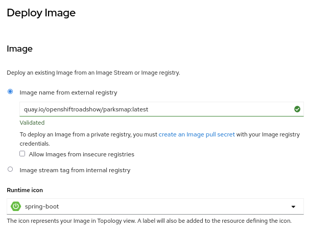
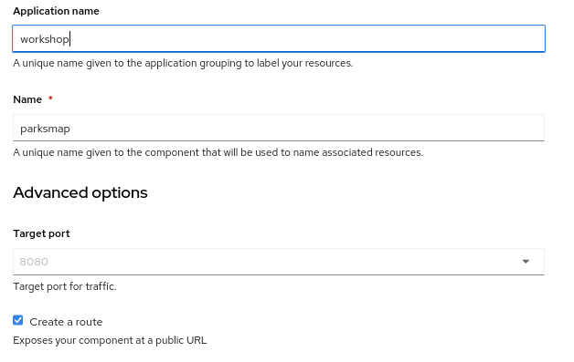
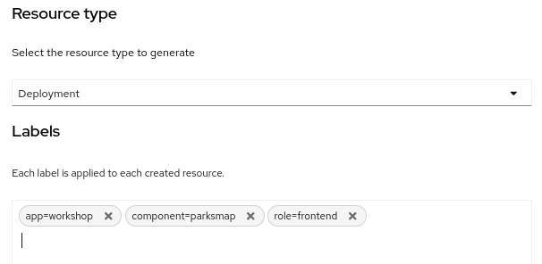
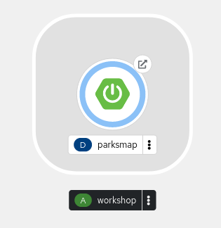
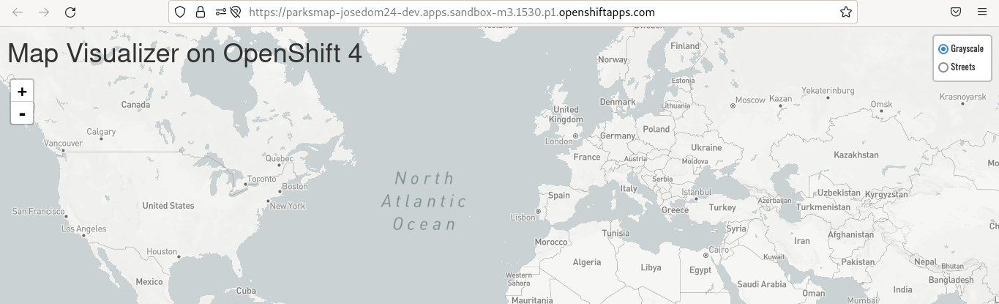
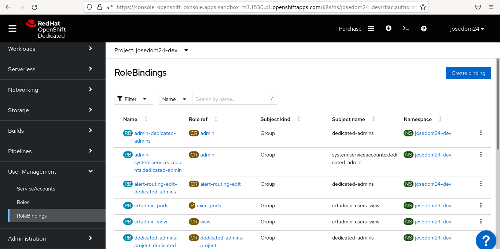
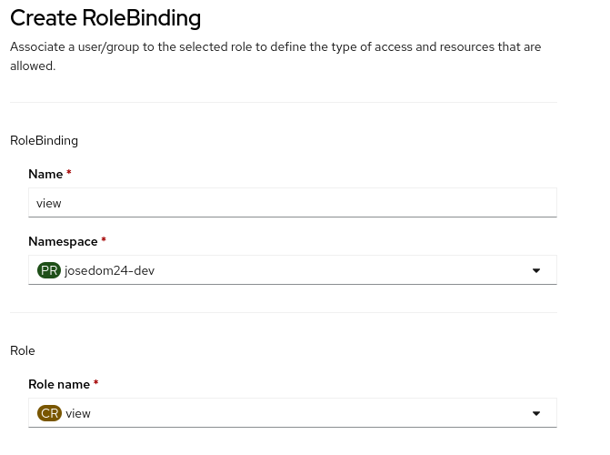
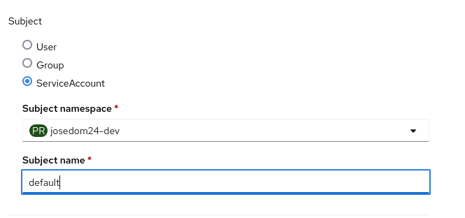

# Despliegue de aplicación Parksmap en OpenShift v4 (1ª parte)

Este ejercicio esta basado y es una adaptación al ejemplo que se muestra en la guía [OpenShift Starter Guides](https://redhat-scholars.github.io/openshift-starter-guides/rhs-openshift-starter-guides/4.9/index.html).

## Arquitectura de la aplicación

## Despliegue de Parksmap

Como hemos visto anteriormente, Parksmap es la aplicación frontend que visualizará en un mapa las coordenados de los parques nacionales. Esta aplicación está escrita con el framework de Java **Spring-boot** y vamos a desplegarla usando la imagen `quay.io/openshiftroadshow/parksmap:latest` desde la consola web:

Hemos escogido en la vista **Developer**, la opción **+Add -> Conatiner Images**, e indicamos la imagen y el icono de **spring-boot**:

A continuación, indicamos el nombre de la aplicación, el nombre del despliegue y creamos un recurso **Route**:

Por último indicamos que vamos a desplegar la aplicación como un objeto **Deployment** e indicamos las siguientes etiquetas:

* `app=workshop`
* `component=parksmap`
* `role=frontend`

Creamos el despliegue, y al cabo de unos segundos comprobamos los recursos creados en la topología:

Accedemos a la URL del objeto **Route** y comprobamos que la aplicación está funcionando, aunque todavía no puede mostrar la localización de los puertos naturales:

### Permisos

Todas las interacciones que hacemos sobre la API de OpenShift son **autenticadas** (¿Quién eres?) y **autorizadas** (¿Estás autorizado a hacer esta operación?).

Muchas de las interacciones que se hacen sobre la API de OpenShift se realizan por el usuario final, pero muchas otras se hacen internamente. Para hacer estas últimas peticiones a la API se utiliza una cuenta especial de usuario, que se llaman **Service Account**.

OpenShift crea automáticamente algunas **Service Account** en cada proyecto. Por ejemplo, hay una **Service Account** que se llama **default** y será la responsable de ejecutar los pods.

Puede ver los permisos actuales en la consola web: en la vista **Administrator** y escoge la opción **User Management -> RoleBindings**:

Más adelante, veremos que la aplicación Parksmap necesita hacer una petición a la API OpenShift para preguntar sobre la configuración de otros recursos.

Por lo tanto, tenemos que otorgar el permiso **view** al **Service Account default**, para que l pod pueda consultar sobre los recursos que se encuentran dentro del proyecto. Para ello, pulsamos sobre le botón **Create binding** de la pantalla anterior y configuramos el permiso indicando el nombre del permiso, el proyecto y el **Role** `view` que se va a asignar a un **Service Account** llamado **default** en nuestro proyecto.

Si queremos hacerlo desde la terminal, ejecutamos:

    oc policy add-role-to-user view -z default

## Ejercicios adicionales

1. Utilizando el comando `oc` o desde la consola web, visualiza todos los recursos que se han creado y visualiza los detalles de cada uno de ellos.
2. Visualiza la definición YAML del pod que se está ejecutando.
3. Accede a la pestaña de **Metrics** y visualiza la monitorización y las métricas del pod que se está ejecutando.
4. Visualiza la definición YAML del recurso **Service** que se ha creado. ¿Qué tipo de **Service** se ha creado?
5. Escala el despliegue para que tenga dos replicas.
6. Accede a la URL de la aplicación y visualiza los logs del despliegue.
7. Accede de forma remota al terminal de unos de los pods que se está ejecutando.
