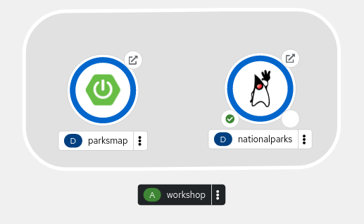
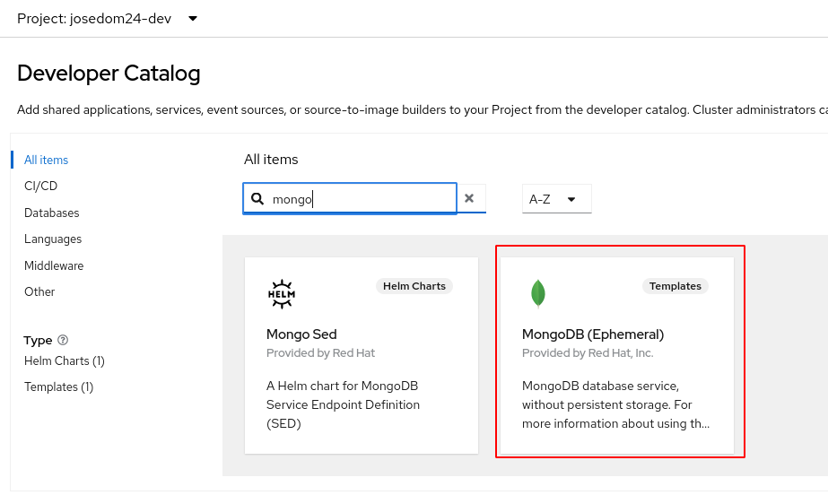
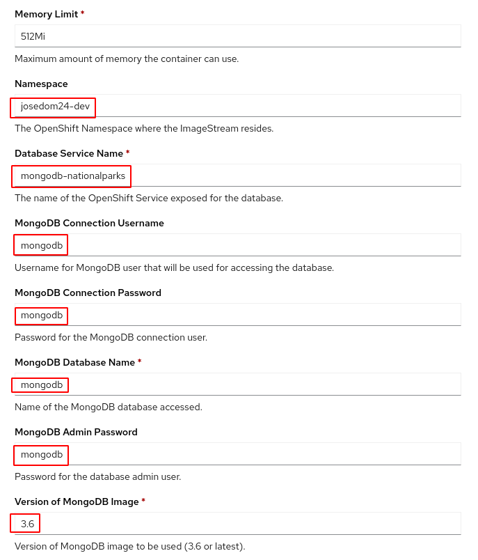
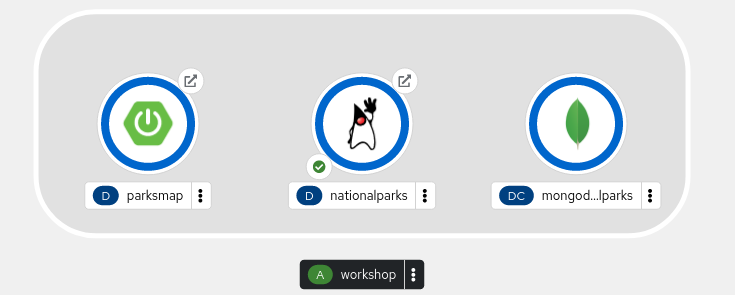
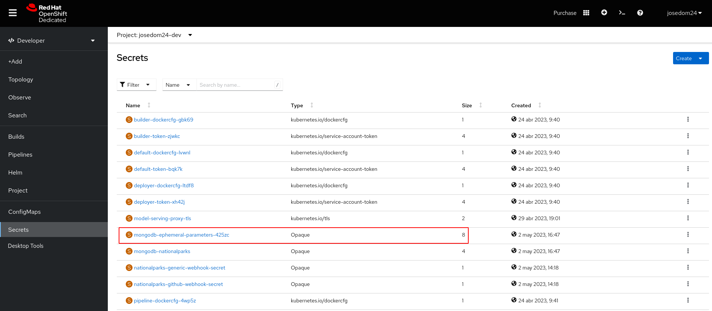
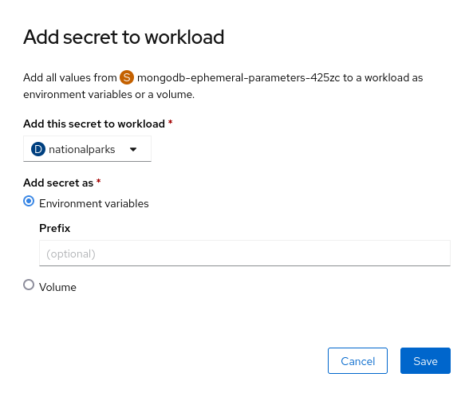
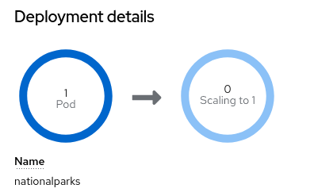
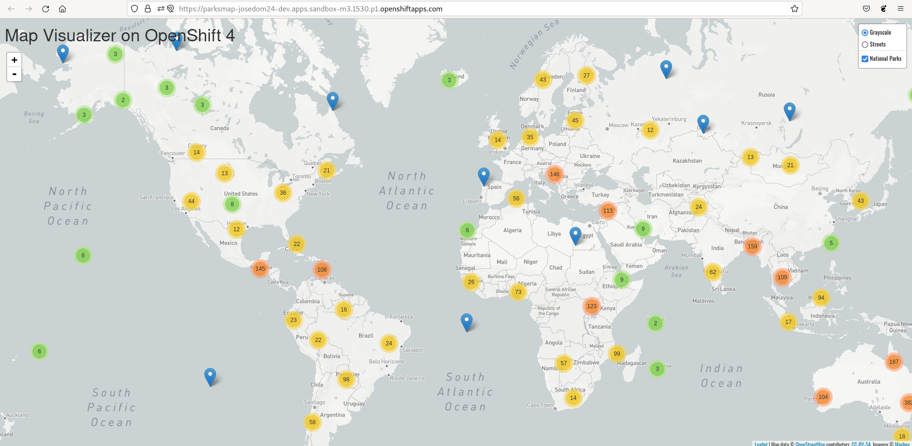

# Despliegue de aplicación Nationalparks en OpenShift v4 (2ª parte)

En este apartado vamos a desplegar la aplicación escrita en Java **Nationalparks**, es el servicio backend, que expondrá varios endpoints que la aplicación **Parksmap** utilizará para obtener la información de los Parques Nacionales que visualizará en el mapa. Este servicio guarda la información de los Parques Nacionales en una base de datos **MongoDB**. Para hacer las peticiones a este servicio se utilizará una URL proporcionada por el objeto **Route** que crearemos a continuación.

Vamos a usar la estrategia de construcción de imágenes **source-2-image**, utilizando el código de la aplicación que se encuentra en el repositorio `https://github.com/openshift-roadshow/nationalparks.git`.

Vamos a crear el despliegue desde la terminal, para ello:

    oc new-app java:openjdk-11-ubi8~https://github.com/openshift-roadshow/nationalparks.git --name=nationalparks --strategy=source -l 'app=workshop,component=nationalparks,role=backend,app.kubernetes.io/part-of=workshop,app.openshift.io/runtime=java'
                    
    oc expose service/nationalparks

Una vez creado los recursos accedemos a la topología y comprobamos los que hemos creado:

Para comprobar que la aplicación está funcionando podemos acceder a la URL `/ws/info` y nos debe aparecer un JSON de ejemplo:

    curl http://nationalparks-josedom24-dev.apps.sandbox-m3.1530.p1.openshiftapps.com/ws/info   
    {"id":"nationalparks","displayName":"National Parks","center":{"latitude":"47.039304","longitude":"14.505178"},"zoom":4}

## Conexión a la base de datos

Es el momento de desplegar una base de datos MongoDB para guardar la información de los parques naturales. Para realizar la instalación de MongoDB vamos a usar un **Template** que vamos a crear en nuestro proyecto:

    oc create -f https://raw.githubusercontent.com/openshift-labs/starter-guides/ocp-4.8/mongodb-template.yaml

Hay que indicar que el **Template** que hemos creado intenta crear el despliegue de MongoDB desde una imagen `mongodb:3.6` que busca por defecto en el proyecto `openshift`. Como en **RedHat OpenShift Dedicated Developer Sandbox** no tenemos esa imagen, vamos a crear un objeto **ImageStream** en nuestro proyecto que apunte a una imagen de MongoDB externa, para ello:

    oc import-image mongodb:3.6 --from=registry.access.redhat.com/rhscl/mongodb-36-rhel7 --confirm

Añadimos el despliegue desde el **catálogo de aplicaciones**, donde buscamos la plantilla que acabamos de crear:

Y realizamos la siguiente configuración:

* Indicamos como **Namespace** donde tiene que buscar el **ImageStream** con el que estamos trabajando.
* El nombre del servicio lo configuramos como `mongodb-nationalparks`.
* Las credenciales de la base de datos, usuario, contraseña, base de datos, contraseña del administrador lo configuramos com `mongodb`.
* Y la versión de la imagen dejamos la `3.6`.

Una vez creada la base de datos, podemos ver los recursos que tenemos en nuestro proyecto desde la topología:

Ahora tenemos que configurar la aplicación **Nationalparks** con las credenciales de acceso a la base de datos para que pueda conectar al MongoDB, para ello vamos a usar el recurso **Secret** que se ha creado con la plantilla y vamos a configurar las variables de entorno de **Nationalparks** con los valores del **Secret**. Para ello, accede a la opción **Secrets** y elige el que se ha creado con la plantilla:

A continuación vamos a usarlo para configurar el despliegue de **Nationalparks**, para ello pulsa sobre el botón **Add Secret to workload**:

Elegimos el **Deployment** **Nationalparks** y lo configuramos con estas nuevas variables de entorno. La configuración del despliegue a cambiado por lo que se producirá una actualización del despliegue, creando un nuevo **ReplicaSet** y un nuevo conjunto de Pods.

A continuación etiquetamos los recursos de MongoDB de forma adecuada:

    oc label dc/mongodb-nationalparks svc/mongodb-nationalparks app=workshop component=nationalparks role=database --overwrite

Para cargar los datos sobre los Parques Nacionales a la base de datos, tenemos que ejecutar la URL `/ws/data/load` de la aplicación **Nationalparks**, para ello:

    curl http://nationalparks-josedom24-dev.apps.sandbox-m3.1530.p1.openshiftapps.com/ws/load
    Items inserted in database: 2893

Ahora si accedemos a la URL `/ws/data/all` veremos un JSON con todos los datos de los Parques Nacionales, que esta leyendo de la base de datos.

Finalmente, veamos como la aplicación **Parksmap** se puede comunicar con la aplicación **Nationalparks**. En otros ejemplos configuramos el frontend con el nombre del recurso **Service** del backend para que pudiera tener acceso al servicio.

En este caso, **Parksmap** está consultando la API de OpenShift y preguntando por las rutas y servicios del proyecto. Si alguno de ellos tiene una etiqueta que sea `type=parksmap-backend`, la aplicación sabe que debe hacer peticiones a esa URL para buscar los datos del mapa. Por lo tanto, si queremos que **Parksmap** haga peticiones a **Nationalparks** para pedir información de los Parques Nacionales y poder visualizarlos tenemos que asignar la etiqueta indicada al recurso **Route** de **Nationalparks**, para ello:

    oc label route nationalparks type=parksmap-backend

Y ahora si accedemos a la URL de **Parksmap**, veremos la visualización de los Parques Nacionales:

