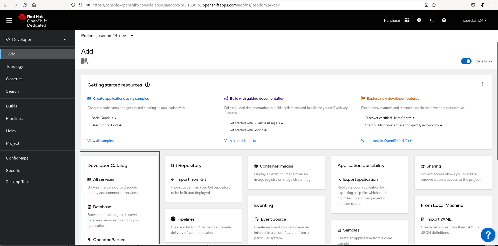
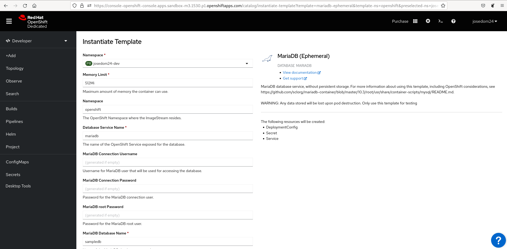
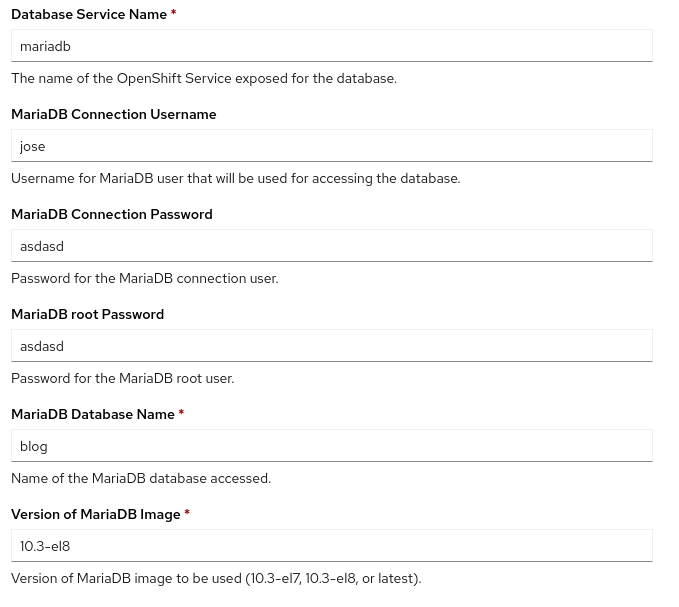
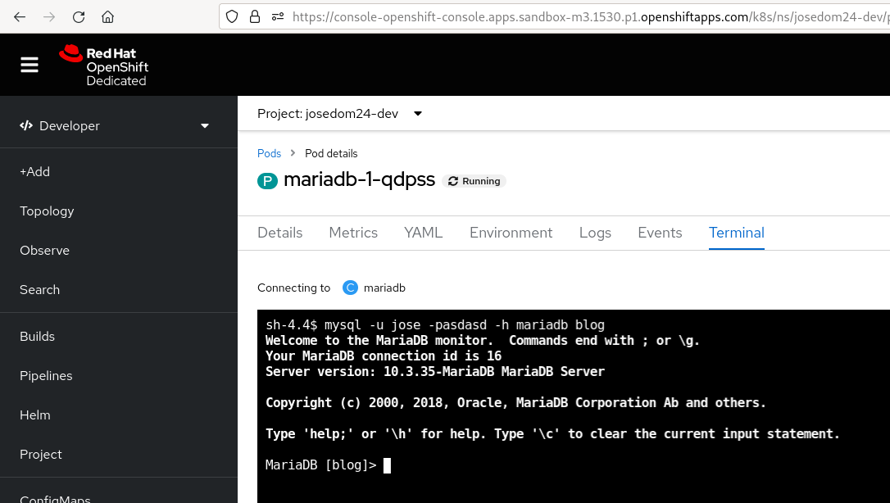

# Despliegue de aplicaciones desde el catálogo desde la consola web

Como hemos indicado, OpenShift nos ofrece un conjunto de **Templates** que podemos encontrar en el **catálogo de aplicaciones**. Para acceder al catálogo, desde la vista **Developer**, escogemos la opción de **+Add** y elegimos el apartado **Developer Catalog**:

Dentro del catálogo, filtramos por la opción **Templates**:

Vemos que podemos hacer búsquedas más específicas, y que tenemos distintas categorías de plantillas: CI/CD, Databases, Languajes,...
Vamos a trabajar con el mismo **Template** que en el apartado anterior: `mariadb-ephemeral`, para ello lo escogemos de la lista y pulsamos sobre el botón **Instantiate Template**:

Como podemos observar, nos aparece un formulario con los parámetros que podemos configurar, también vemos la lista de objetos que se crearán a partir de la plantilla. Para realizar la configuración, indicamos los mismos valores que pusimos en el apartado anterior:

Pulsamos el botón **Create**, y al cabo de unos segundos tenemos desplegada nuestra base de datos:

Finalmente, para comprobar que la base de datos está funcionando, podemos acceder a los detalles del Pod que se ha creado, y en la **Terminal** accedemos al servicio de mariadb:

