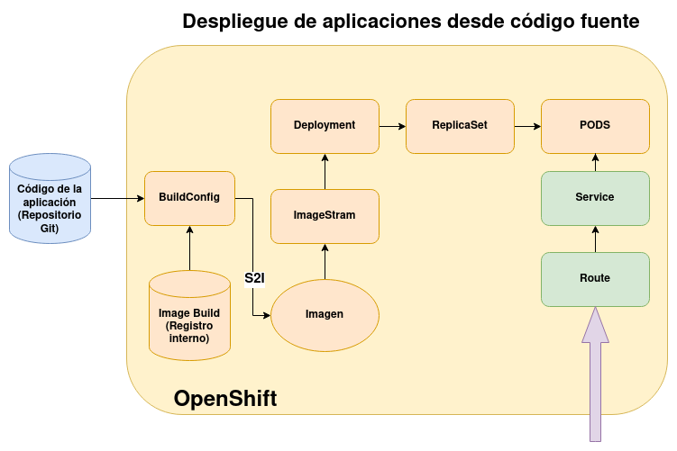
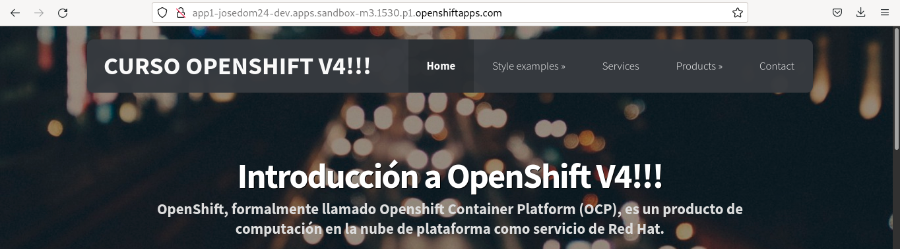

# Despliegue de aplicaciones desde código fuente con oc

El esquema para ver los recursos que se crean en OpenShift al realizar un despliegue desde código fuente es el siguiente:

Como vemos, el proceso es el siguiente:

1. Tenemos que indicar la URL del repositorio GitHub donde se encuentra la aplicación.
2. OpenShift examina el contenido del repositorio y si es posible, te sugiere la **Image builder** que podemos usar para construir la nueva imagen. Si no es posible o queremos usar otra, tendremos que indicarla.
3. Se crea un recuso **BuildConfig** responsable de realizar la construcción. 
4. La configuración de una construcción en concreto se guarda en un recurso **Build**.
5. El proceso de construcción se realizará en un **build pod**.

## Despliegue de una página estática con un servidor apache2

Queremos construir una imagen con un servidor web a partir de un repositorio donde tenemos una página web estática, para ello ejecutaremos:

    oc new-app https://github.com/josedom24/osv4_html.git --name=app1
    error: No language matched the source repository

Vemos que no es posible averiguar el lenguaje con el que está escrito, por lo que tendremos que indicar la **Builder Image** que vamos a utilizar. 

Las **Builder Image** están referenciadas por una **Image Stream**, por ejemplo, podemos buscar las **Builder Image** con el servidor web apache:

    oc new-app -S httpd
    ...
    Image streams ...
    -----
    httpd
      Project: openshift
      Tags:    2.4-el7, 2.4-ubi8, 2.4-ubi9, latest

Obtenemos además las distintas etiquetas que podemos usar, que corresponden a distintas versiones del servidor web. Por lo tanto si queremos generar una imagen con el código de nuestro repositorio usando de base una imagen basada en *httpd* (al no indicar la etiqueta se escogerá la *latest* que apunta a la última versión de la imagen), ejecutamos:

    oc new-app httpd~https://github.com/josedom24/osv4_html.git --name=app1
    
    ...
    --> Found image e54df11 (5 months old) in image stream "openshift/httpd" under tag "2.4-ubi8" for "httpd"
    ...
    --> Creating resources ...
        imagestream.image.openshift.io "app1" created
        buildconfig.build.openshift.io "app1" created
        deployment.apps "app1" created
        service "app1" created
    --> Success
        Build scheduled, use 'oc logs -f buildconfig/app1' to track its progress.
        Application is not exposed. You can expose services to the outside world by executing one or more of the commands below:
         'oc expose service/app1' 
        Run 'oc status' to view your app.
    
Como vemos se han creado varios recursos:

1. Un **ImageStream** `app1` que apuntará a la nueva imagen que vamos a generar, y que se utilizará en la definición del despliegue.
2. Un **BuildConfig**, que guardará la configuración necesaria para construir la nueva imagen. De forma automática creará un objeto **Build** responsable de crear la imagen. Este proceso se realizará en un **build pod**.
3. Un recurso **Deployment** responsable de desplegar los recursos necesario para ejecutar los Pods.
4. Un recurso **Service** que nos posibilita el acceso a la aplicación.
5. No ha creado un recurso **Route** para el acceso por medio de una URL, pero nos ha indicado el comando necesario para crearlo.

Podemos comprobar todos los recursos que se han creado, ejecutando:

    oc status
    ...
    svc/app1 - 172.30.217.224 ports 8080, 8443
      deployment/app1 deploys istag/app1:latest <-
        bc/app1 source builds https://github.com/josedom24/osv4_html.git on openshift/httpd:2.4-ubi8 
        deployment #2 running for 30 seconds - 1 pod
        deployment #1 deployed about a minute ago

También podemos ver los recursos que hemos creado, ejecutando:

    oc get all

    NAME                       READY   STATUS      RESTARTS   AGE
    pod/app1-1-build           0/1     Completed   0          2m20s
    pod/app1-f55dbb8d7-r4bkx   1/1     Running     0          105s

    NAME                        TYPE        CLUSTER-IP       EXTERNAL-IP   PORT(S)                               AGE
    service/app1                ClusterIP   172.30.217.224   <none>        8080/TCP,8443/TCP                     2m21s

    NAME                   READY   UP-TO-DATE   AVAILABLE   AGE
    deployment.apps/app1   1/1     1            1           2m21s

    NAME                              DESIRED   CURRENT   READY   AGE
    replicaset.apps/app1-5bc9cfc7b9   0         0         0       2m21s
    replicaset.apps/app1-f55dbb8d7    1         1         1       106s

    NAME                                  TYPE     FROM   LATEST
    buildconfig.build.openshift.io/app1   Source   Git    1

    NAME                              TYPE     FROM          STATUS     STARTED         DURATION
    build.build.openshift.io/app1-1   Source   Git@5ae3b13   Complete   2 minutes ago   37s

    NAME                                  IMAGE REPOSITORY                                                                                      TAGS     UPDATED
    imagestream.image.openshift.io/app1   default-route-openshift-image-registry.apps.sandbox-m3.1530.p1.openshiftapps.com/josedom24-dev/app1   latest   About a minute ago

Finamente, creamos el recurso **Route**:

    oc expose service app1

Y accedemos a la aplicación:

