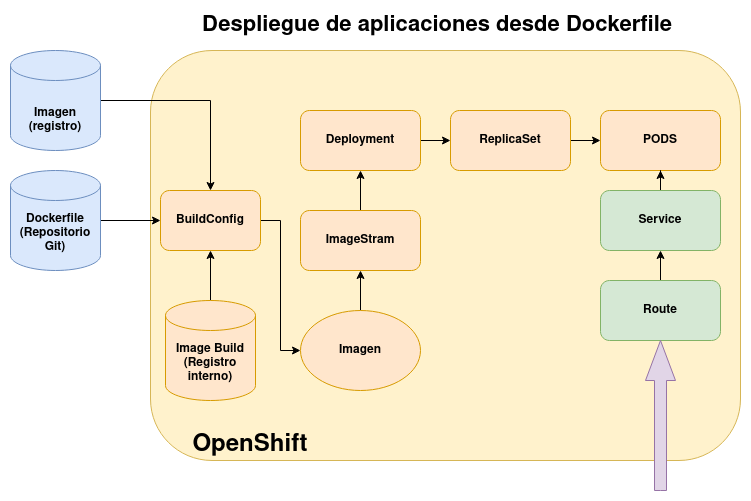

# Despliegue de aplicaciones desde Dockerfile con oc

El esquema para ver los recursos que se crean en OpenShift al realizar un despliegue desde un fichero `Dockerfile` es el siguiente:

Sigamos trabajando con el mismo repositorio y ahora vamos a suponer que queremos ejecutar nuestra aplicación con otra imagen base y hacer una configuración extra en la creación de la imagen. Tendríamos que crear un fichero `Dockerfile` para especificar los pasos de creación de la imagen. Para ello, creamos un fichero `Dockerfile` en el repositorio con el siguiente contenido:

    FROM bitnami/nginx
    WORKDIR /app
    COPY . /app

Evidentemente, este fichero puede ser más complejo si la construcción de la imagen lo requiere. Ahora guardamos el fichero en el repositorio:

    git add Dockerfile
    git commit -am "php"
    git push

Y ahora al intentar crear una nueva aplicación, OpenShift detectará que hay un fichero `Dockerfile` en el repositorio y lo utilizará para la creación automática de la imagen:

    oc new-app https://github.com/josedom24/osv4_html.git --name=app1

Si queremos que la construcción se vuelva a realizar usando el mecanismos de s2i, tendremos que indicar la estrategia específicamente:

    oc new-app https://github.com/josedom24/osv4_html.git --name=app2 --strategy=source

Y volverá a usar el mecanismo anterior.

