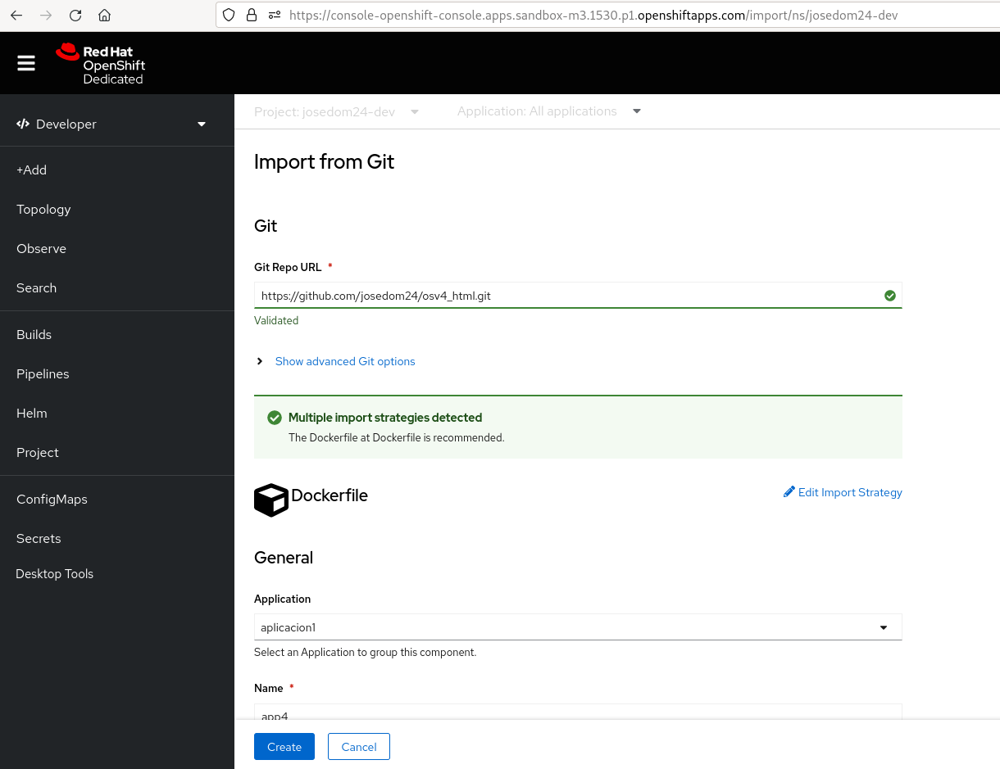
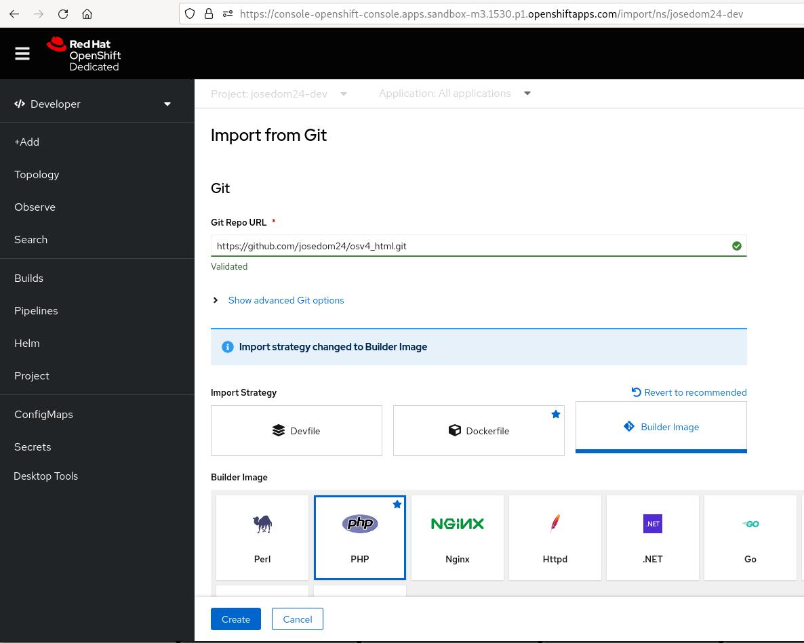

# Despliegue de aplicaciones desde Dockerfile desde la consola web

Como indicábamos en el apartado anterior, ahora vamos a añadir un fichero `Dockerfile` (el mismo que vimos en el apartado anterior) al repositorio. En este caso, volvemos a elegir la opción **+Add** y elegimos el apartado **Git Repository**. Y comprobaremos que ahora nos sugiere la estrategia docker para construir la nueva imagen:

Si queremos que la construcción se vuelva a realizar usando el mecanismos de **Source-to-Image**, tendremos que indicar la estrategia específicamente pulsando sobre la opción **Edit Import Strategy**:

