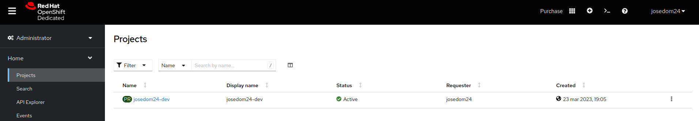
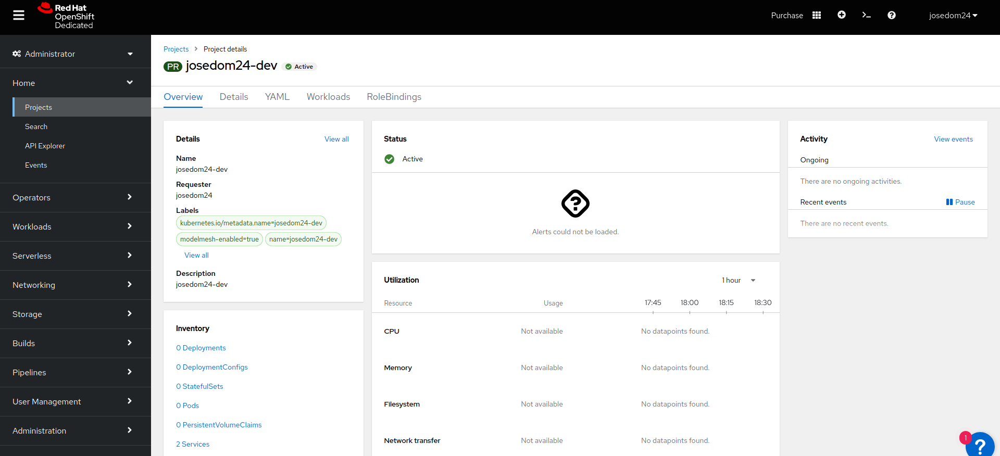
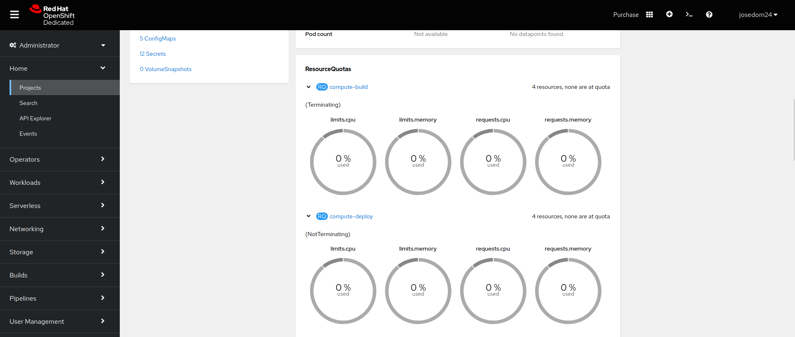

# Visión general del proyecto de trabajo

Un proyecto permite a OpenShift agrupar distintos recursos. Es similar al recurso namespace de Kubernetes, pero guarda información adicional.

De hecho, cada vez que se crea un nuevo proyecto, se crea un recursos namespace con el mismo nombre.

En RedHat OpenShift Dedicated Developer Sandbox, no podemos crear nuevos proyecto y se nos asigna de forma automática un proyecto con el mismo nombre que el de nuestro usuario.

Para acceder a la información de nuestro proyecto, en la **Vista Administrator**, escogemos la opción **Home -> Projects**:

Si pulsamos sobre el nombre del proyecto, obtendremos los detalles del mismo: definición, inventario, uso de recursos, métricas, cuotas, eventos,...

Tenemos varias opciones:

* **Details**: detalles sobre la definición del proyecto.
* **YAML**: definición YAML del recurso proyecto.
* **Workloads**: acceso a todos los recursos definidos en este proyecto.
* **RoleBindings**: Permisos definidos para este proyecto.