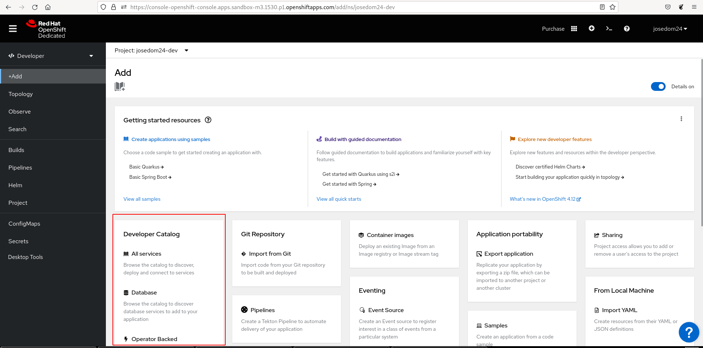
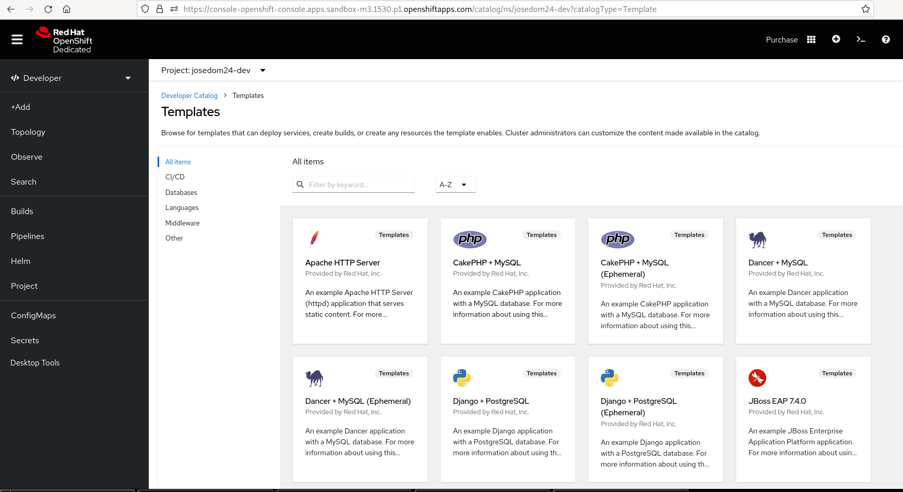
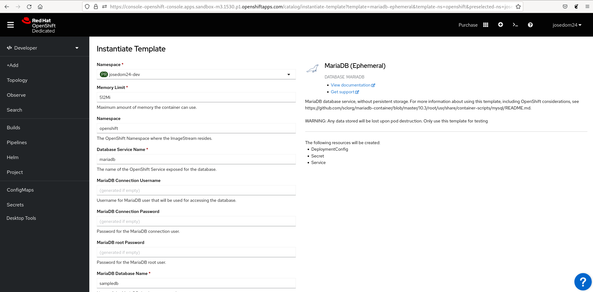
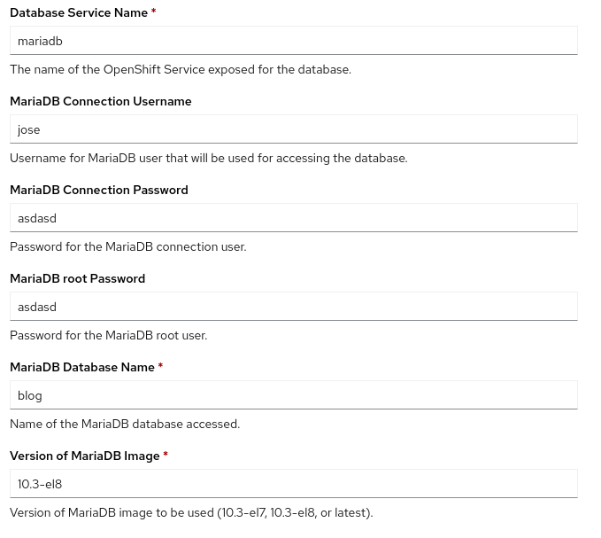
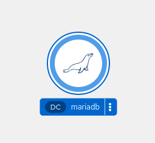
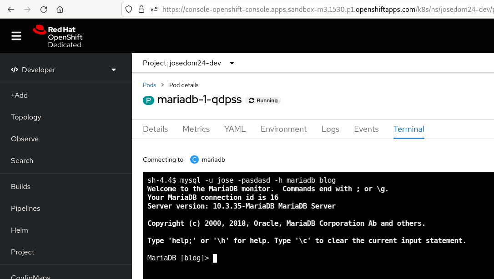

# Despliegue de aplicaciones desde el catálogo desde la consola web

Como hemos indicados OpenShift nos ofrece un conjunto de **Templates** que podemos encontrar en el **catálogo de aplicaciones**. Para acceder al catálogo, desde la vista **Developer** a la opción de **+Add** y elegimos el apartado **Developer Catalog**:

Dentro del catálogo, filtramos por la opción **Templates**:

Vemos que podemos hacer búsqueda más específicas, y que tenemos distintas categorías de plantillas: CI/CD, Databases, Languajes,...
Vamos a trabajar con el mismo **Template** que en ela apartado anterior: `mariadb-ephemeral`, para ello lo escogemos de la lista y pulsamos sobre el botón **Instantiate Template**:

Como podemos observar, nos aparece un formulario con los parámetros que podemos configurar para crear los objetos que creará la plantilla. además podemos ver la lista de estos objetos. Para configurar ponemos los mismos datos que en el apartado anterior:

Pulsamos el botón **Create**, y al cabo de unos segundos tenemos desplegada nuestra base de datos:

Finalmente, para comprobar que la base de datos está funcionando, podemos acceder a los detalles del pod que se ha creado, y en la **Terminal** accedemos a al servicio de mariadb:

