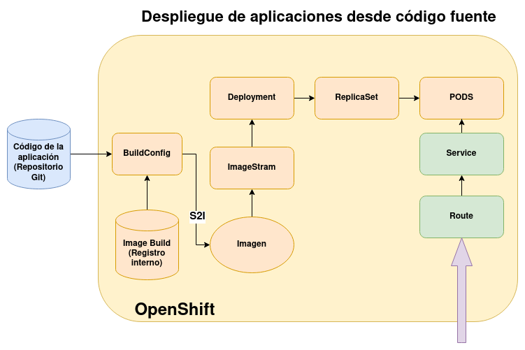

# Despliegue de aplicaciones desde código fuente con oc

El esquema para ver los recursos que se crean en OpenShift al realizar un despliegue desde código fuente es el siguiente:

    oc new-app https://github.com/josedom24/osv4_html.git --name=app1
    error: No language matched the source repository

Vemos que no es posible averiguar el lenguaje con el que está escrito, por lo que tendremos nosotros que indicar la **Builder Image** que vamos a utilizar. 

Las **Builder Image** están referencia por una **Image Stream**, por ejemplo, podemos buscar las **Builder Image** con el servidor web apache:

    Image streams ...
    -----
    httpd
      Project: openshift
      Tags:    2.4-el7, 2.4-ubi8, 2.4-ubi9, latest

Obtenemos además las distintas etiquetas que podemos usar, que corresponder a distintas versiones del servidor web. Por lo tanto si queremos generar una imagen con el código de nuestro repositorio usando de base una imagen basada en *httpd*, ejecutamos:

    oc new-app httpd~https://github.com/josedom24/osv4_html.git --name=app1
    
    ...
    --> Found image e54df11 (5 months old) in image stream "openshift/httpd" under tag "2.4-ubi8" for "httpd"
    ...
    --> Creating resources ...
        imagestream.image.openshift.io "app1" created
        buildconfig.build.openshift.io "app1" created
        deployment.apps "app1" created
        service "app1" created
    --> Success
        Build scheduled, use 'oc logs -f buildconfig/app1' to track its progress.
        Application is not exposed. You can expose services to the outside world by executing one or more of the commands below:
         'oc expose service/app1' 
        Run 'oc status' to view your app.
    
Como vemos se han creado varios recursos:

1.
2.
3.

Si queremos crear una aplicación con la página web de nuestro repositorio con una imagen basada en nginx, podemos buscar los recursos **Images Stream** que tenemos en el catálogo:

    oc new-app -S nginx

Y posteriormente creamos la aplicación con el comando:

    oc new-app nginx~https://github.com/josedom24/osv4_html.git --name=app2

## Detección automática del Builder Image

OpenShift examina el repositorio y según los ficheros que tengamos es capaz de determinar con que lenguaje está escrito y te sugiere un **Builder Image** .

Si añadimos un fichero `index.php` a nuestro repositorio:

    git add index.php 
    git commit -am "php"
    git push

Y ahora creamos la aplicación sin indicar la **Builder Image**:

    oc new-app https://github.com/josedom24/osv4_html.git --name=app3
    --> Found image b34c3d8 (5 months old) in image stream "openshift/php" under tag "8.0-ubi8" for "php"

        Apache 2.4 with PHP 8.0 
        ----------------------- 
        PHP 8.0 available as container is a base platform for building and running various PHP 8.0 applications and frameworks. PHP is an HTML-embedded scripting language. PHP attempts to make it easy for developers to write dynamically generated web pages. PHP also offers built-in database integration for several commercial and non-commercial database management systems, so writing a database-enabled webpage with PHP is fairly simple. The most common use of PHP coding is probably as a replacement for CGI scripts.

        Tags: builder, php, php80, php-80

        * The source repository appears to match: php
        * A source build using source code from https://github.com/josedom24/osv4_html.git will be created
          * The resulting image will be pushed to image stream tag "app3:latest"
          * Use 'oc start-build' to trigger a new build

    --> Creating resources ...
        imagestream.image.openshift.io "app3" created
        buildconfig.build.openshift.io "app3" created
        deployment.apps "app3" created
        service "app3" created
    --> Success
        Build scheduled, use 'oc logs -f buildconfig/app3' to track its progress.
        Application is not exposed. You can expose services to the outside world by executing one or more of the commands below:
         'oc expose service/app3' 
        Run 'oc status' to view your app.

Comprobamos que ha detectado que la aplicación está escrita en PHP, y nos ha seleccionado la **Builder Image** `php:8.0-ubi8`.

