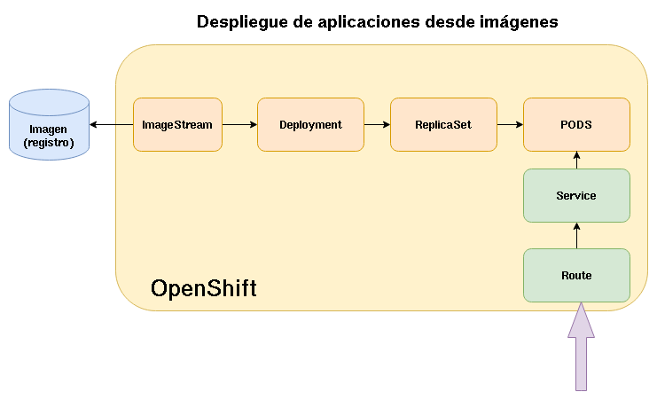
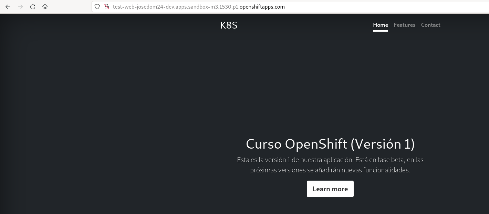

# Despliegue de aplicaciones desde imágenes con oc

El esquema para ver los recursos que se crean en OpenShift al realizar un despliegue desde una imagen es el siguiente:

Para crear un despliegue desde la imagen `josedom24/test_web:v1` que se llame `test-web` ejecutamos el comando:

    oc new-app josedom24/test_web:v1 --name test-web

    --> Found container image 4b01a27 (12 days old) from Docker Hub for "josedom24/test_web:v1"

        * An image stream tag will be created as "test-web:v1" that will track this image

    --> Creating resources ...
        imagestream.image.openshift.io "test-web" created
        deployment.apps "test-web" created
        service "test-web" created
    --> Success
        Application is not exposed. You can expose services to the outside world by executing one or more of the commands below:
         'oc expose service/test-web' 
        Run 'oc status' to view your app.

Como vemos se han creado varios recursos:

1. Ha encontrado una imagen llamada `josedom24/test_web:v1` en Docker Hub.
2. Ha creado un recurso **ImageStream** que ha llamado igual que la aplicación y la ha etiquetado con la misma etiqueta que tiene la imagen y que referencia a la imagen original.
3. Ha creado un recurso **Deployment** responsable de desplegar los recursos necesarios para ejecutar los pods.
4. Ha creado un recurso **Service** que nos posibilita el acceso a la aplicación.
5. No ha creado un recurso **Route** para el acceso por medio de una URL, pero nos ha indicado el comando necesario para crearlo.

Creamos el recurso **Route**:

    oc expose service/test-web

Y comprobamos los recursos que se han creado:

    oc status
    ...
    http://test-web-josedom24-dev.apps.sandbox-m3.1530.p1.openshiftapps.com to pod port 8080-tcp (svc/test-web)
      deployment/test-web deploys istag/test-web:v1 
        deployment #2 running for about a minute - 1 pod
        deployment #1 deployed about a minute ago

También podemos ver los recursos que hemos creado, ejecutando:

    oc get all

    NAME                            READY   STATUS    RESTARTS   AGE
    pod/test-web-6f87bb78f9-9f2v5   1/1     Running   0          2m23s

    NAME                        TYPE        CLUSTER-IP     EXTERNAL-IP   PORT(S)                               AGE
    service/modelmesh-serving   ClusterIP   None           <none>        8033/TCP,8008/TCP,8443/TCP,2112/TCP   19d
    service/test-web            ClusterIP   172.30.75.17   <none>        8080/TCP,8443/TCP                     2m23s

    NAME                       READY   UP-TO-DATE   AVAILABLE   AGE
    deployment.apps/test-web   1/1     1            1           2m23s

    NAME                                  DESIRED   CURRENT   READY   AGE
    replicaset.apps/test-web-6c944c9765   0         0         0       2m23s
    replicaset.apps/test-web-6f87bb78f9   1         1         1       2m23s

    NAME                                      IMAGE REPOSITORY                                                                                          TAGS   UPDATED
    imagestream.image.openshift.io/test-web   default-route-openshift-image-registry.apps.sandbox-m3.1530.p1.openshiftapps.com/josedom24-dev/test-web   v1     2 minutes ago

    NAME                                HOST/PORT                                                          PATH   SERVICES   PORT       TERMINATION   WILDCARD
    route.route.openshift.io/test-web   test-web-josedom24-dev.apps.sandbox-m3.1530.p1.openshiftapps.com          test-web   8080-tcp                 None

Veamos algunos aspectos con detalle:

1. Vemos que se han creado dos despliegues, dos recursos **ReplicaSet**: En realidad, en el proceso interno de creación del despliegue se crea un **ReplicaSet** pero no tiene indicada la imagen, por eso falla y a continuación se vuelve a crear otro que ya si funciona y crea el pod.
2. Vemos como se ha creado un recurso **ImageStream** que apunta a la imagen que hemos indicado. Podemos ver los detalles de este recurso ejecutando:

        oc describe is test-web

3. El recurso **Deployment** que se ha creado hace referencia al recurso **ImageStream** en la definición del contenedor que se ha creado:

        oc describe deploy test-web
        ...
        Containers:
         test-web:
         Image:        josedom24/test_web@sha256:99db6f7fdcd6aa338d80b5cd926dff8bae50062c49f82c79a3d67d048efb13a4
        ...

4. Podemos comprobar que si accedemos a la URL generada por el recurso **Route**, la aplicación está funcionando:

    

5. Para eliminar la aplicación, tenemos que borrar los recursos que hemos creado:

        oc delete deploy test-web
        oc delete service test-web
        oc delete route test-web
        oc delete is test-web