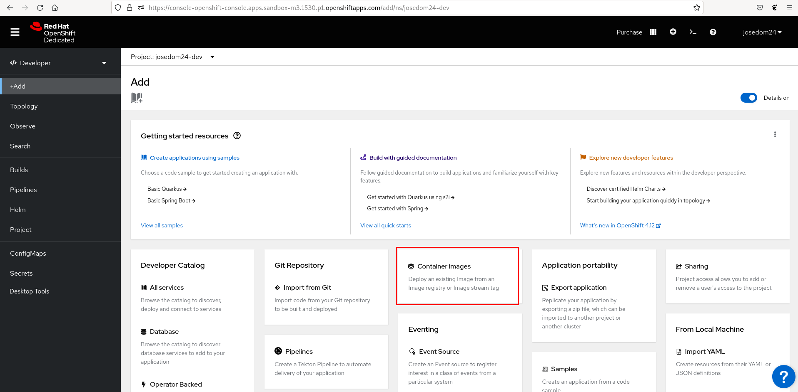
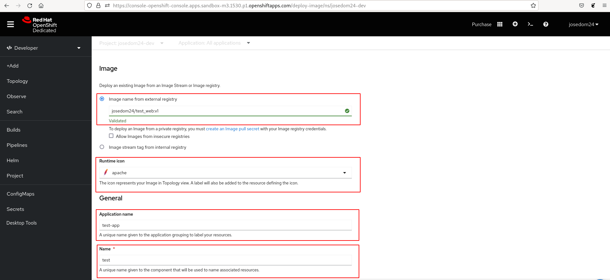
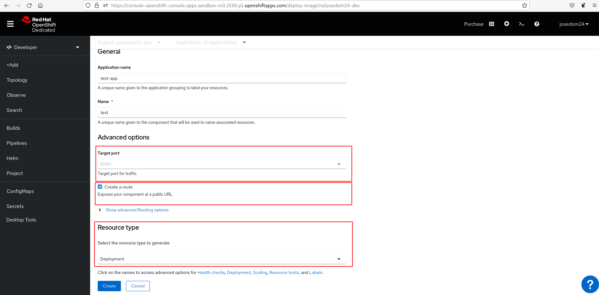
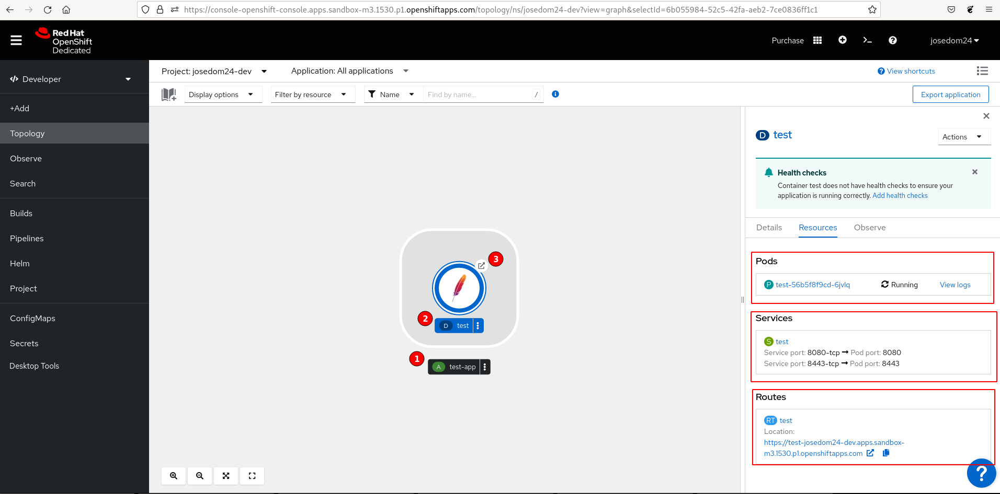
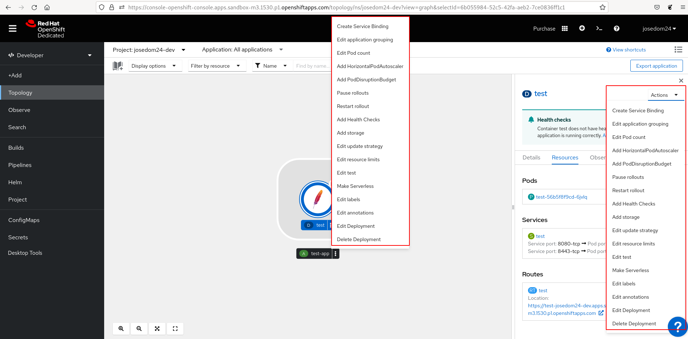
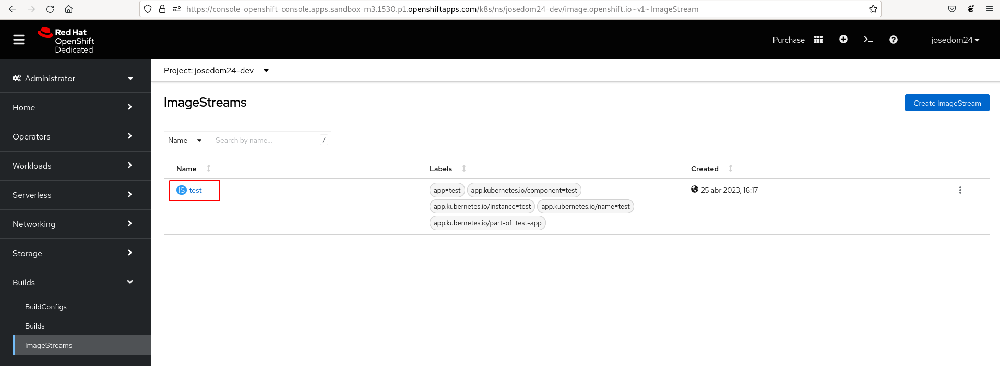
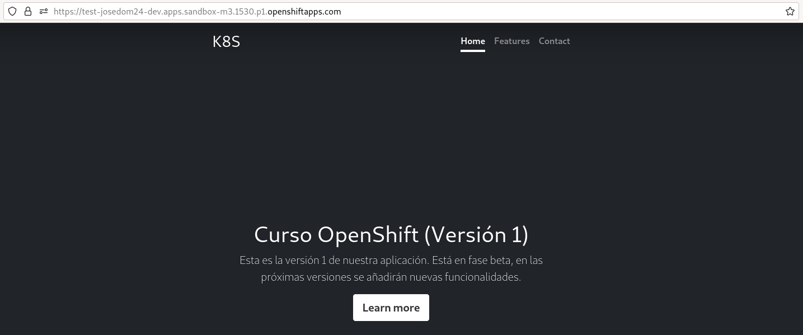
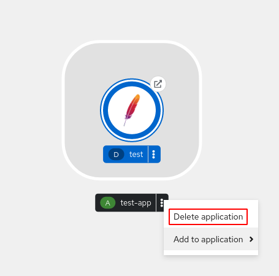

# Despliegue de aplicaciones desde imágenes desde la consola web

Vamos a realizar el mismo ejercicio pero desde la consola web. Para ello accedemos desde la vista **Developer** a la opción de **+Add** y elegimos el apartado **Container Images**:

A continuación vamos a configurar las propiedades del despliegue:

* Indicamos la imagen que se va a desplegar.
* El icono con el que se va a representar el despliegue en la topología.
* El nombre de la aplicación que nos va permitir agrupar distintos recursos con un mismo nombre.
* El nombre del despliegue.

Continuamos con la configuración:

* El puerto donde se ofrece el servicio, normalmente es el 8080, pero dependerá de la imagen que estamos desplegando.
* Indicamos que se cree un objeto **Route** para acceder a la aplicación por medio de una URL.
* Pulsamos sobre la opción **Resource type** y elegimos **Deployment**.

Finalmente le damos al botón **Create** para crear el despliegue, y al cano de unos segundo, accedemos al apartado **Topology** y comprobamos que se han creado los distintos recursos:

Podemos ver que tenemos varias secciones el icono que representa el despliegue:

1. Representa la aplicación. Es una agrupación de recursos. Si borramos la aplicaciones, se borrarán todos los recursos.
2. Representa el **Deployment**: En la pabntalla lateral, podemos acceder a algunos de los recursos que se han creado.
3. Si pulsamos sobre "la flechita" se abrirá una nueva página web con la URL del objero **Route** que nos permitirá el acceso a la aplicación.

Si pulsamos sobre los tres puntos verticales del cuadro del **Deployment** o sobre el botón **Actions**, obtendremos un menú con todas las acciones que podemos realizar sobre el objeto:

Nos queda por comprobar que se ha creado un objeto **ImageStream**, para ello en la vista **Administrator**, en la opción **Builds -> ImageStreams** la podemos encontrar:

Al acceder a la URL de la ruta accedemos a la aplicación:

Por último podemos borrar todos los recursos creado, eliminando la aplicación:

